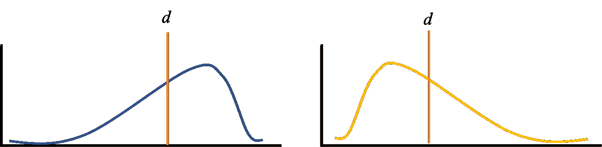
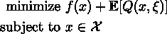
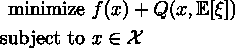

# 随机规划的情况

> 原文：<https://medium.com/mlearning-ai/the-case-for-stochastic-programming-6a2b67e2327b?source=collection_archive---------6----------------------->

## 为什么建模中均值和中间值不够

数学优化是运筹学和数据科学的一个领域，旨在通过搜索一组约束条件允许的一组解决方案来最大化或最小化某个数学函数[1]。

这个框架有很多好处，真的可以帮助一个人抓住现实世界问题的关键要素，并用数字来解决它。然而，如何表示随机的问题元素呢？主流优化技术通常只取观察到的随机性的平均值或中值，并将这些变量视为常数，但我认为*这种方法产生了次质量的解决方案。*对于最高质量的解决方案，应使用两种基于不确定性的建模框架之一。在本文中，我们将讨论利用随机规划的理由，这是一个旨在最大化/最小化你的预期利润/成本的框架。

# 激励的例子

让我们假设我们是一个报纸供应商，试图决定买多少份报纸，以便明天出售。报纸的买卖成本是元，而元。如果我们卖不完所有的报纸，我们可以把它们退还给出版公司，收取 *r* 美元( *r < c < s* )。现在，我们是一个聪明的报摊，我们已经跟踪了过去几周的销售情况，并相信某一天的需求是随机的，但平均来说，人们每天都需要一份报纸。

在一个确定性公式中，我们会充分假设这些信息，然后只买报纸。然而，这真的是最好的方法吗？让我们看看我们的需求在两种情况下可能会是什么样子:

Example Demand Distributions

在案例 1(蓝色分布)中，每天的实际需求通常高于平均值，这意味着大多数时候我们会短缺几份报纸，导致我们损失利润。

在情况 2(黄色分布)中，我们有相反的问题，需求通常小于平均需求，这意味着我们在大多数日子里会有太多的论文，导致我们亏损。

根据 *r、c* 和 *s* 的不同，我们可能对短(例如低退货价格和高成本)，但在其他情况下(例如低成本，高销售价格)短缺会导致我们失去潜在的利润。无论哪种方式，根据销售的分布情况，购买比平均水平多一点或少一点都是值得的。*但是在确定性模型中，我们失去了这种细微差别，因此失去了利用这种细微差别做出决策的能力。*

# 什么是随机规划

随机规划(SP)是一个涉及不确定性的建模优化问题的框架[2]。当其他建模范例强迫随机变量进入确定性空间时，随机程序利用了支配数据的概率分布存在且已知的事实[2]。

然后，SP 模型利用抽样技术(如样本平均近似值[3])根据不确定性的各种潜在实现来创建各种子问题。然后，SP 返回产生最佳期望值的决策。数学上，SP(更准确地说是 2 级 SP)可以写成:

SP Formulation

其中 *x* 是我们的第一阶段(又名“此时此地”)决策， *f(x)* 是前期成本， *xi* 是我们的随机性， *Q(x，xi)* 是给定我们的第一阶段决策和随机性的未来成本。

为了更好地理解这个公式，也可以使用这个两阶段模板来编写确定性公式:

Deterministic Formulation

在 SP 中，我们会考虑未来成本的预期值，以便根据我们的分销情况做出决策。在确定性公式中，我们考虑了随机性的期望值，删除了分布信息。

# 有什么条件？

没有抓到！客观上，随机编程在各方面都更好……至少我希望如此。SP 给出了比普通优化问题更高质量的解决方案，但是这是以更高的计算成本为代价的。由于 SP 通过创建多个子问题来发挥作用，单个问题可以迅速扩展，变得非常复杂，需要更多的时间和计算能力。因此，更经常选择确定性优化，因为在许多情况下，人们不需要最佳解决方案，而是需要一个“足够好”的解决方案。

然而，有许多方法可以帮助减少计算时间。这些算法包括像 Bender 分解和各种基于机器学习的方法(如[4])。

[1] N. Upadhya，[数学优化导论](/@upadhyan/an-introduction-to-mathematical-optimization-d9e49e05aa95) (2022)，中等

[2] A .菲尔波特，[什么是随机规划](https://stoprog.org/what-stochastic-programming?qt-inroduction_quicktab_block=1#qt-inroduction_quicktab_block) (2022)，随机规划学会。

[3] B. Verweij，S. Ahmed，A. J. Kleywegt，G. Nemhauser，A. Shapiro，[应用于随机路由问题的样本平均近似法:计算研究](https://link.springer.com/article/10.1023/A:1021814225969) (2003)，计算优化与应用

【4】[J](https://arxiv.org/abs/2205.12006)。杜穆谢尔，r .帕特尔，E. B .哈利勒，m .博杜尔， [Neur2SP:神经两阶段随机规划](https://arxiv.org/abs/2205.12006) (2022)，arXiv 预印本 arXiv:2205.12006

 [## Mlearning.ai 提交建议

### 如何成为 Mlearning.ai 上的作家

medium.com](/mlearning-ai/mlearning-ai-submission-suggestions-b51e2b130bfb)