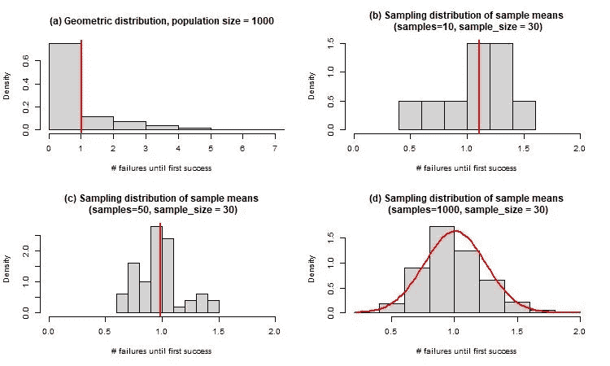
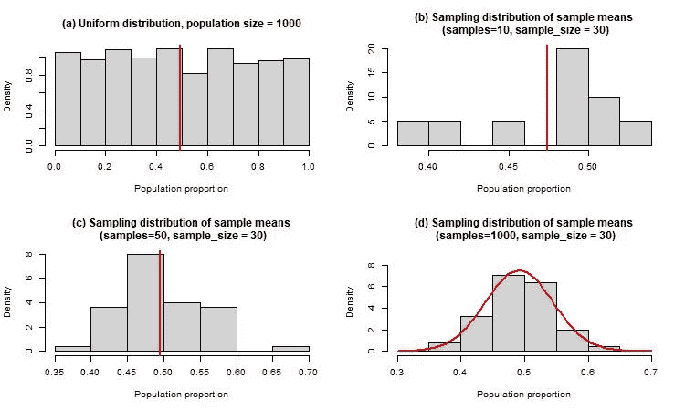

# 平衡之举

> 原文：<https://medium.com/mlearning-ai/the-central-limit-theorem-faaba8261a0f?source=collection_archive---------10----------------------->

Photo by M[ali Maeder](https://www.pexels.com/@mali?utm_content=attributionCopyText&utm_medium=referral&utm_source=pexels) from [Pexels](https://www.pexels.com/photo/stack-of-stones-1278952/?utm_content=attributionCopyText&utm_medium=referral&utm_source=pexels)

中心极限定理——简称 CLT。我第一次接触到这个概念是在 R&D 的一个制造车间，当时我是 R&D 的一名工艺工程师。这里收集了关于试生产过程的数据，大多数分析是在正态假设下进行的。我在下面补充一个 CLT 的正式定义:

> 中心极限定理指出，当我们处理越来越多的样本时，样本均值的分布接近正态分布，而不管总体分布的形状如何。

换句话说，根据 CLT，对于大的随机样本，假设样本均值为正态分布总是没问题的。科学家绘制了气体分子的随机速度，以及扩散等过程，并发现这些可以模拟近似正常的行为。为了演示 CLT 的实际操作，我在 r 中生成了如下所示的图表

这张图(a)显示了一个几何分布的人口。(b、c 和 d)都显示了从(a)中的分布中替换抽取的大小为 30 的随机样本的样本均值。b、c 和 d 的样本分别被抽取 10、50 和 1000 次，我们可以清楚地看到(d)中的分布接近正态分布，其中样本被抽取 1000 次。

下面是另一系列的图，从均匀分布开始，遵循与几何分布相同的程序。事实上，当采样完成 1000 次时，样本的采样分布意味着大约正态(d)。

对于正态分布，期望值(平均值)等于最可能值(众数)。这是否意味着，无论整个宇宙中任何事物的起点是什么，如果我们跟踪它足够长的时间，或模拟它足够长的时间，或重复它如此多次，最终结果是*最有可能*落在期望值或平均值处？注意，这个问题不是问*是否所有的*点都将*总是*落在精确的平均值(对于 std。正态分布有 68%的几率在 1 sigma 内，95%的几率在 2 sigma 和[之间，以此类推](https://mathbitsnotebook.com/Algebra2/Statistics/STstandardNormalDistribution.html)。

这个想法让我想起苏斯博士《你要去的地方》中的一句台词:

> "小心谨慎地迈步，记住生活是一场伟大的平衡行动."

明白了吗？任何物体的质量中心或重心——也称为平衡点，是所有物质均匀分布的点，即对于密度均匀的对称物体，它总是在物体的中心。这一概念类似于概率论中的期望值，其中期望值(平均值)是概率密度函数(又称 pdf(或离散情况下的 pmf ))的质心，概率均匀分布在平均值的两侧。

如果你想从宗教的角度从类似的概念中汲取智慧，可以看看“中道”，这是佛教*佛法*的核心哲学之一。《圣经》中提到走中道，下面是《古兰经》中的一段话:

> 你应当公平地称万物，不要用小秤称物*(古兰经*[*55:*](http://tilaw.at/55:8-10)09)

阿拉伯语单词 *Meezan (* 来源于 *wazn* ，字面意思是重量 *)* 可以翻译为平衡、测量、平均值。它融合了判断、平衡和合理论证的概念。

总的来说，当我能够把我在课堂上学到的东西应用到我的生活中时，我很高兴。我真的很喜欢写这篇文章，请让我知道你的想法！

 [## Mlearning.ai 提交建议

### 如何成为 Mlearning.ai 上的作家

medium.com](/mlearning-ai/mlearning-ai-submission-suggestions-b51e2b130bfb)