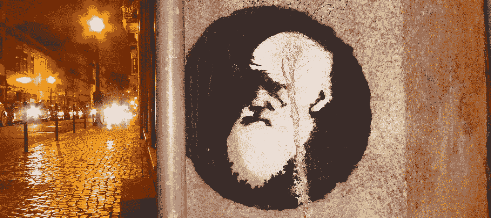

# 做出最佳选择的挑战

> 原文：<https://medium.com/mlearning-ai/the-challenge-of-making-the-best-choices-35a5d54c570b?source=collection_archive---------2----------------------->

(featured image: [duncan c/Flickr](https://www.flickr.com/photos/duncan/49792373367/in/photolist-2iRYVRZ-2kiux5e-2g64Len-75WfFf-75WeXy-75RWwV-75Wisf-75We5f-75ShsZ-75Sb1R-75S85B-75W3TE-75Wcp3-75W6Rq-75W9gm-75RZRT-75W8o5-75SgfZ-75S8UV-75VV8U-75Wdf7-75W7H7-2heM4FQ-8sJbrK-75W5GL-75WgHC-ogVPvW-yDLoh2-26GyyS9-2kAZdrW-Q7uUyZ-3b6A6U-2iE49Px-QLLpz3-631N9x-qGH6DV-8ULRay-zhxkiW-yCfiyF-5ZrZac-2h3vJNa-iDF6x-gS1fNS-2iYS631-kqvdit-2htFNBU-4UPaaM-UJ5zWU-6dvdeb-GinWcR) CC BY)

## *更好的决策可能意味着拓宽或缩小视野——取决于你是人还是机器*

F 几年前，2017 年 3 月 21 日凌晨，多特蒙德-沙恩霍斯特站周围的街区被一声巨响震动。早些时候，一名 31 岁的男子决定进入…