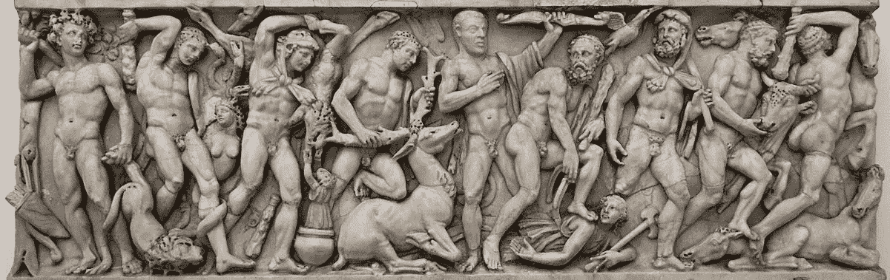
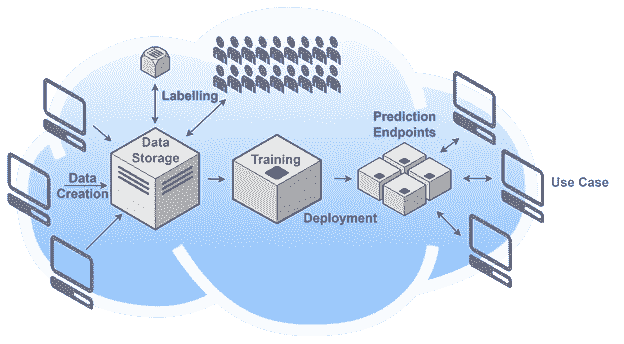
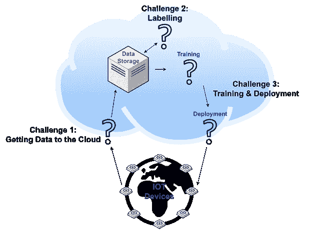

# 在物联网领域实施 ML 的挑战—第 1 部分

> 原文：<https://medium.com/mlearning-ai/the-challenges-of-implementing-ml-in-the-iot-space-part-1-abff7abf326b?source=collection_archive---------7----------------------->

物联网(IoT)空间是利用机器学习(ML)解决方案的一个不断增长的领域。当谈到 ML 时，在物联网领域工作会面临一些独特的挑战。在这个由两部分组成的系列中，我们将首先定义这些挑战，然后在第二部分中，我们将探索可以用来克服这些挑战的数据和 ML 工程解决方案。

# 挑战

Hercules had twelve challenges presented to him. We have three. Fair, I think, considering that he was a demigod. ([Public Domain](https://commons.wikimedia.org/wiki/File:Twelve_Labours_Altemps_Inv8642.jpg))

通常在机器学习中:

*   模型是使用在线平台上创建的数据进行训练的，因此这些数据会存储在云中。然后，这些数据可以很容易地用于训练模型的预处理。
*   数据标注由人工完成，取自现有的已标注数据集或两者的组合。
*   然后，将选定的模型部署到一个在线端点，通过 API 访问该端点以进行预测。

A typical machine learning solution

然而，在物联网领域:

*   数据是由传感器在本地创建的，如果要存储的话，也是在本地存储，通常只存储很短的一段时间。
*   由于收集数据的物理环境特定于用于收集数据的传感器组合的使用情况或规格，因此数据对于设备而言通常是唯一的。这种独特的、未标记的数据被大量收集。
*   由于实时、低延迟预测等原因，或者仅仅因为设备不能保证连接到互联网或任何其他设备，模型经常需要部署在物联网设备上。

这种环境带来的挑战是:

1.  **将数据放入云中—** 为了进行有效的模型培训，数据必须可用于培训，并且最好放在云中访问，在云中培训流程可以利用数量无限且种类繁多的可用资源。因此，物联网设备捕获的任何相关数据都必须传输到云端。这意味着:

> a.物联网设备必须能够以某种方式访问互联网连接。这可以是直接的，或者通过连接到另一个具有互联网连接的设备。
> 
> b.物联网设备必须能够存储足够长时间的相关数据，以应对可能无法连接到互联网的情况。

2.**数据标签** —物联网领域的部分特征是需要捕捉和处理的数据量巨大。这本身就具有挑战性，但在 ML 的环境中，这又带来了额外的挑战:

> a.数据可能对于收集数据的传感器和收集数据的环境是唯一的。因此，不太可能有足够相似的现成标签数据集可用于训练模型。
> 
> b.这些大量的数据必须被标记，以提供训练 ML 模型的基础事实的来源。传感器信号只能由训练有素的领域专家来解释。所以如此大规模的人为标记是不可行的。

3.**模型培训&部署到嵌入式技术** —在嵌入式技术中，许多硬件要求是由设备小巧轻便的需求驱动的。这反过来又推动了软件需求和 ML 模型需求。该模型可能必须是轻量级的，需要在特定的操作系统上运行，并且可能对所用数据的位大小有限制。此外，每个设备必须有自己的模型副本。因此 **:**

> a.部署的模型必须在设备上运行，就像在训练它的机器上一样。为了实现这一点，训练环境应该尽可能与设备环境相似。例如，物联网设备可能仅限于使用 8 位操作系统，因此培训应模拟这种情况，因为模型参数中的 32 位或 64 位数字可能会在部署时完全改变模型行为。
> 
> b.每次更新模型时，都必须将其部署到多个设备上。对于部署到新设备和部署到现有设备的更新，必须实现某种自动化版本控制和自动化部署过程。
> 
> c.可能会同时使用多个设备版本(硬件或软件)来执行同一任务。这是建立在上述 *a.* 和 *b.* 的基础上的；部署的模型应该在执行相同任务的所有设备上运行，如果这意味着不同的模型文件，这应该在自动化部署过程中考虑。

Challenges in IoT based ML Solutions

为了取得成功，在物联网领域实施 ML 的解决方案必须考虑这些挑战。当我听到你哭泣时，怎样称呼他们最好？好吧，你只能等到下周才能看到这个系列的第二部分…

更新:现在可以在[这里找到](/@jamie_bamforth/the-challenges-of-implementing-ml-in-the-iot-space-part-2-d4b8a57bf522)！

 [## Mlearning.ai 提交建议

### 如何成为 Mlearning.ai 上的作家

medium.com](/mlearning-ai/mlearning-ai-submission-suggestions-b51e2b130bfb) 

🔵[成为作家](/mlearning-ai/mlearning-ai-submission-suggestions-b51e2b130bfb)