# 使用 LSTM、双 LSTM 和 GRU 的文本消息分类

> 原文：<https://medium.com/mlearning-ai/the-classification-of-text-messages-using-lstm-bi-lstm-and-gru-f79b207f90ad?source=collection_archive---------0----------------------->

文本分类也称为文本标记或文本分类，是将文本分类到有组织的组中的过程。通过使用自然语言处理(NLP)，文本分类器可以自动分析文本，然后根据其内容分配一组预定义的标签或类别。

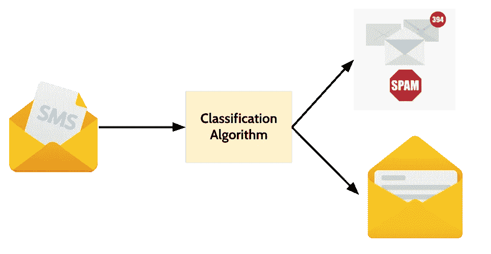

本文旨在建立一个二元分类模型来检测哪些短信是垃圾短信，哪些不是垃圾短信。此外，我们还增加了一个部分来预测或检测使用短信的垃圾邮件，这是我们从来没有见过的。

我们使用来自[UCL](https://archive.ics.uci.edu/ml/datasets/SMS+Spam+Collection)的公共数据集。它包含 5.574 条手机短信。这些数据是为了手机垃圾邮件研究的目的而收集的。这些数据被标记为垃圾邮件或非垃圾邮件(ham)。

我们将使用密集分类器、长短期记忆(LSTM)、双向长短期记忆(双 LSTM)和门控循环单元(GRU)作为我们的方法，并根据模型性能比较所有这些方法。

以下是做实验的步骤:

*   导入库
*   加载数据集
*   使用 wordcloud 可视化垃圾邮件
*   处理不平衡数据
*   文本预处理
*   定义模型架构并训练四个模型
*   比较四种不同模型的结果
*   使用最终训练的模型对新消息进行分类

# 第一步。导入库

让我们导入我们需要的库:

```
**# Load, explore and plot data
import** numpy as np
**import** pandas as pd
**import** seaborn as sns
**import** matplotlib.pyplot as plt
**from** wordcloud **import** WordCloud, STOPWORDS, ImageColorGenerator
%matplotlib inline**# Train test split
from** sklearn.model_selection **import** train_test_split**# Text pre-processing
import** tensorflow as tf
**from** tensorflow.keras.preprocessing.text **import** Tokenizer
**from** tensorflow.keras.preprocessing.sequence **import** pad_sequences
**from** tensorflow.keras.callbacks **import** EarlyStopping**# Modeling
from** tensorflow.keras.models **import** Sequential
**from** tensorflow.keras.layers **import** LSTM, GRU, Dense, Embedding, Dropout, GlobalAveragePooling1D, Flatten, SpatialDropout1D, Bidirectional
```

# 第二步。加载数据集

我们在本文中使用的数据集来自 UCI 机器学习知识库:[垃圾短信收集数据集](https://archive.ics.uci.edu/ml/datasets/SMS+Spam+Collection)。然而，为了使本文更简单，我们尝试从这个 github 访问数据集:[https://raw . githubusercontent . com/Kenneth-lee-ch/SMS-Spam-Classification/master/Spam . CSV](https://raw.githubusercontent.com/kenneth-lee-ch/SMS-Spam-Classification/master/spam.csv)。

```
df = pd.read_csv('https://raw.githubusercontent.com/kenneth-lee-ch/SMS-Spam-Classification/master/spam.csv', encoding='ISO-8859-1')**# rename the columns** df = df[['v1','v2']]
df.rename(columns={'v1':'label', 'v2':'message'}, inplace=True)
df.head()
```

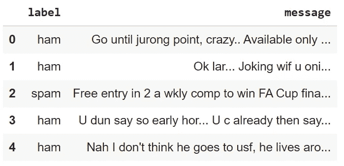

汇总统计有助于更好地理解数据:

```
df.describe()
```

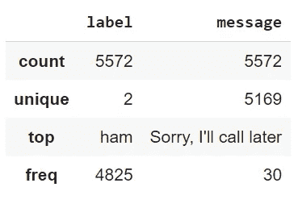

```
df.groupby('label').describe().T
```

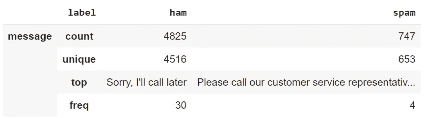

# 第三步。使用 wordcloud 可视化垃圾邮件

下一步是使用 WordCloud 可视化给定文本中出现频率最高的单词。

**“火腿”消息的文字云:**

```
**ham_msg_cloud** = WordCloud(width =520, height =260, stopwords = STOPWORDS, max_font_size = 50, background_color = "black", colormap = 'Pastel1').generate(ham_msg_text)plt.figure(figsize=(16,10))
plt.imshow(**ham_msg_cloud**, interpolation = 'bilinear')
plt.axis('off') # turn off axis
plt.show()
```


基于上述 WordCloud 的 ham 消息中出现频率最高的词有:现在、将要、好的、今天、抱歉等。

**“垃圾”消息的词云:**

```
**spam_msg_cloud** = WordCloud(width =520,
                          height =260,
                          stopwords=STOPWORDS,
                          max_font_size=50, 
                          background_color ="black",
                         colormap='Pastel1').generate(**spam_msg_text**)
plt.figure(figsize=(16,10))
plt.imshow(**spam_msg_cloud**, interpolation='bilinear')
plt.axis('off') # turn off axis
plt.show()
```


上面来自 WordCloud 的垃圾短信中出现频率最高的词有:免费、通话、加急、移动等。

# 第四步。处理不平衡数据

下一步:让我们来看看火腿和垃圾短信是如何分布的。

```
plt.figure(figsize=(8,6))
sns.countplot(df.label)
plt.title(**'The distribution of ham and spam messages'**)
```

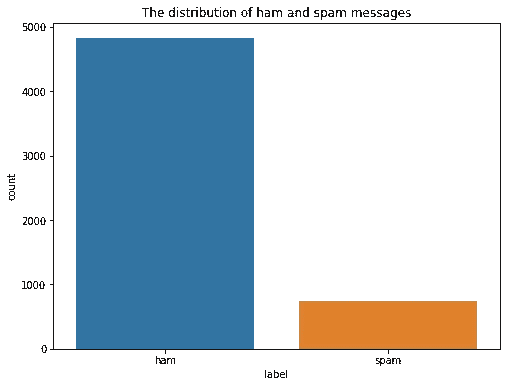

基于上述数据分布的可视化，可以得出数据不平衡的结论。最常见的是垃圾邮件。

处理不平衡数据集问题的方法:

*   选择合适的评估指标
*   重采样(过采样和欠采样)
*   合成少数过采样技术(SMOTE)
*   平衡分级器
*   阈值移动

在本文中，我们使用**欠采样**方法来处理不平衡数据。欠采样是指随机且均匀地对多数类进行欠采样。这可能会导致信息丢失。但是如果多数类的例子离其他的很近，这种方法可能会产生好的结果。

```
**# downsample the ham msg**
ham_msg_df = ham_msg.sample(n = len(spam_msg), random_state = 44)
spam_msg_df = spam_msg
```

下面的 ham 和 sample 消息分布(缩减采样后)显示了考虑不平衡数据后消息类型的类似分布:

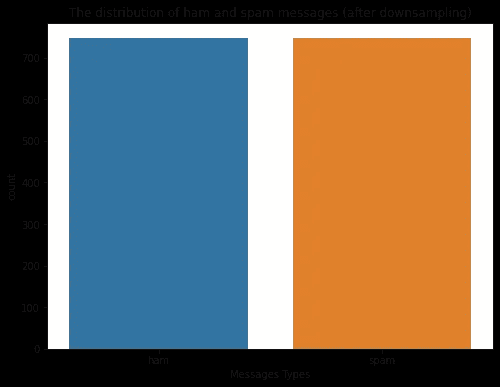

# 第五步。文本预处理

## **5.1。获取每个文本的长度列，并将文本标签转换为数值:**

在我们得到最终的数据帧之后，接下来我们添加`text_length`列(每条文本消息的长度)和`msg_type`列(数据的转换后的数字标签)。

```
**# Get length column for each text**
msg_df['text_length'] = msg_df['message'].apply(len) msg_df['msg_type'] = msg_df['label'].map({'ham':0, 'spam':1})
msg_label = msg_df['msg_type'].valuesmsg_df.head()
```

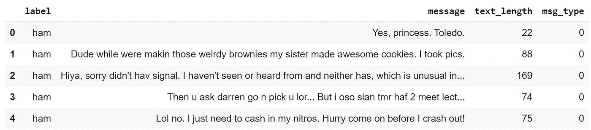

## **5.2。列车测试分割**

之后，我们进行训练测试分割，将数据分成 80%的训练数据和 20%的测试数据。

```
**x_train, x_test, y_train, y_test** = train_test_split(msg_df['message'], msg_label, test_size=0.2, random_state=434)
```

## **5.3。标记化**

我们需要将文本消息数据转换成数字表示，这样模型才能理解它。

```
**# Defining pre-processing parameters**
max_len = **50** 
trunc_type = **'post'**
padding_type = **'post'**
oov_tok = **'<OOV>'** # out of vocabulary token
vocab_size = **500**
```

TensorFlow Keras 的 Tokenizer API 可以将句子拆分成单词，并编码成整数。

记号赋予器将执行所有必要的预处理步骤:

*   标记成单词字符(单词级)
*   num_words 表示唯一令牌的最大数量
*   过滤掉标点符号
*   将所有单词转换成小写
*   将所有单词转换为整数索引

```
tokenizer = **Tokenizer**(num_words = vocab_size, 
                      char_level = False,
                      oov_token = oov_tok)tokenizer.fit_on_texts(x_train)
```

*   `num_words`:我们希望在训练和测试数据中加载多少个独特的词
*   `oov_token`:词汇外标记将被添加到用于建立模型的语料库中的单词索引中。这用于在 text_to_sequence 调用期间替换词汇表之外的单词(不在我们的语料库中的单词)。

```
**# Get the word_index**
word_index = tokenizer.word_index
total_words = len(word_index)total_words
```

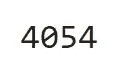

## **5.4。序列和填充**

下一步:让我们使用来自 Tokenizer 对象的`texts_to_sequences`用数字序列表示每个句子。之后，我们填充序列，这样我们就可以有相同长度的每个序列。

对于数据训练:

```
training_sequences = tokenizer.texts_to_sequences(x_train)
training_padded = pad_sequences(training_sequences,
                                maxlen = max_len,
                                padding = padding_type,
                                truncating = trunc_type)
```

对于数据测试:

```
testing_sequences = tokenizer.texts_to_sequences(x_test)
testing_padded = pad_sequences(testing_sequences,
                               maxlen = max_len,
                               padding = padding_type,
                               truncating = trunc_type)
```

*   `padding`:“前”或“后”(默认前)。通过使用 pre，我们将在每个序列之前填充，post 将在每个序列之后填充。
*   `maxlen`:所有序列的最大长度。如果没有提供，默认情况下它将使用最长句子的最大长度。
*   `truncating`:‘前’或‘后’(默认为‘前’)。如果序列长度大于提供的`maxlen`值，那么这些值将被截断为`maxlen`。“pre”选项将在序列的开头截断，而“post”将在序列的结尾截断。

训练和测试填充的形状(张量):

```
print('Shape of training tensor: ', training_padded.shape)
print('Shape of testing tensor: ', testing_padded.shape)
```

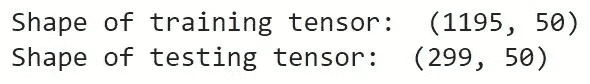

# 第六步。定义模型架构并训练模型

## **6.1 密集模型**

定义密集分类器模型架构:

```
**# Define parameter**
vocab_size = **500** 
embedding_dim = **16**
drop_value = **0.2**
n_dense = **24****# Define Dense Model Architecture**
model = Sequential()
model.add(Embedding(vocab_size,
                    embedding_dim,
                    input_length = max_len))
model.add(GlobalAveragePooling1D())
model.add(Dense(24, activation='relu'))
model.add(Dropout(drop_value))
model.add(Dense(1, activation='sigmoid'))
```

`Sequential`调用 Keras 顺序模型，其中层按顺序添加。嵌入层将每个单词映射到实数的 N 维向量。`embedding_dim`是`word_vector`的大小，这里我们用 16。因为嵌入层是我们模型中的第一个隐藏层，我们需要按照`input_length` = `max_len`的定义来设置我们的输入层

接下来，我们使用`GlobalAveragePooling1D`作为池层，这有助于减少模型中的参数数量，并避免过度拟合。

接下来，我们使用一个带有激活函数`relu`的密集层，然后是一个用于避免过拟合的丢弃层和一个带有`sigmoid`激活函数的最终输出层。`sigmoid`激活函数输出概率将在 0 和 1 之间。

密集模型的概要:

```
model.summary()
```

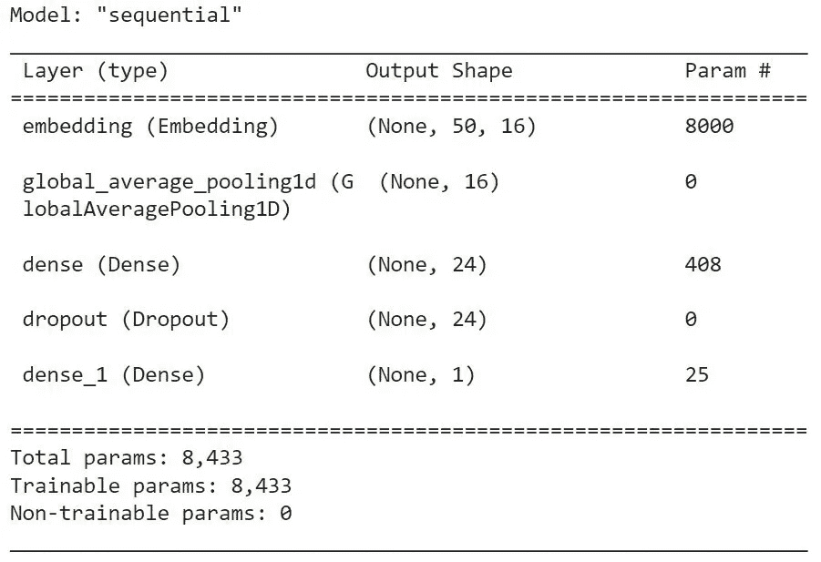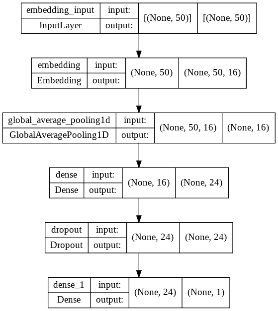

**编译模型:**

```
model.compile(loss = 'binary_crossentropy', optimizer = 'adam' , metrics = ['accuracy'])
```

我们使用`binary_crossentropy`作为损失函数，因为模型的输出是二进制的，对于优化器，我们使用`adam`，它利用动量来避免局部最小值。

**训练模型:**

接下来，让我们使用`model.fit`来训练模型。它使用填充的训练数据

```
num_epochs = 30
early_stop = EarlyStopping(monitor='val_loss', patience=3)
history = model.fit(training_padded,
                    y_train,
                    epochs=num_epochs, 
                    validation_data=(testing_padded, y_test),
                    callbacks =[early_stop],
                    verbose=2)
```

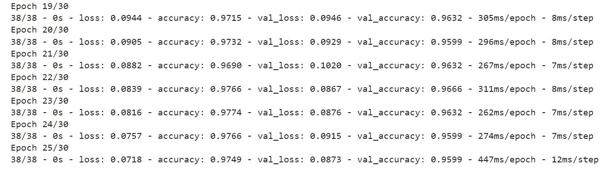

*   epoch:学习算法在整个训练数据中工作的次数。
*   回调:传递早期停止参数。early stopping(monitor = ' val _ loss '，patience=2)用于定义我们希望监控验证损失，如果验证损失在 2 个时期后没有改善，则模型训练将停止。这种技术有助于避免过拟合问题。
*   verbose : 2，它将向我们显示每个时期的损失和准确性。

```
model.evaluate(testing_padded, y_test)0s 10ms/step - loss: 0.0873 - accuracy: 0.9599
```

模型得出，训练损失为 0.07，训练准确率为 97.49%，验证损失为 0.0873，验证准确率为 95.99%。

**绘制精度曲线图:**

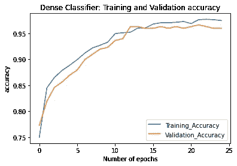

从上面的精度图来看，精度随着时代的推移而增加。该模型在训练数据中的表现优于在有效数据中的表现。

**绘制损失图:**

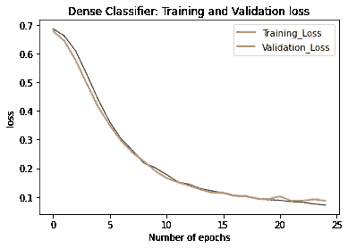

从下面的损失图中，我们可以得出结论，损失是否随着历元数的增加而减少。

打印训练和有效数据的准确性:

```
train_dense_results = model.evaluate(training_padded, np.asarray(y_train), verbose=2, batch_size=256)
valid_dense_results = model.evaluate(testing_padded, np.asarray(y_test), verbose=2, batch_size=256)
print(f'Train accuracy: {train_dense_results[1]*100:0.2f}')
print(f'Valid accuracy: {valid_dense_results[1]*100:0.2f}')
```

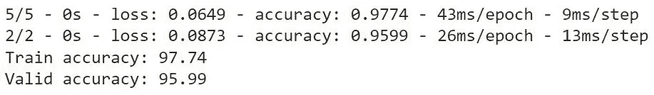

## **6.2 长短期记忆(LSTM)**

长短期记忆(LSTM)旨在通过允许网络将数据存储在一种可以在以后访问的存储器中来克服简单递归神经网络(RNN)的问题。

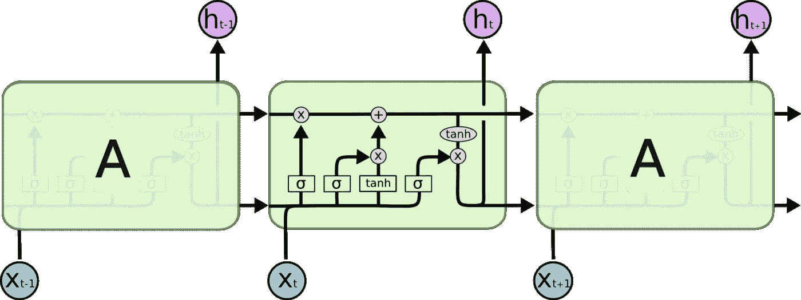

Source: [https://colah.github.io/posts/2015-08-Understanding-LSTMs/](https://colah.github.io/posts/2015-08-Understanding-LSTMs/)

LSTM 模型的关键是**细胞状态。**用很少的计算更新单元状态两次，得到稳定的梯度。它还有一个隐藏的状态，就像短期记忆一样。

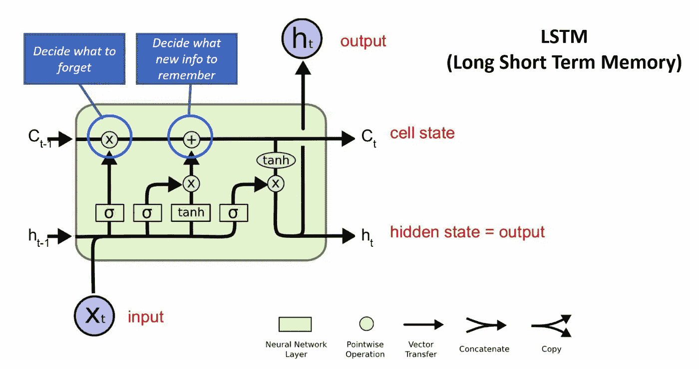

在 LSTM 有遗忘门、输入门和输出门。

*   第一步是决定我们要从细胞状态中丢弃什么信息。这个决定是由被称为“忘记门”层的 s 形层做出的。
*   第二步是决定我们要在单元格状态中存储什么样的*新*信息。这有两个部分。首先，称为“输入门”层的 sigmoid 层决定我们将更新哪些值。接下来，tanh 层创建一个新的候选值向量，可以添加到状态中。
*   最后，我们需要决定我们要输出什么。该输出将基于我们的单元状态，但将是过滤后的版本。首先，我们运行一个 sigmoid 层，它决定我们要输出细胞状态的哪些部分。然后，我们将单元状态通过 tanh(将值推到-1 和 1 之间)并乘以 sigmoid 门的输出，这样我们只输出我们决定的部分

**定义 LSTM 模型架构:**

```
**# Define parameter** n_lstm = 128
drop_lstm = 0.2**# Define LSTM Model** 
model1 = Sequential()
model1.add(Embedding(vocab_size, embedding_dim, input_length=max_len))
model1.add(SpatialDropout1D(drop_lstm))
model1.add(LSTM(n_lstm, return_sequences=False))
model1.add(Dropout(drop_lstm))
model1.add(Dense(1, activation='sigmoid'))
```

**模型总结:**

```
model1.summary()
```

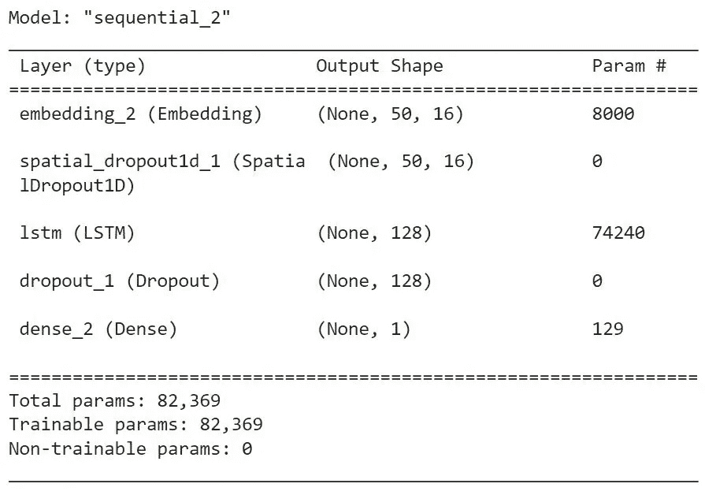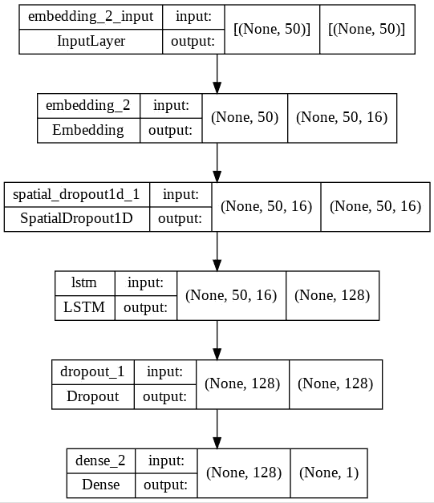

**编译模型:**

```
model1.compile(loss = 'binary_crossentropy',
               optimizer = 'adam',
               metrics = ['accuracy'])
```

**训练模型:**

```
num_epochs = 30
early_stop = EarlyStopping(monitor='val_loss', patience=2)
history = model1.fit(training_padded,
                     y_train,
                     epochs=num_epochs, 
                     validation_data=(testing_padded, y_test),
                     callbacks =[early_stop],
                     verbose=2)
```

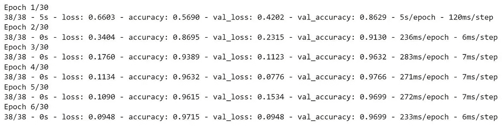

**绘制精度图:**

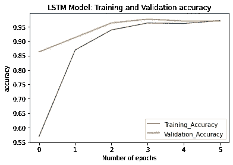

**绘制损失图:**

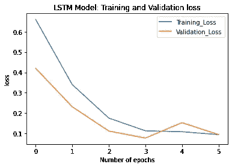

**打印列车精度和有效数据:**


## **6.3 双向长短期记忆(双 LSTM)**

双向 LSTM(bil STM)是一种序列处理模型，由两个 LSTM 组成:一个接收正向输入，另一个接收反向输入。BiLSTMs 有效地增加了网络可用的信息量，改善了算法可用的上下文(例如，知道句子中哪个单词紧跟在哪个单词之后和之前)。与标准 LSTM 不同，双 LSTM 的输入是双向的，它能够利用双方的信息。它也是一个强大的工具，用于在序列的两个方向上对单词和短语之间的顺序依赖性进行建模。

BiLSTM 增加了一个 LSTM 层，它逆转了信息流的方向。简而言之，这意味着输入序列在附加的 LSTM 层中向后流动。然后，我们以几种方式组合来自两个 LSTM 层的输出，例如平均、求和、乘法或级联。

为便于说明，展开的 BiLSTM 如下图所示:

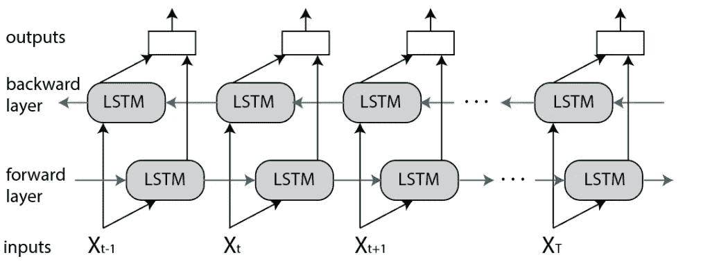

Source: [https://www.baeldung.com/cs/bidirectional-vs-unidirectional-lstm](https://www.baeldung.com/cs/bidirectional-vs-unidirectional-lstm)

**定义双 LSTM 模型架构:**

```
model2 = Sequential()
model2.add(Embedding(vocab_size,
                     embedding_dim,
                     input_length = max_len))
model2.add(Bidirectional(LSTM(n_lstm,
                              return_sequences = False)))
model2.add(Dropout(drop_lstm))
model2.add(Dense(1, activation='sigmoid'))
```

**模型概要:**

```
model2.summary()
```

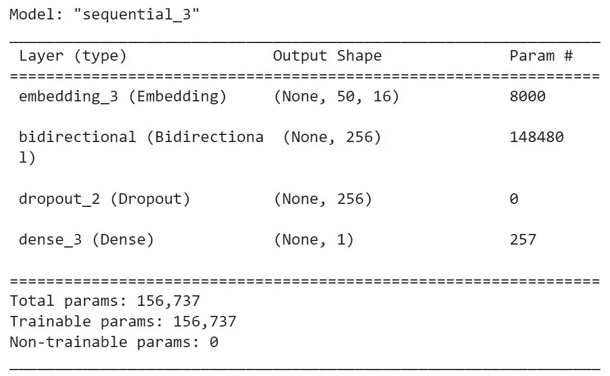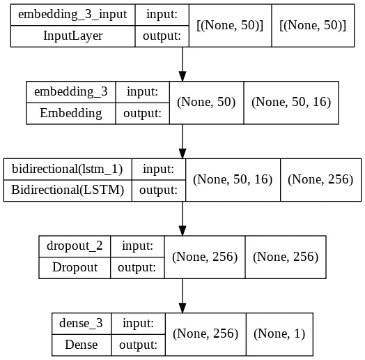

**编译模型:**

```
model2.compile(loss = 'binary_crossentropy',
               optimizer = 'adam',
               metrics=['accuracy'])
```

**训练模型:**

```
num_epochs = 30
early_stop = EarlyStopping(monitor = 'val_loss',
                           patience = 2)
history = model2.fit(training_padded,
                     y_train,
                     epochs = num_epochs,
                     validation_data = (testing_padded, y_test),
                     callbacks = [early_stop],
                     verbose = 2)
```

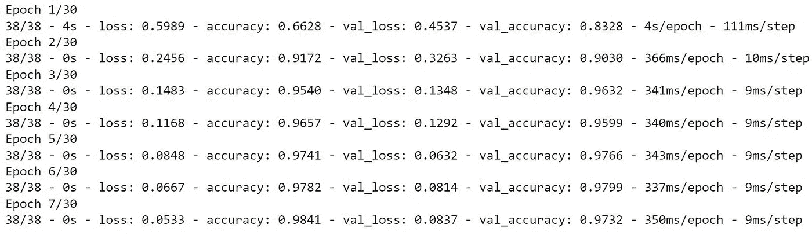

**绘制精度图:**

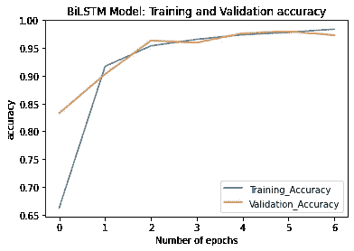

**绘制损失图:**

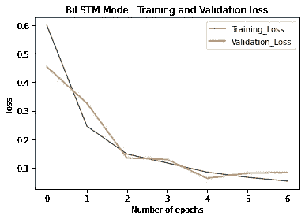

**打印列车精度和有效数据:**

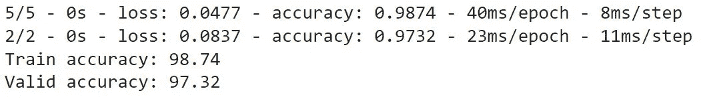

## **6.4 门控循环单元(GRU)**

门控递归单元或 GRU 是一种递归神经网络。它类似于 LSTM，但只有两个门——一个复位门和一个更新门，并且明显缺少输出门。更少的参数意味着 gru 通常比 LSTM 同行更容易/更快地训练。

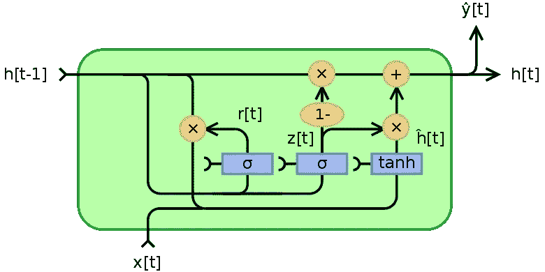

Source: [https://paperswithcode.com/method/gru](https://paperswithcode.com/method/gru)

**定义 GRU 模型架构:**

```
model3 = Sequential()
model3.add(Embedding(vocab_size,
                     embedding_dim,
                     input_length = max_len))
model3.add(SpatialDropout1D(0.2))
model3.add(GRU(128, return_sequences = False))
model3.add(Dropout(0.2))
model3.add(Dense(1, activation = 'sigmoid'))
```

**模型概要:**

```
model3.summary()
```

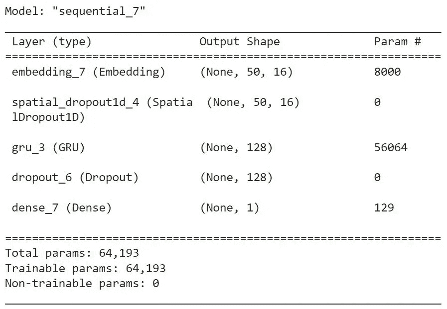

**编译模型:**

```
model3.compile(loss = 'binary_crossentropy',
                       optimizer = 'adam',
                       metrics=['accuracy'])
```

**训练模型:**

```
num_epochs = 30
early_stop = EarlyStopping(monitor='val_loss', patience=2)
history = model3.fit(training_padded,
                     y_train,
                     epochs=num_epochs, 
                     validation_data=(testing_padded, y_test),
                     callbacks =[early_stop],
                     verbose=2)
```

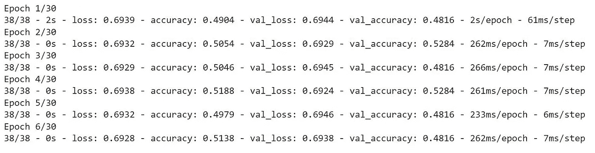

**绘制精度图:**

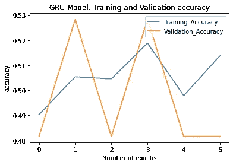

**绘制损失图:**


**打印列车精度和有效数据:**

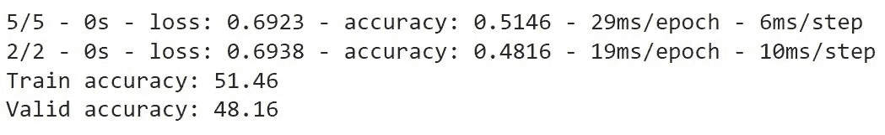

# **比较四种不同型号**

下一步是比较我们使用的四个模型，

```
# Comparing the four different models
print(f"Dense model loss and accuracy: {model.evaluate(testing_padded, y_test)} " )
print(f"LSTM model loss and accuracy: {model1.evaluate(testing_padded, y_test)} " )
print(f"Bi-LSTM model loss and accuracy: {model2.evaluate(testing_padded, y_test)} " )
print(f"GRU model loss and accuracy: {model3.evaluate(testing_padded, y_test)}")
```

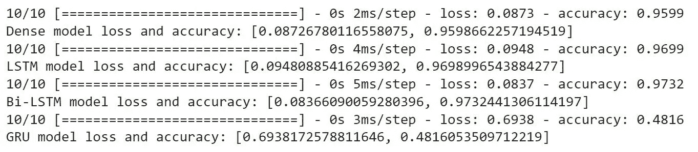

这四个模型的验证损失分别为 0.087、0.095、0.084 和 0.69。验证准确率分别为 95.98%、96.98%、97.32%和 48.16%。

基于损失、准确度和图，我们可以断定双 LSTM 模型是否是该分类情况的最佳模型，验证准确度= 97.32 %，损失= 0.084。

# 预测新邮件的垃圾邮件

根据原始数据中的文本，评估密集模型如何预测/分类它是垃圾邮件还是火腿。下面的第一条消息是**垃圾消息，**而第二条**是**火腿**消息。**

```
**predict_msg** = ["Have friends and colleagues who could benefit from
                these weekly updates? Send them to this link to
                subscribe", "Call me"]**def predict_spam(predict_msg)**:
  new_seq = tokenizer.texts_to_sequences(predict_msg)
  padded = pad_sequences(new_seq,
                         maxlen = max_len,
                         padding = padding_type,
                         truncating = trunc_type)
  return(model.predict(padded))**predict_spam(predict_msg)**
```

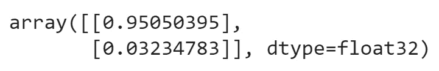

如下图所示，模型正确预测第一句为**垃圾邮件**，第二句为非垃圾邮件或**火腿。**第一句话有 95%的几率是**垃圾信息**。

# 总结:

在本文中，我们使用几个深度学习模型对 [UCL 数据集](https://archive.ics.uci.edu/ml/datasets/SMS+Spam+Collection)进行了二元分类，包括:Dense、LSTM、Bi-LSTM 和 GRU。基于已经进行的实验，得出的结论是 Bi-LSTM 模型是具有最佳性能的模型(在这种情况下)，准确率值为 97.32%，损失值= 0.084。

# 参考资料:

[](https://towardsdatascience.com/nlp-spam-detection-in-sms-text-data-using-deep-learning-b8632db85cc8) [## NLP:使用深度学习检测短信(文本)数据中的垃圾邮件

### TensorFlow2 中使用密集网络、LSTM 和双 LSTM 架构的文本分类

towardsdatascience.com](https://towardsdatascience.com/nlp-spam-detection-in-sms-text-data-using-deep-learning-b8632db85cc8)  [## SMS _ Spam _ Detection _ DNN _ LSTM _ BiLSTM/NLP _ SMS _ Spam _ Detection _ final version _ down sampling _ Dense _ LSTM _ BiLST…

### 通过在 GitHub 上创建一个帐户，为 ShresthaSudip/SMS _ Spam _ Detection _ DNN _ LSTM _ BiLSTM 开发做出贡献。

github.com](https://github.com/ShresthaSudip/SMS_Spam_Detection_DNN_LSTM_BiLSTM/blob/master/NLP_SMS_Spam_Detection_FinalVersion_Downsampling_Dense_LSTM_BiLSTM.ipynb) [](https://www.analyticsvidhya.com/blog/2021/06/5-techniques-to-handle-imbalanced-data-for-a-classification-problem/) [## 什么是不平衡数据|处理不平衡数据的技术

### 本文是作为数据科学博客的一部分发表的，分类问题在

www.analyticsvidhya.com](https://www.analyticsvidhya.com/blog/2021/06/5-techniques-to-handle-imbalanced-data-for-a-classification-problem/) [](https://djajafer.medium.com/multi-class-text-classification-with-keras-and-lstm-4c5525bef592) [## 基于 Keras 和 LSTM 的多类文本分类

### 在本教程中，我们将与克拉斯和 LSTM 建立一个文本分类，以预测 BBC 新闻的类别…

djajafer.medium.com](https://djajafer.medium.com/multi-class-text-classification-with-keras-and-lstm-4c5525bef592) [](https://paperswithcode.com/method/bilstm) [## 论文与代码-比尔斯特姆解释

### 双向 LSTM，简称 biLSTM，是一个序列处理模型，由两个 LSTM 组成:一个在一个

paperswithcode.com](https://paperswithcode.com/method/bilstm) [](https://paperswithcode.com/method/gru) [## 有代码的文件——GRU 解释道

### 门控递归单元或 GRU 是一种递归神经网络。它类似于 LSTM，但只有两个门…

paperswithcode.com](https://paperswithcode.com/method/gru) 

[https://www . bael dung . com/cs/bidirectional-vs-单向-lstm](https://www.baeldung.com/cs/bidirectional-vs-unidirectional-lstm)

[](/mlearning-ai/mlearning-ai-submission-suggestions-b51e2b130bfb) [## Mlearning.ai 提交建议

### 如何成为 Mlearning.ai 上的作家

medium.com](/mlearning-ai/mlearning-ai-submission-suggestions-b51e2b130bfb)