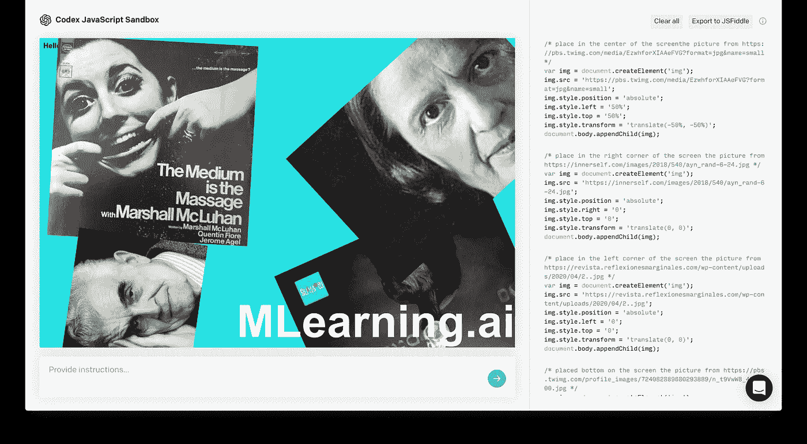

# 法典就是信息

> 原文：<https://medium.com/mlearning-ai/the-codex-is-the-message-ae14f22bd2af?source=collection_archive---------4----------------------->

## [学得更好更快](/mlearning-ai/learning-better-and-faster-7e52615a1b44)

## 提示示例

generated by CODEX

哲学家们已经为 21 世纪初的技术准备了一个基本代码。【2021 年 8 月 10 日改变一切。

这一切将走向何方？还没人知道。世界已经发生了变化，很难说它将从这里走向何方。任何人都可以创造他们能想到的任何东西…