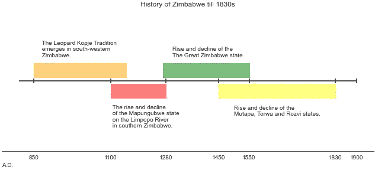
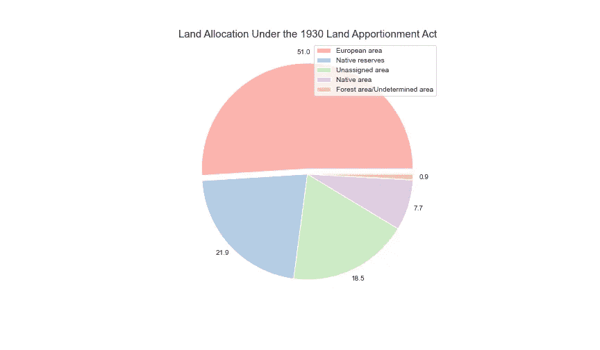
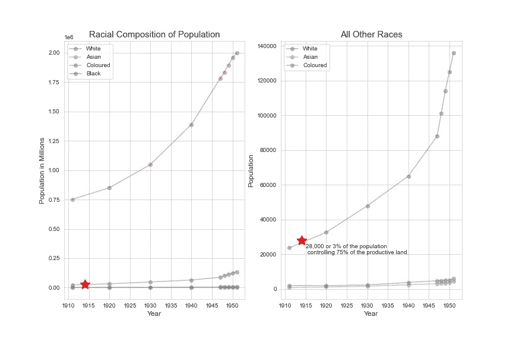
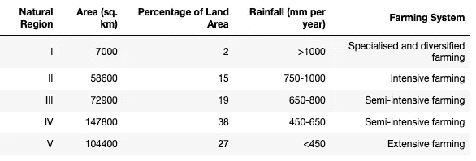
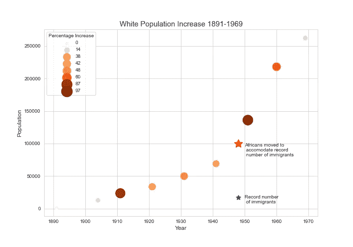
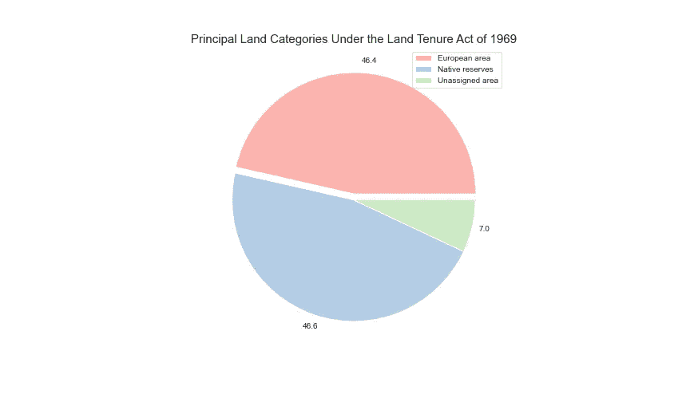

# 津巴布韦奇案第二部

> 原文：<https://medium.com/mlearning-ai/the-curious-case-of-zimbabwe-part-ii-91df7a681cf2?source=collection_archive---------9----------------------->

# **回顾和概述**

《T2》前情提要“我们得到了六个国家的数据集，其中一个是津巴布韦。我注意到津巴布韦在预期寿命方面取得了巨大的进步，甚至超过了同期的其他国家；事实上，它是两个数据集中最大的国家(我把这个数据集和我以前的数据集进行了交叉引用)。

在穷尽了所有的数据之后，我决定去读 T4 大学教授阿洛伊斯·s·姆兰博的《津巴布韦历史》。这本书简要概述了津巴布韦的历史，以前称为罗得西亚，在欧洲人入侵津巴布韦之前，它被称为许多其他的东西。对于一个帖子来说太多了，所以我打算写两个。也许三个。这篇文章将讨论津巴布韦直到 20 世纪 50 年代，为了书中的数据，有时会延伸到这一点。下面是一条从不间断的过去一直延伸到 20 世纪中叶的时间线。

所有的数字、表格、图表和引用都是使用 Alois S. Mlambo 教授的《津巴布韦历史》中的数据复制或创建的。

# 【1900 年以前的历史

(我不喜欢史前这个术语，原因将在下面变得明显，但我想有些人可能会用它来描述这个时期)

在《向前跳跃》中，我们掩盖了大量的历史，我想至少给它一个图表和几个句子。我还想指出，这是真实的历史，尽管有些人会让你认为:

> 也许在将来……会有一些非洲历史可以教。但目前没有:只有欧洲人在非洲的历史。剩下的大部分是…黑暗。黑暗不是历史的主题。
> 
> 休·特雷弗·罗珀教授

这句话有两点令人惊讶:1)它是由牛津的一位教授在 20 世纪 60 年代提出的。2)是他在书中两句引语的驯服者。

但是我们不能花时间指出人们对津巴布韦或非洲说的所有疯狂的种族主义、无知和无礼的事情。我们也不能花太多时间谈论居住在现在称为津巴布韦的国家的原始居民，除了说这个国家以一个在非洲大陆上仅次于金字塔的建筑命名真是太棒了。我还要补充一点，姆兰博教授的书让我想读一读南部非洲的国王们，他们只是从 1986 年流行的电视迷你剧里听说过沙卡祖鲁。

然而，不幸的是，沉湎于那段有趣而不为人知的历史无助于回答我最初的问题。在过去的 50 年里，津巴布韦的预期寿命发生了什么变化？所以我们继续吧。

姆兰博教授记录了 1830 年至 1900 年间发生的五个关键事件:

19 世纪 30 年代——逃离姆费坎和布尔移民的恩德贝勒人向北迁移，定居在今天的马塔贝莱兰。

1888 年的今天，阿曼德布尔的统治者洛本古拉被骗签署了陆克文让步协议，这份文件实际上是将他的权力交给了塞西尔·约翰·罗兹和他的合伙人。

1889 年的今天，塞西尔·约翰·罗兹利用陆克文的特许权作为法律基础，从英国政府那里获得特许，让他新成立的英国南非公司(BSAC)占领津巴布韦。该公司被授权占有和管理土地，组建自己的警察部队，并在自己的边界内建立定居点。

1890 年——由 mining magnet(原文如此？)塞西尔·约翰·罗兹从南方来到了索尔兹伯里堡，也就是未来首都哈拉雷的所在地。

1893 年的今天，反对 BSA 统治的恩德贝勒起义被镇压。

让我们从先锋专栏的时代快进到现在。在我们在上一篇文章中提到的文章中，穆加贝被单独挑出来作为津巴布韦问题的原因。那么，他为什么上台？他在独立后掌权。为什么会有独立运动？如果我们能找到导致独立运动的原因，我们就能找到是什么导致穆加贝把津巴布韦搞垮。问题是，这些独立运动从来没有这么简单—

> 我可以深入研究立法、居住、经济机会、教育中的歧视理论。我可以深入探讨这个问题，但我将仅限于土地问题，因为我认为这是非常基本的问题。对我们来说，剥削的本质，白人统治的本质，是对土地的统治。这是真正的问题。
> 
> -非洲民族联盟主席赫伯特·契特波

好吧，是的，我听到了，但那是一个人的—

> 非洲人的问题是没有土地，这是他们痛苦的原因。

没错，但这并不意味着

> 津巴布韦的解放战争主要是为了土地问题。

好吧，好吧。这个土地问题好像有点问题。让我们来看看。

# **土地**

在《T4 津巴布韦历史》中，这被称为“津巴布韦土地上种族隔离的大宪章”种族隔离一直存在。现在它被正式化了，给欧洲人的土地是给非洲人的两倍。有两倍多的欧洲人吗？

当然不是，但你已经知道了。你可以看到欧洲人口增加了，但从未接近非洲人口。两个图表上的星星代表完全相同的点。左边的图表显示了这一点与非洲人口的关系。右图显示了除土著非洲人以外的所有种族的情况。标题告诉我们，不仅白人控制了不成比例的土地，而且它还详细描述了即使分给土著人的贫瘠土地也很难适合农业，当然也无法养活大量的非洲人口。

根据津巴布韦的历史，80%的人口生活在所谓的非洲保护区，即第四和第五区，那里的农作物生产很困难。

当非洲人为生存而挣扎时，白人继续增加他们的数量，即使许多人在移民后不久就离开了。下面是一张更详细的图表，显示了白人定居者逐年增加的情况:

请注意图上的星星。1948 年，17，000 名欧洲人搬进来，因此 100，000 名非洲人不得不搬走以腾出空间。不成比例。20 世纪津巴布韦的历史充满了这样的事件:非洲人被迁离他们的土地去安置白人，或者被法律强迫去卖牛，或者不得不去耕种最不理想的土地。

因此，可以肯定地说，独立战争的一个主要原因，几乎肯定是主要原因，是因为土地问题。稍后会有更多，但首先，

# **短暂的文学插曲……**

碰巧在我做这项研究的时候，我去了中国南京当地的外文书店，买了一本阿加莎·克里斯蒂的小说，*《穿棕色西装的人》。*我读过马普尔女士的每一部小说，除了一本波洛的书(我不想读波洛的死亡)，所以我买了这本书，没有看阿加莎·克里斯蒂的《我爱任何东西》的情节。事实证明，这本书出版于 1924 年，部分故事发生在南非，包括南非和罗得西亚。它能告诉我们当时大英帝国的心态是什么？

在去罗得西亚/南非的船上:

> 我们那桌只有四个人，我自己，几个老太太，还有一个传教士，他大谈“我们可怜的黑人兄弟”(69)

当时确实有许多传教士，他们留下了混合的遗产，姆兰博教授谈到了这一点。可以这样总结:他们做了一些好事(一些人推动教育，另一些人认为非洲人是人类的一员)和一些坏事(将他们的宗教强加给土著人民，支持并参与压迫制度)。

稍后在*穿棕色西装的男人*:

> "这是你第一次来南非吗？"我健谈地问道。
> 
> “去南非，是的。但过去两年，我一直在东非内陆的食人部落中工作。”
> 
> “多么惊心动魄！你有过很多次九死一生吗？”
> 
> “越狱？”
> 
> “我的意思是被吃掉？”
> 
> "你不应该如此轻率地对待神圣的话题，贝丁菲尔德小姐."( 85–86)

只是在东非闲逛试图让野蛮人不要自相残杀。没什么大不了的。

在第 89 页，我们得到了更有趣的东西:

> …雷斯上校真的是我理想中严厉、沉默的罗得西亚人。也许我会嫁给他！

在我看来，这意味着这个种族一直站在前线，面对危险，从非洲人手中窃取土地。多梦幻啊！

《后来的种族》和《贝丁菲尔德蜡》对非洲进行了诗意的/哲学的阐释:

> “一定曾经有过巨人，”我梦呓般地说。“他们的孩子就像今天的孩子一样——他们玩一把把鹅卵石，把它们堆起来，又把它们敲下来，他们越巧妙地平衡它们，就越高兴。如果让我给这个地方起个名字，我会叫它巨人之国。”
> 
> “也许你比你知道的更接近目标，”种族上校严肃地说。“简单、原始、庞大——这就是非洲。”
> 
> 我赞赏地点点头。
> 
> “你爱它，不是吗？”我问。
> 
> “是的。但是在里面生活久了——嗯，就会使人变得你所说的残酷。一个人把生死看得很轻。”(198)

我想知道，一个人对谁变得残酷？

在书中很久以后，安妮(贝丁菲尔德女士)找到了她的一个小伙子(不是种族)，他们正在享受一种原始的幸福:

> 那是一个奇怪的时代。我们与世界隔绝，像亚当和夏娃一样孤独地生活在一起——但这又有什么不同呢！老巴塔尼在附近徘徊，数数也不比一只狗多。(218)

老巴塔尼当然是“本地人”。

姆兰博教授引用了多丽丝·莱辛的《青草在歌唱》一书，该书在《T2》之后 28 年出版。我读它是因为姆兰博教授提到了它。莱辛的书对罗得西亚人持批评态度，所以书中的引用只是描述，而不是像阿加莎·克里斯蒂(Agatha Christie)在游历南非后写的书那样的热情支持。

> 他曾经在盛怒之下杀死了一个土著人。他被罚款 30 英镑。(14)
> 
> 几个月后，当他“习惯了这个国家”时，他会更好地理解这一切。然后，他会尽最大努力忘记这些知识，因为如果一个人想继续成为社会中被接受的一员，与肤色歧视的所有细微差别和含义生活在一起就意味着对许多事情关闭心灵。(32)
> 
> 每当两个或三个农民聚在一起，这是法令，他们应该讨论除了当地人的缺点和不足。他们谈论他们的劳工时，声音中带着持续的愤怒:他们可能喜欢土著人，但作为一个群体，他们厌恶他们。他们厌恶他们到了神经官能症的程度。他们从未停止抱怨他们不幸的命运，不得不与当地人打交道，这些人对白人的福利漠不关心，只为取悦自己而工作。他们不知道劳动的尊严，不知道通过努力工作来提高自己。(105)
> 
> 而且，真的，她很喜欢。成为大约 80 名黑人工人的老板的感觉给了她新的信心；这是一种很好的感觉，让他们服从她的意志，让他们按照她想要的去做。(158)
> 
> 正是这种对工作的态度造就了白人:白人工作是因为工作有益，因为没有报酬的工作证明了一个人的价值。
> 
> 这个小演讲的短语自然地来到她的嘴唇:她不需要在她的脑海里寻找它们。她经常从她的父亲那里听到这些，当他在教训他的土著仆人的时候，它们从她大脑中保存她最早记忆的部分涌出。(161)

在我重印整本书之前，我就讲到这里。重点是这些段落表明了一种普遍的态度。一种根深蒂固的优越感，一种对勇敢、殖民者的正义、对“土著”不适合其人民一直居住的土地(尽管班图扩张)的看法。它之所以重要，是因为它引入了一个数据中无法解释的因素。这就是为什么姆兰博教授把它列入他的学术研究，也是为什么把它列入这里。不是拿一个民族的土地那么简单；这是一种心理解构，是一种教育“本地人”和所有白人(不管是新来的还是国外的)的程序，这是土地被夺走的正当理由。这种观点不那么侮辱人，但同样不真实的版本是，土地坐在那里将被浪费。这一前提的更具侮辱性的延伸是，邻近该土地的人(理解为:不在该土地上，因为这将涉及积极使用该土地)在能力、倾向或意愿方面都不适合使用该土地。

## 插曲结束。

但就这样，土地问题并没有好转。伯纳德·威利认为，“打个比喻来说，《土地保有法》是这个国家种族歧视的‘宪法’。”该法案是在《土地分配法》通过近 40 年后通过的。

所以，最终还是要着陆。这是推动一切运动的动力。这就是我们如何从罗得西亚到津巴布韦，到穆加贝，再到预期寿命是—

> …非洲医院也长期人满为患。例如，虽然全国 232，422 名白人约有 280 名医生，但 1978 年 700 万非洲人只有 850 名医生……同样，非洲人的预期寿命为 49.8 岁，而白人为 66.9 岁。

1978 年，非洲人的预期寿命约为 50 岁。22 年后，这一数字降至 44 岁。这与其他一些关于预期寿命下降幅度的说法相去甚远，除非你不按种族划分变量。会不会是预期寿命下降的同时，预期寿命更长的白人从这个国家大量外流？

这将需要更多的数据和更多的阅读。敬请关注。

还做了一个相关的播客[在这里](https://soundcloud.com/bobby-wilson-588095918/alois-mlambo-a-history-of-zimbabwe?si=bde4fff9f76d4f38b9d3f52abc976edb&utm_source=clipboard&utm_medium=text&utm_campaign=social_sharing)。

 [## Mlearning.ai 提交建议

### 如何成为 Mlearning.ai 上的作家

medium.com](/mlearning-ai/mlearning-ai-submission-suggestions-b51e2b130bfb)