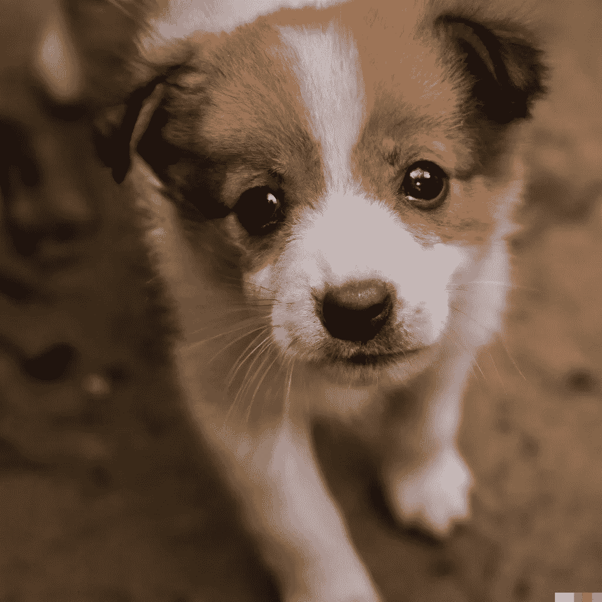
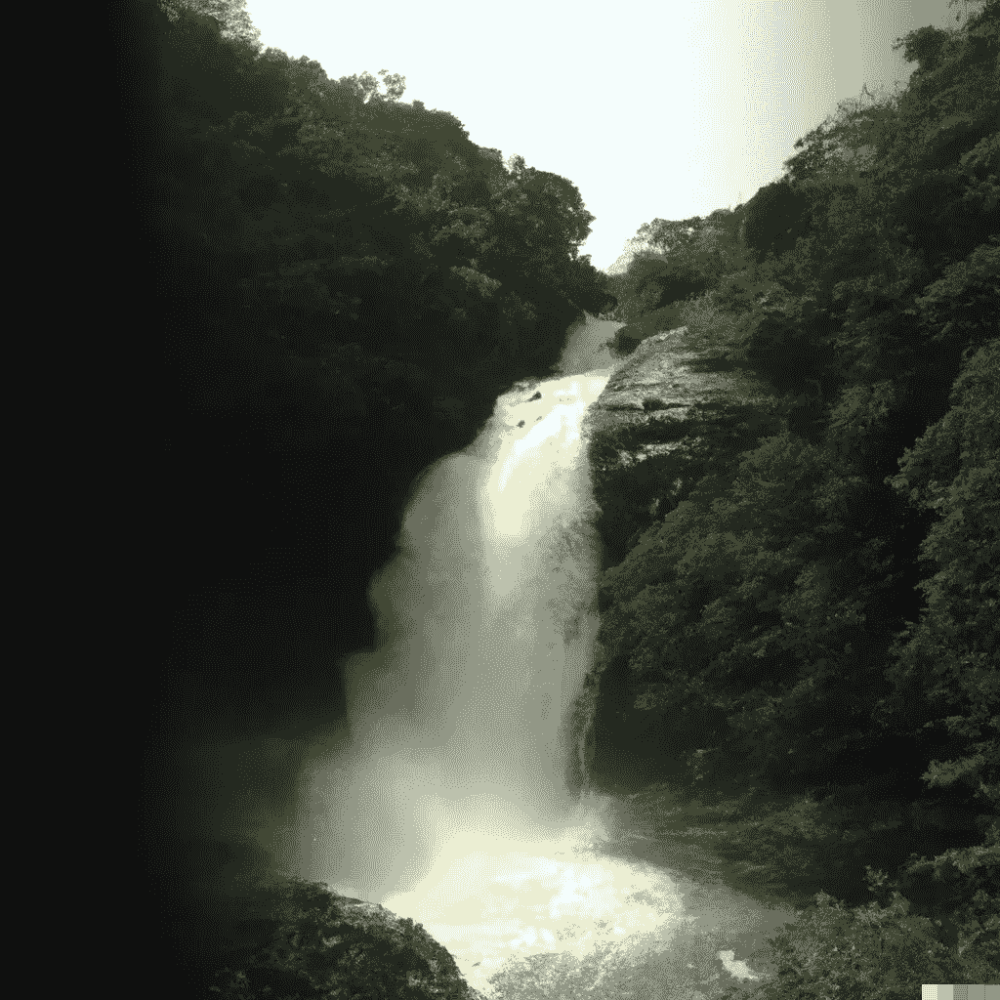
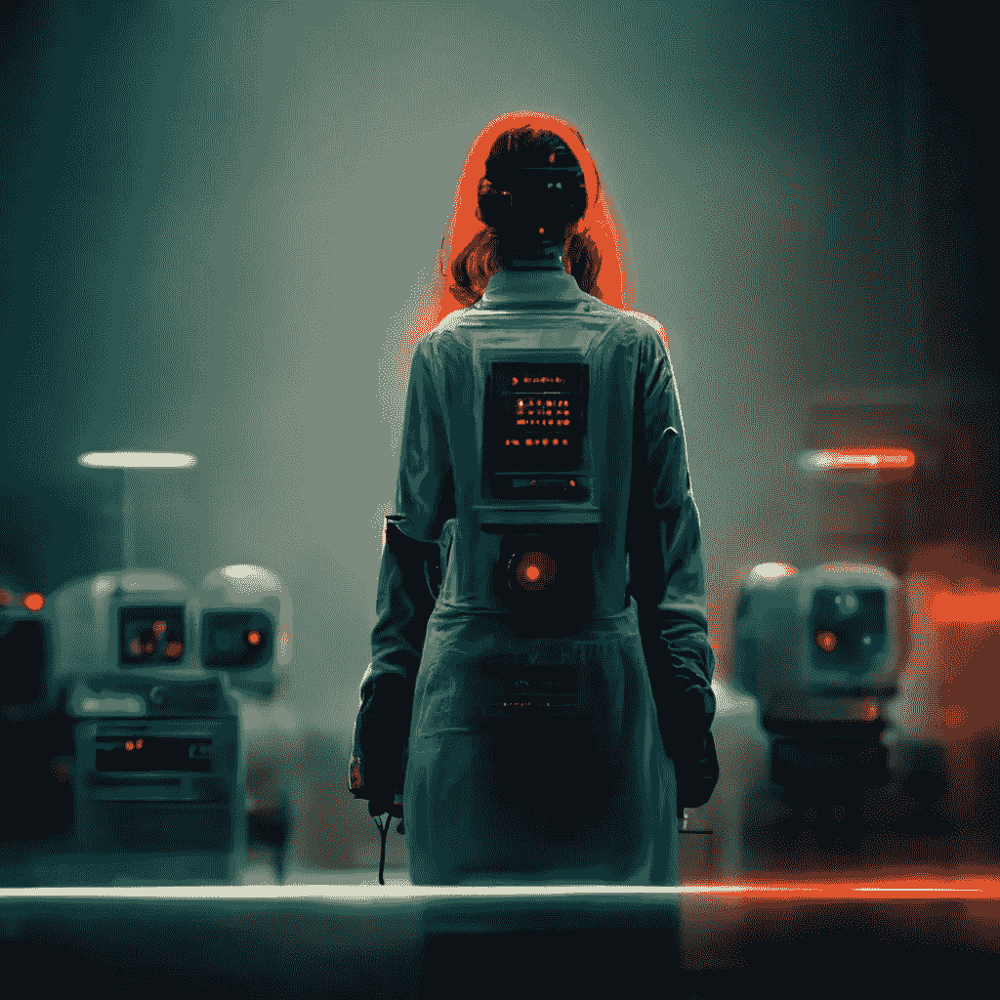

# 人工智能的日常艺术作品

> 原文：<https://medium.com/mlearning-ai/the-daily-art-work-of-artificial-intelligence-a8050c42b293?source=collection_archive---------5----------------------->

Dall-E 和 mid journey 刚刚掌握了绘画

# 介绍

基于人工智能的模型 Dall-E 和 mid journey.ai 可以在几分钟内创建艺术和图像。这些人工智能模型从数百万张图像的数据集学习，并在接受训练的同时绘制它们看到的东西。结果非常逼真，图像甚至可以愚弄人类！

这些模型是使用深度神经网络创建的，深度神经网络是一种机器学习技术，用于创建模拟人脑工作方式的人工智能系统。

Image generated by Dall-E

深度神经网络通过使用大型数据集来训练计算机算法，这些算法使用这些数据点来识别图像或视频中的模式。一旦在数据集上训练了算法，它就可以用于识别新图像中的项目，而不必每次都在相同的训练集上重新训练。

# 深度学习:神经网络变得简单

深度学习始于由多层处理单元组成的神经网络。每一层都为正在处理的信息增加了一个新的维度，可以有数百或数千个单元。

神经网络的第一层称为输入层，它处理输入数据。例如，如果您使用图像识别软件来识别图像中的对象，该软件将使用输入图层将图像中的每个像素识别为“对象”或“背景”

输出层是信息被处理并传递到网络其他部分的地方。随后，后续层可以使用该输出来完善对所查看内容的理解。例如，如果您使用图像识别软件来识别图像中的对象，该软件将使用输出图层将图像中的每个像素识别为“对象”或“背景”

Image generated by Dall-E

# 大量训练数据

人工智能算法不是为执行特定任务而设计的；取而代之的是，给机器一个大的训练数据集。这些数据的目标是训练机器识别图像中的模式。

学习过程包括两个步骤:首先，神经网络将用于识别图像中的不同对象；第二，这些结果将与以前试验中的其他类似图像进行比较。如果与任何先前的图像都不匹配，或者如果存在不匹配，那么将使用不同的方法重新训练网络，直到它能够正确地识别所有的对象。

# 达尔-埃

DALL-E 是一个可以从文本输入生成图像的模型。该模型已使用 ImageNet 数据集的数据进行了训练，该数据集包含超过一百万张图像。

该模型将英语句子作为输入，并输出图像。它通过对输入句子应用一系列变换来生成输出图像。这些转换使用层来完成，一层的输出成为另一层的输入。

第一层从给定的句子中生成一系列单词(例如，“猫打了个哈欠”)。然后，它对每个单词使用不同的变换来创建一系列图像(“cat”= >“kitten”，“thiated”= >“extended out”)，并将它们加在一起(“kitten”+“thiated”)。这创建了不同部分在不同时间显示的图像(例如，伸展)。

第二层然后获取这些图像并对它们应用一些变换(例如，顺时针旋转它们 90°)，使得它们现在以特定顺序显示(例如，从右到左)。最后，它将所有这些图像相加并生成一个图像。

# mid travel . ai

MidJourney 是一个新工具，可以将任何想象从文本变成艺术品。你可能在过去见过一些由这个概念产生的混乱的艺术，但 MidJourney 创作的最终艺术作品肯定会让你惊叹不已——它们是独一无二的，其中一些令人惊叹。我们被这个文本到图像的概念迷住了，所以我们申请成为这个工具的测试版的一部分。我们花了几天时间玩它，玩得很开心！

Mid Journey Generated image

# 人工智能在各行业的普及

好消息是，这些方法可以应用于语音识别、计算机视觉、自然语言处理和其他领域。坏消息是，用于这些任务的学习算法是出了名的难以理解。

作为这个问题的一个例子，考虑我们如何教计算机如何识别猫。我们可以从 YouTube 视频或谷歌图片上的一些猫的图片开始。然后我们在这些图像上训练我们的模型，看看它在不同的任务上表现如何，比如识别一张照片是不是猫。在这个过程的几次迭代之后，我们将有一个模型可以识别大多数照片是猫，但它也很难区分狮子和老虎的照片(后者更难，因为它们有斑点而不是条纹)。

# 外卖食品

艺术中的人工智能是一个前所未闻的想法，但现在它已经司空见惯了。每天有更多的程序员和开发人员从事艺术项目，也有更多的渠道让这些作品接触到观众。随着这一领域在未来几年的成长和发展，它无疑将改变我们对艺术及其创作的看法。如果你对人工智能及其对创造性艺术的影响感兴趣，有许多令人惊叹的网站可以让你进一步探索这个令人兴奋的领域。

 [## Mlearning.ai 提交建议

### 如何成为 Mlearning.ai 上的作家

medium.com](/mlearning-ai/mlearning-ai-submission-suggestions-b51e2b130bfb)