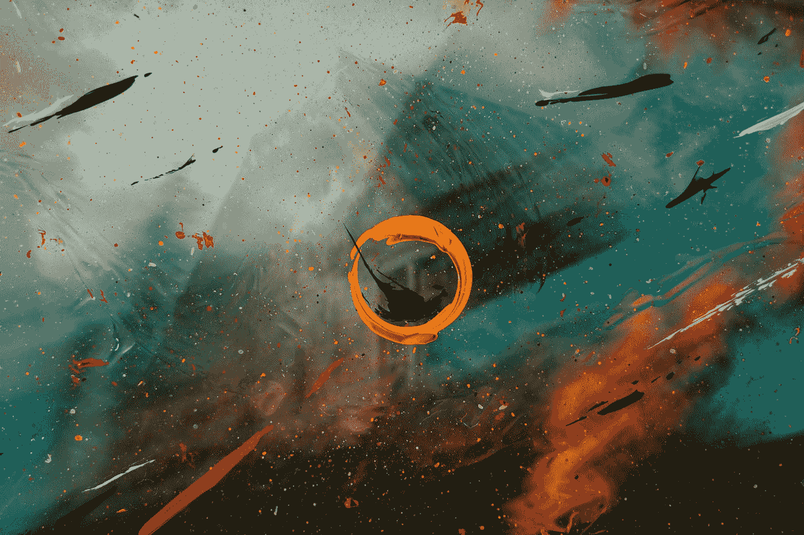

# 图像生成中的多模态学习

> 原文：<https://medium.com/mlearning-ai/the-dall-e-2-multimodal-learning-in-image-generation-45d8ebbb1dc0?source=collection_archive---------5----------------------->

## DALL E 2 是用于图像的 GPT-3。

Photo by [Jr Korpa](https://unsplash.com/@jrkorpa?utm_source=medium&utm_medium=referral) on [Unsplash](https://unsplash.com?utm_source=medium&utm_medium=referral)

**简介**

DALL E 2 是一个基于扩散模型和反转剪辑的文本条件图像生成器。插入文本作为输入。DALL E 2 将输出与文本匹配的图像。

> DALL E 2 的等候名单在第一周就超过了 10 万人…