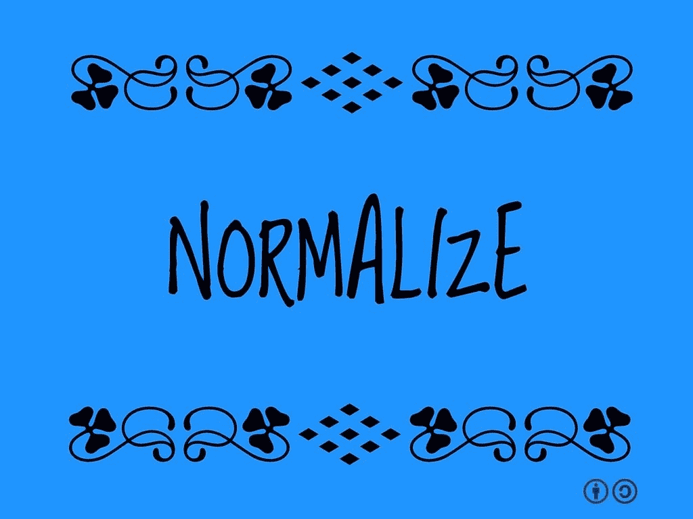

# 标准化对数据集预测的影响

> 原文：<https://medium.com/mlearning-ai/the-effect-normalisation-has-on-making-predictions-on-datasets-bf1563ef8078?source=collection_archive---------1----------------------->

由于我一直在学习 Udacity 的《机器学习入门》课程，所以我遇到了关于规范化的课程。规范化是将数据集中的值转换为从 0 到 1 的值的过程，因为这样更容易获得准确的预测。标准化数据的公式如下