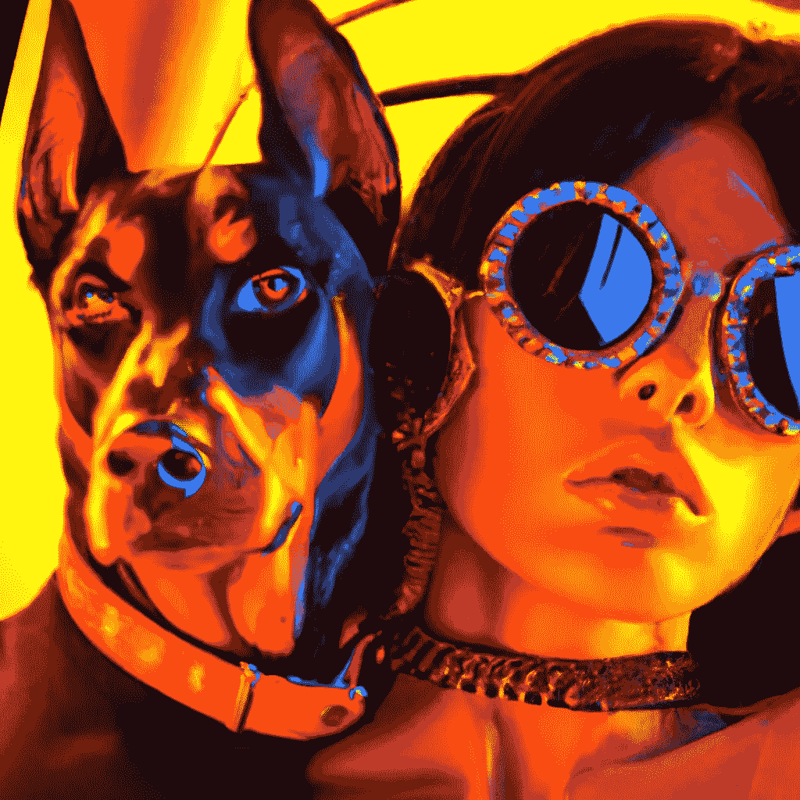

# Photoshop 时代的终结

> 原文：<https://medium.com/mlearning-ai/the-end-of-the-photoshop-era-a4777e981320?source=collection_archive---------0----------------------->

## [人工智能生成艺术](https://mlearning.substack.com/p/new-ai-art-generators-you-should?r=z7zu8&s=w&utm_campaign=post&utm_medium=web)

## 只有 [AI 艺术](/mlearning-ai/ai-generator-photo-datasets-find-your-image-used-to-train-ai-art-f9c6c1beed84)插件才能让 Adobe 焕发生机。【萤火虫更新 2023 年 3 月】

[Results of proposed AI plug-ins](https://evartology.substack.com/p/how-ai-art-is-revolutionizing-photoshopping?r=9hp4d&s=w&utm_campaign=post&utm_medium=web), [have i beentrained](/mlearning-ai/ai-generator-photo-datasets-find-your-image-used-to-train-ai-art-f9c6c1beed84)

[**机器学习艺术**](https://mlearning.substack.com)Photoshop 的插件，通常被称为“人工智能插件”，是为照片添加新的[人工智能生成](https://mlearning.substack.com/p/run-your-private-ai-art-generator?r=z7zu8&s=w&utm_campaign=post&utm_medium=webv)效果或执行 Adobe Photoshop 单独无法完成或表现不佳的工作的附加应用程序。