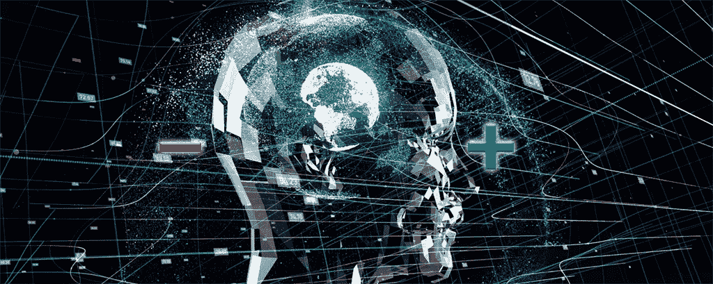

# 人工智能的伦理，概述

> 原文：<https://medium.com/mlearning-ai/the-ethics-of-artificial-intelligence-an-overview-870f6595492a?source=collection_archive---------3----------------------->

Issac Asimov 为机器人在社会中的道德运作提出了一套著名的三定律。

第一定律
机器人不得伤害人类，也不得坐视人类受到伤害。
**第二定律**
机器人必须服从人类给它的命令，除非这些命令与第一定律相冲突。
**第三定律**
机器人必须保护自己的存在，因为…