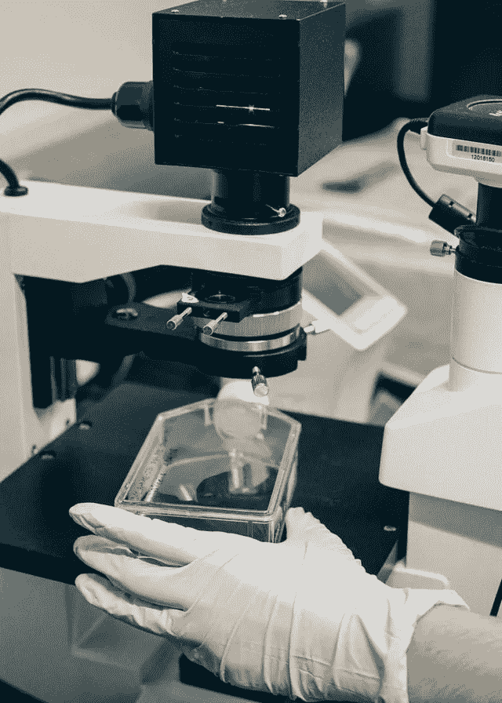

# 医学深度学习模型的评价

> 原文：<https://medium.com/mlearning-ai/the-evaluation-of-medical-deep-learning-models-af4035115afa?source=collection_archive---------3----------------------->

Photo by [Jaron Nix](https://unsplash.com/@jaronnix?utm_source=unsplash&utm_medium=referral&utm_content=creditCopyText) on [Unsplash](https://unsplash.com/s/photos/medical-robot?utm_source=unsplash&utm_medium=referral&utm_content=creditCopyText)

随着**人工智能**尤其是**医疗**领域的**深度学习**技术的快速发展，研究和学习也在增加。**机器学习**在诊断方面的贡献无疑会让 Z 世代的年龄提高到 100 级…

如果我们回到现在，我认为对深度学习模型的评估，解释和解释…