# 啤酒年销售量的影响因素——时间序列分析中的线性模型

> 原文：<https://medium.com/mlearning-ai/the-factors-of-yearly-beer-sales-linear-model-in-time-series-analysis-9666dd6cd4d9?source=collection_archive---------1----------------------->

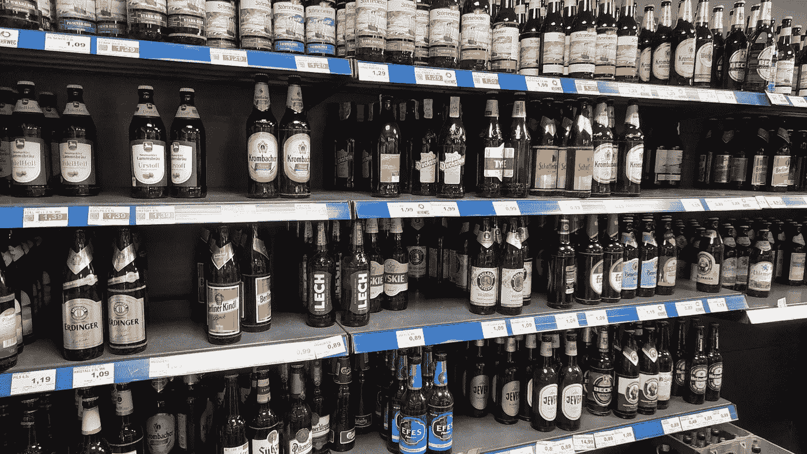

Beer in Supermarket!

啤酒是德国最著名的饮料之一，当然也是德国文化的一部分！柏林的一家杂货配送公司收集了全年的啤酒销售和其他因素的数据。他们想知道哪个因素对啤酒销售很重要，并据此调整他们的商业策略。

所有的代码和原始数据都可以在 Github 的[这里](https://github.com/WHPAN0108/DurstExpress_exercise)找到

# 数据

该数据集包含 2019 年每一天的以下值:

*   售出的啤酒箱数
*   日照时间
*   公共假日(0 或 1)
*   以摄氏度为单位的平均温度

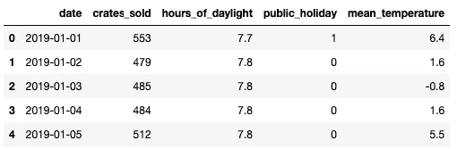

data for the sales

# 探索性分析

在运行任何模型之前，我们希望更深入地了解数据。

*   **时基数据趋势—每日**

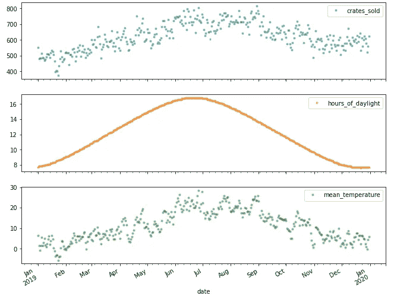

我们可以看到销售肯定与日照时间和温度有关(一点也不奇怪，谁不喜欢夏天喝啤酒呢？)

*   **时基数据趋势—工作日**

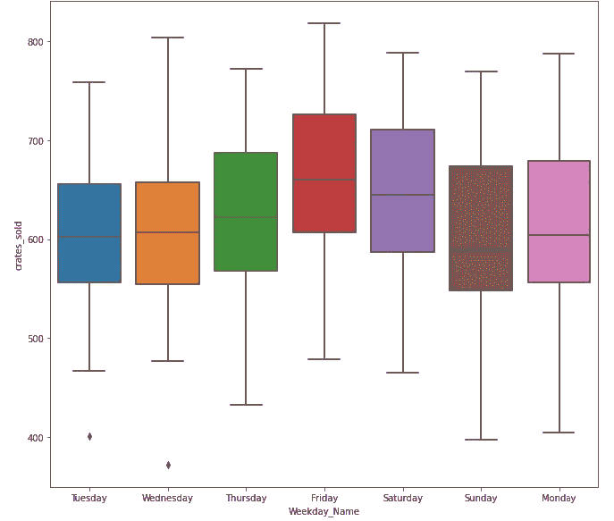

weekday trend for the beer sale

我们可以看到`crates_sold`在周四、周五和周六更高(也不奇怪)。

# 因变量之间的相关性

我计算相关性并绘制出`hours_of_daylight`和`mean_temperature`的散点图。相关性非常高(Pearson 相关性 0.801)，这可能会导致模型中的共线性问题。

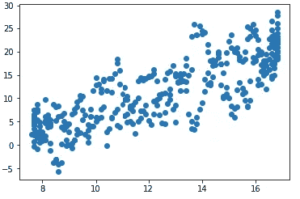

correlation between temperature and daylight

# 简单线性模型

由于`hours_of_daylight`和`mean_temperature`的高度相关性，我们只将`mean_temperature`放入模型中以避免共线性。我试图将交互作用放入模型中，但是交互作用项并不重要。所以我选择最终的模型只有主效果。

```
mod = smf.ols(formula='crates_sold ~ mean_temperature+public_holiday', data=data)
reg = mod.fit()
model_norm_residuals = reg.get_influence().resid_studentized_internal
print(reg.summary())
```

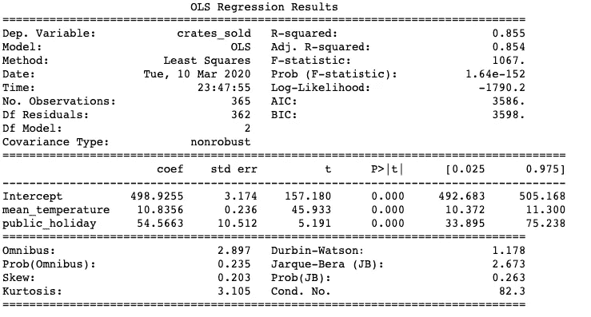

Result of the simple linear model

# 简单线性模型的模型诊断

线性模型的假设:残差应该是

1.  平均值等于 0 的正态分布
2.  等方差
3.  身份证

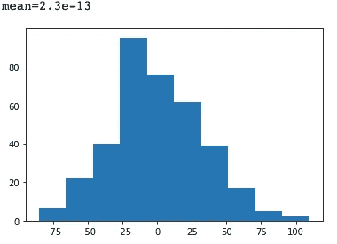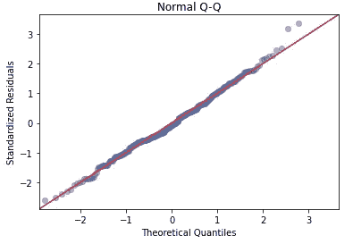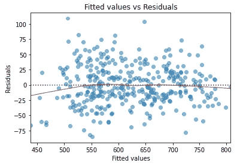

Residual histogram and QQ-plot

看起来正态性很好，但是残差之间的相关性如何呢？

这不是随机的……意味着它们在某种程度上是相关的

# 自相关

误差应该相互独立。但是在下面的图中，我们可以看到 **7** 的趋势，这可能表明误差项与工作日有关。

```
acf = smt.graphics.plot_acf(reg.resid, lags=40 , alpha=0.05)
acf.show()
```

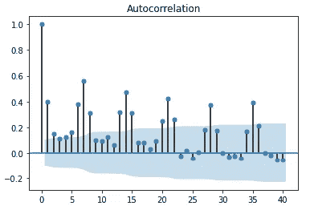

我们可以看到在 7 天的时间里有三个高峰，分别是周四、周五和周六的比赛。

# **通过添加新功能重新建模**

我在模型中添加了工作日(星期四、星期五、星期六)、月份(3-12)

```
mod_final = smf.ols(formula='crates_sold ~ mean_temperature +public_holiday +Weekday_Name_Friday + Weekday_Name_Saturday + Weekday_Name_Thursday  + Month_3 + Month_4 +Month_5 + Month_6 + Month_7 +Month_8 +Month_9 + Month_10 + Month_11 + Month_12', data=new_data) 
reg_final = mod_final.fit()print(reg_final.summary())
```

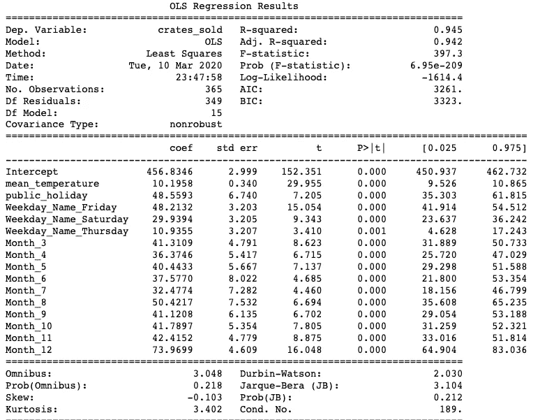

# 再次模型诊断

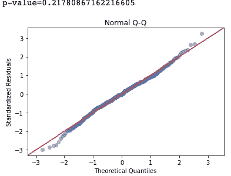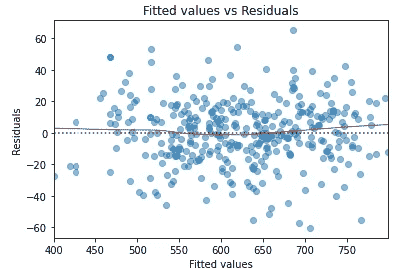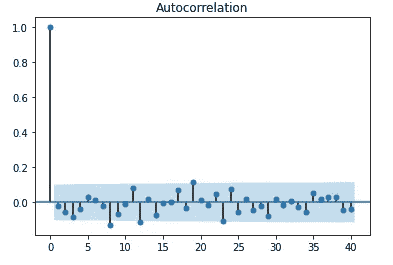

自相关没了！！！！！！！

# 结论和意见

最终模型与数据非常吻合，残差符合模型假设。

# 关注:

模型的 R 平方为 0.94。这是极高的，甚至有点不寻常。这可能是由于过度拟合。为了解决这个潜在的问题，我将使用更多的历史数据来验证这个模型。

# 业务备注:

1.  制定销售策略:
    根据数据，某些工作日和月份的销售情况较低。我们可以建议营销团队在那几天提供特别优惠来增加订单。
2.  做好资源安排的计划:
    销售情况高度依赖季节。我们可以调整送货司机/车辆的安排。这种布置也可以应用于饮料储存。
3.  城市间的差异:
    该数据来自柏林。在其他城市新开市场时，可以这个模型为基线，我们可以根据真实的数据来改变模型结构。

# PS。

*这是我在 2020 年申请一家在线饮料配送公司的数据科学家职位时的一次练习。它曾经是我梦想中的公司之一。可惜我没入选，不过从另一方面来说，这也不算太差。几个月后，这家公司与另一家公司合并了，许多员工被解雇了。也许这是上帝给的。*

*在面试中，我认识了那里的一位数据科学家，我们甚至一起吃了顿饭，这是一次很好的经历！很荣幸认识* [*丹尼尔*](https://www.linkedin.com/in/dwolfeu/) *:)*

[](/mlearning-ai/mlearning-ai-submission-suggestions-b51e2b130bfb) [## Mlearning.ai 提交建议

### 如何成为 Mlearning.ai 上的作家

medium.com](/mlearning-ai/mlearning-ai-submission-suggestions-b51e2b130bfb)