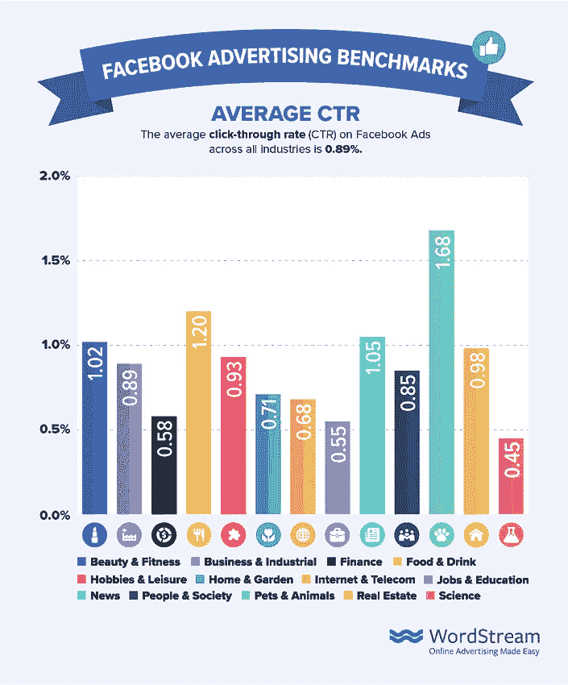

# 数据驱动营销的谬误

> 原文：<https://medium.com/mlearning-ai/the-fallacy-of-data-driven-marketing-24db401029f0?source=collection_archive---------1----------------------->

是什么促使人们*回应*(点击、喜欢、分享、评论)，并从你的营销努力中转化(购买、试用、注册、订阅)？这是一个非常重要的问题，因为营销就是让人们做我们指导他们做的事情，或者采取一个*行动*。

在*的基础上，所有的*营销都是**心理**的实践。为了有效地进行营销——激励人们购买我们的产品或相信我们的信息——我们必须监控、分类并试图理解人类行为。

大数据科学对人的*动作*进行监测和分类，而不是 ***行为*** 。虽然数据科学家会告诉你他们跟踪行为，但他们真正想说的是他们跟踪购买，计算机无法判断这些是给你个人的、职业的还是给别人的礼物。它们可以跟踪你阅读电子书或在线观看电影的时间，但无法判断你是在看电影还是一直盯着手机。

当*脸书、谷歌、Instagram* 正在“分析”你的订阅源，试图对你的文字和图片帖子进行分类时，他们的电脑，甚至更糟的是，他们的营销部门(依靠大数据)，对你几乎一无所知。

我用大这个词是因为没有大量的数据，就没有数据分析的科学。大数据可以识别行为的总体模式，这可以在对极大量的人群进行营销时应用，但是，对于大多数企业来说，新的营销是一场傻瓜游戏，是对营销资金的浪费。

我们的心理是我们采取任何行动的动力。电脑很蠢，我是说非常蠢。他们根本无法思考。他们只知道我们放了什么进去。“垃圾输入—垃圾输出”，这是当今大多数数据科学的含义。垃圾。尽管大数据行业有很棒的销售人员，因为他们已经说服大多数(年轻的)营销人员，分析将通过你的营销努力获得销售，尽管这是一个谎言。

这让我想到了我的主要观点:数据科学在严格的针对性上不起作用，因为**人们会撒谎**。

心理学与其说是一门科学，不如说是一门艺术。人类是复杂的生物，是动态的，我们[感知到的]需求和欲望随着年龄和生活环境不断变化。我们**对自己**撒谎——告诉自己我们需要我们不需要的东西，或者做出我们从未遵守的承诺，比如节食、锻炼、控制支出、减少在电子设备上的时间、YouTube……等等。我们**互相撒谎**，因为我们自己相信，或者我们想显得更聪明、更善良、更睿智。我们都会撒谎、夸大、捏造、记错，因为记忆已经被证明是有缺陷的。人类是善变的，这使得当我们经常不了解自己时，弄清楚是什么在激励我们变得特别困难。

我们*刚刚开始*通过大数据收集和分析来识别我们大多数人常见的一些基本行为模式。然而，对行为进行评估和分类并不会自动给我们一个原因，即为什么有人选择采取行动。

请记住，人类是动态的、复杂的，激励我们采取任何行动是很难的，因为**人们会说谎。**我们*都*做，如前所述。不管你喜不喜欢，阅读这篇文章的每一个人都在撒谎。*很多！我们撒谎以显得政治正确，尽管我们都是天生的种族主义者。我们告诉自己各种各样的废话来为不健康的行为找借口，并且用我们告诉别人的更多废话来合理化我们的立场。每个人都这样。* **说谎是人类的一种状态**，喜欢利己。我们几乎每天都在对自己撒谎/为自己辩护/为自己辩解，然后对其他人——爱人、朋友、同事、陌生人——撒谎/为自己辩护。

有针对性的[数字]营销被认为是将广告商的广告放在最有可能对其感兴趣的人群面前。根据*谷歌*和*脸书*的说法，他们知道这些人是谁，因为他们跟踪和“分析”他们用户的每一个帖子的内容，所以他们*声称*知道我们喜欢什么和不喜欢什么，我们在哪里闲逛，什么吸引我们，以及我们将传递什么。然而，即使有了这些数据，定量的数据并不能真正告诉我们为什么有人真的做了大多数事情。这是机器学习(通常称为人工智能)的一个致命缺陷，也是为什么即使有这些数据，**大多数数字营销努力的回应率平均在 0.05-5%之间**，这实际上低于印刷、电视广告和其他“传统”媒体。

数据科学让你的营销工作向*销售*你的产品的奇迹到此为止。而且世界上所有的*喜欢*和*股份*都不会卖你的东西。智能营销——营销人员实际上投入了脑力(而不是仅仅依靠分析，这是死脑筋*)并考虑将从产品的*最佳*特征中受益的人(目标市场)——实际上销售产品、服务，甚至非营利信息。*

*当*脸书*告诉你*他们知道*谁会对你的产品感兴趣，嗯，他们在骗你。当人们在他们的 *FB* feed 上发布消息时，他们经常发布虚假消息，要么是因为他们已经说服自己这是事实，要么是因为他们试图向他人营销，即销售。*

*此外，广告商和广告谎言。营销销售真实的利益，以及感知的利益。苹果向他们的拥趸兜售一种观念，即如果他们使用苹果*设备，他们会“更有创造力”，但这是一个谎言。创造力来自我们的内心，而不是来自我们用来创造它的技术。**

*谷歌、FB 或者任何社交平台都不知道谁在撒谎，或者为什么撒谎。当他们试图将广告中的内容与代销商网站上的内容进行匹配时，他们的算法是将这种“匹配”基于广告内容中的关键词和短语，而不是广告是否是真实的——是真的在卖广告，还是在开玩笑，还是在卖感觉。*

*因此，当你的分析部门或人工智能供应商告诉你，它知道你的产品的目标，而*并不密切*知道关于你正在销售的产品的*最好的部分*，他们在对你撒谎。*

*当然，肯定会有许多人吹捧数据科学和机器学习的成功(真是个笑话，因为没有学习，只有一个机器吸收模式，一个傲慢的程序员让你很难理解他在做什么，你只能*必须*相信他，否则会看起来很蠢)。*

*问题是，往墙上扔足够多的屎，其中一些就会粘上，这就是为什么数据科学可以显示结果。他们只是不断地花你的营销资金去购买更多的狗屁统计数据，而你会把这些数据用在你的营销材料中，因为他们让你这么做。而且你(通常)会得到**. 05–5%的回应**并感觉很棒，不知道印刷本会让你花费更少，但结果却一样或更好，也没有意识到真正考虑哪类人可能从你的产品的独特功能中受益最大*会让*以*更好的回应率*出售它，根本没有任何数据科学。*

*** [## Mlearning.ai 提交建议

### 如何成为 Mlearning.ai 上的作家

medium.com](/mlearning-ai/mlearning-ai-submission-suggestions-b51e2b130bfb)*