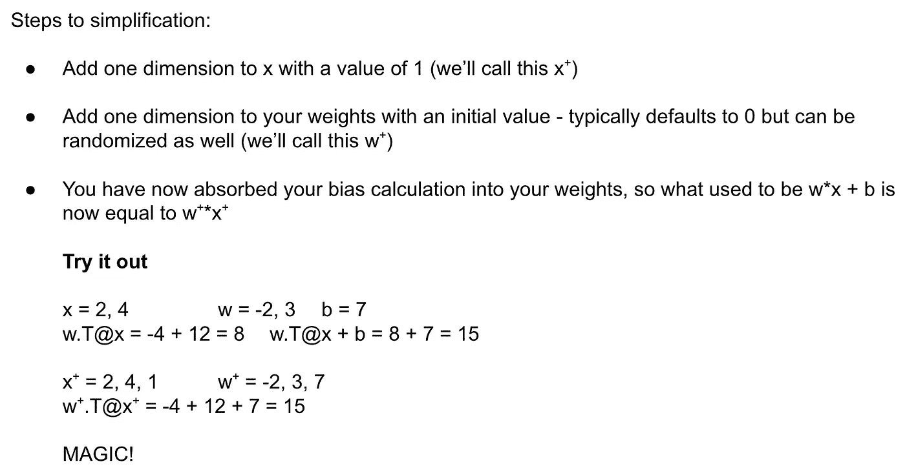
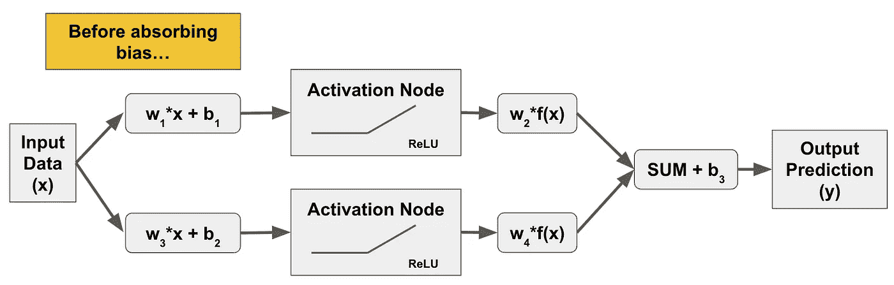
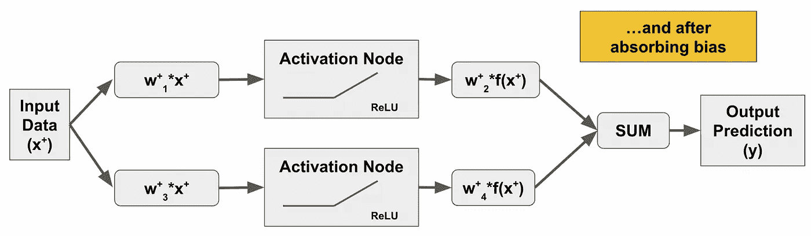
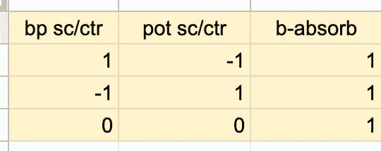
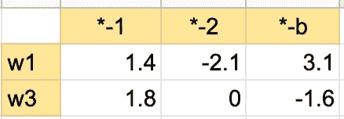
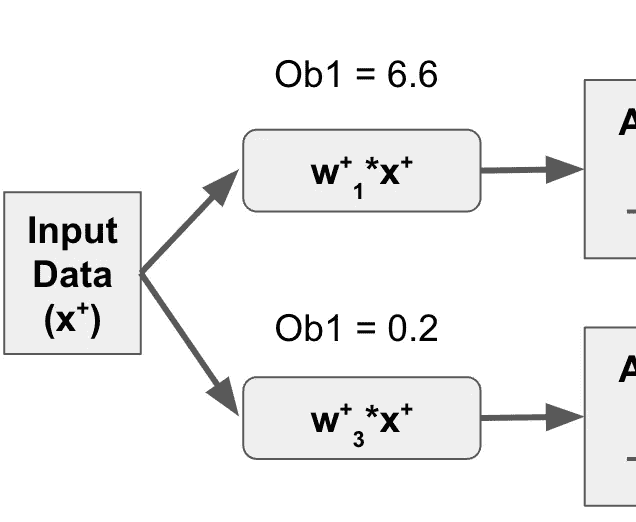
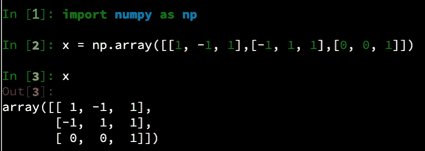
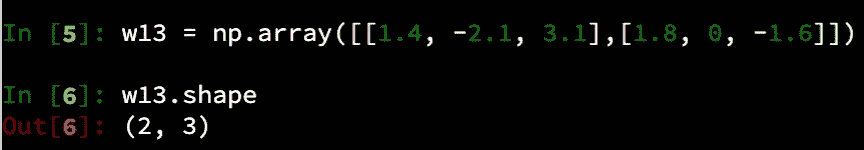
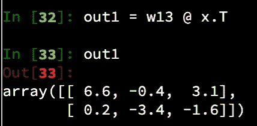

# 第一刀是最浅的

> 原文：<https://medium.com/mlearning-ai/the-first-cut-is-the-shallowest-bdbc657001b7?source=collection_archive---------10----------------------->

在激活函数之前加权数据

在本帖中，我们将通过观察在将数据提交给激活函数之前，将随机权重和偏差值应用于我们的数据时会发生什么，来迈出使我们的数学变得真实的第一步。

回想一下，我们已经通过使用矩阵乘法简化了我们的神经网络数学，并通过向数据和权重向量添加一个维度来吸收我们的偏差计算。

Reduces number of calculations by approximately 50%!

因此，逻辑流程是这样的:

…对此:

接下来，我将去掉 x 和 w 符号中的 **"+"** ，我们将简单地假设，如果您在计算中没有看到偏差，那么它已经被吸收到数据和权重中。

记住我们现在用的是矩阵乘法。我们的输入数据实际上是一个矩阵:

因此，神经网络中需要生成随机权重的每一步，我们实际生成的是一个随机权重+偏差向量。让我们将这些值用于我们的示例运行:

正如我大学时的物理学教授鲍勃·基钦过去常说的那样:从这里开始，一切都只是“砰”的一声！

# 施加重量

我们可以只使用 NumPy 为我们做数学，但我认为它将帮助我们手动完成一些工作，以确保我们理解正在发生的事情。

我们从第一个随机选择的权重值 w1 开始，它等于(1.4，-2.1，3.1)。我们需要计算这个权重和我们的 x 值之间的内积，从 x 中的第一个观察值开始。但是请记住，内积的工作方式是第一个矩阵(权重)将按行计算，而第二个矩阵(数据)将按列计算。因此，为了正确地将权重应用于第一次观察中的所有内容，我们需要转置数据，并将行转换为列。一会儿我们将看到如何用代码来实现这一点。

那么，第一个结果将考虑的 x 值是(1，-1，1)。[内积](https://jasondeden.medium.com/matrix-multiplication-e2cf007d0755)得出 1.4 + 2.1 + 3.1= 6.6。这是我们反应矩阵中的第一个值，它被传递到第一个神经元的激活节点。

在底部神经元上，我们用第二组权重 w3 重复这个过程，w3 是(1.8，0，-1.6)。这给了我们 1.8 + 0 + -1.6，即 0.2，这是 gest 传递给第二个神经元中激活节点的响应矩阵中的第一个值。

Math checks out so far…

# 所有的数学一步到位？

**看看**使用矩阵乘法来简化这一点的能力。当我说简化的时候，我的姐妹们、非姐妹们和兄弟们，我是指 ***简化*** 。

你可以一次用手算出一个结果。或者，你可以变聪明，简单地计算每个神经元的一个内积。然而，事实证明我们甚至不需要做这么多工作。你可以求解整个第一层，不管神经元的数量，数据点，权重等等。用单个矩阵乘法。

Stupid butterfly. I (used to) have Gold airline status!

让我们首先将数据创建为 NumPy 矩阵:

接下来，让我们使用随机生成的 w1 和 w3 的权重创建第二个数组:

Note the weight shape is such we don’t need to transpose anything to perform inner product calculations.

现在，我们可以简单地将 w13 和 x 的内积转置，得到以下输出:

请注意，数组中的每一行都对应于我们在单独执行计算时手动收集的输出(6.6 是第一个神经元中的第一个值，0.2 是第二个神经元中的第一个值……)我们已经用一次矩阵乘法完成了整个第一层计算。

这里是令人兴奋的部分:这种单一计算方法将是正确的*** *不管神经网络中的观察值、特征和神经元的数量。**** 如果您有 10，000 个观察值、2，000 个特征和一个宽度为 500 个神经元的神经网络，则神经网络过程第一步的全部输出将由一个矩阵乘法来表示。

我的。介意。吹了。你呢。

接下来:激活功能到底是什么，它到底是如何工作的？乐趣才刚刚开始！

 [## Mlearning.ai 提交建议

### 如何成为 Mlearning.ai 上的作家

medium.com](/mlearning-ai/mlearning-ai-submission-suggestions-b51e2b130bfb)