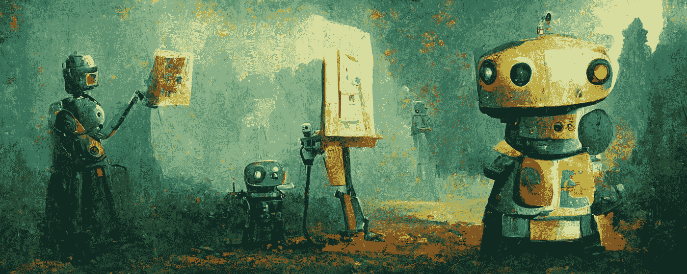

# 以下视觉艺术工作将被人工智能取代

> 原文：<https://medium.com/mlearning-ai/the-following-visual-art-jobs-will-be-replaced-by-ai-942f8558963e?source=collection_archive---------1----------------------->

© The Robot Artists, Made on Midjourney

这篇文章对我来说很难写。

我毕业于纽约的视觉艺术学院，并在电视广告公司担任故事板艺术家。后来，我在广告和营销公司担任插画师，最终进入了教育出版业。