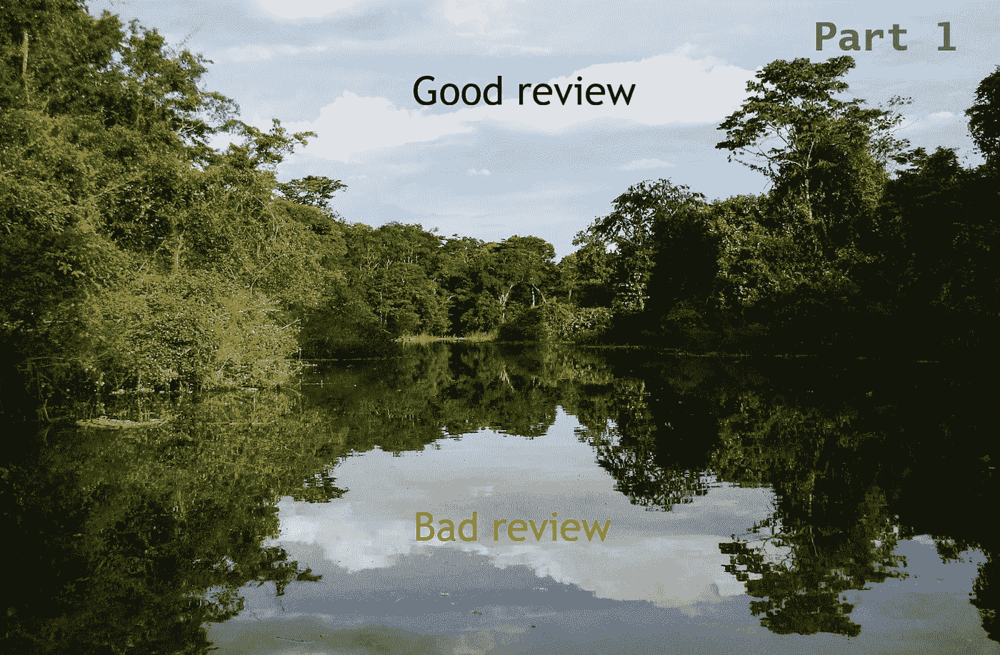
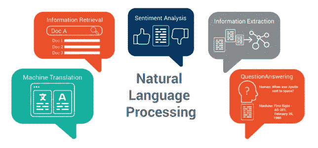
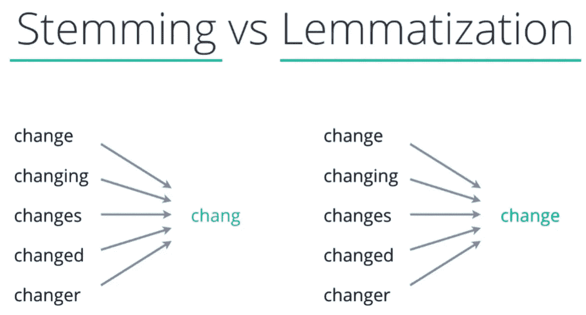
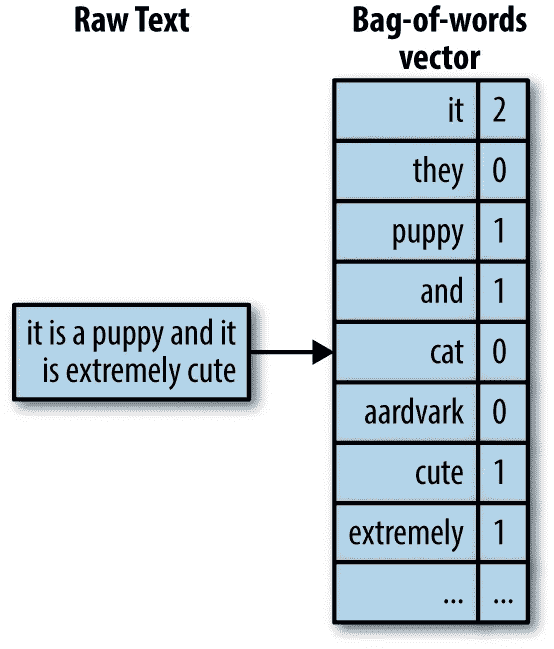
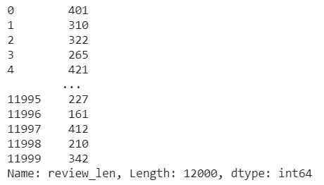
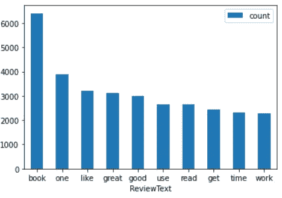

# 亚马逊森林评论，第 1 部分(NLP 的故事)

> 原文：<https://medium.com/mlearning-ai/the-forest-of-the-amazon-reviews-part-1-an-nlp-story-fa98efa892b8?source=collection_archive---------3----------------------->



在这篇文章中，我们将进入 [NLP ( *自然语言处理* )](https://en.wikipedia.org/wiki/Natural_language_processing) 的世界，研究计算机和人类语言之间的互动。

文本分析是机器学习算法的一个主要应用领域。



我们将解释如何分析从亚马逊产品评论中获得的文本，我们称之为**情感分析。**

在亚马逊评论中，客户在他们的评论上打星号(1 到 5)，在这种情况下，我们只考虑好的(4.5)或坏的(1.2)评论，而不是中性的。

然后应用预测模型并评估其性能。我们将分两部分进行:

我们将通过删除对分析文本无用的内容来清理文本。我们将使用 NLTK 删除停用词并对单词进行词干分析。我们将创建一个矢量器，允许我们创建一个重复单词的矩阵。

**第 2 部分**)我们将把一个叫做随机森林的模型应用到我们在第 1 部分中获得的数据帧中。然后，我们将使用不同的指标评估它的性能，并使用 GridSearchCV 测试模型的不同配置

好了，解释太多了！！，我建议你在阅读我将解释的每个概念及其代码时，打开你的 jupyter，打开这篇文章专用的笔记本，自己尝试一下。

# 导入库

```
import pandas as pd
import nltk
import re
import string
```

从 nltk 我们将需要:停用词和 PorterStemmer，但是它们是干什么用的呢？

**停用词**

包含一组无意义的单词，如冠词、代词、介词等。在处理之前或之后被过滤。例如:“我”、“我”、“我的”、“我自己”、“我们”、“我们的”、“我们的”、“我们自己”、“你”、“你是”、…

**词干化和词汇化**

PorterStemmer 是词干的一种:“*词干(词根)是单词中你加上屈折(变化/派生)词缀的部分，如***(-ed，-ize，-s，-de，-ing)* ***。*** *因此，对一个单词或句子进行词干分析可能会产生不是实际单词的单词。词干是通过去掉一个词的后缀或前缀而产生的。*(**datacamp.com**)*

**另一个类似的技术是词汇化:“*词汇化，不同于词干化，适当地减少了词形变化，确保词根属于该语言。在引理化中，词根叫做* **引理** *。一个词条(复数词条或词条)是一组单词的规范形式、词典形式或引用形式*[(**datacamp.com**)](http://datacamp.com/)**

****

**因此，词干化和词尾化都会产生词根形式的词形变化。区别在于词干可能不是一个真实的单词，而 lemma 是一个真实的语言单词。两者都是在文本挖掘中广泛使用的好技术。**

```
**# nltk libraries
nltk.download('stopwords')
from nltk.corpus import stopwords
from nltk import PorterStemmerstopwords = stopwords.words('english')
ps = PorterStemmer()**
```

# **获取数据**

**我们从 kaggle ( [*亚马逊评论进行情感分析*](https://www.kaggle.com/bittlingmayer/amazonreviews) )获取数据。数据在用 bz2 压缩的 txt 文件中，格式如下:**

****__label__ ReviewText** ，其中标签可以是 *__label__1* (差评)或 *__label__2* (好评)**

```
**import bz2 #unzip and load
train_file = bz2.BZ2File('train.ft.txt.bz2')
test_file = bz2.BZ2File('test.ft.txt.bz2')
train_lines = train_file.readlines()
test_lines = test_file.readlines()
print('Train line: {}'.format(train_lines[11]))**
```

***火车线路:b'__label__2 伟大的书:这是一本伟大的书，我简直爱不释手，可以……***

**有 360 万条火车线，40 万条试验线！！**

**由于处理时间的原因，我们将只提取一小部分数据**

```
**train_part = train_lines[:10000]
test_part = test_lines[:2000]
# Put all together
amz_rev_part = train_part + test_part**
```

# **准备数据**

**现在我们将获得 X(评论)和 y(标签)的值，在 X 中有一些清理和转换任务**

```
**# Get label text and return 0 (__label__1=bad review) and 1 (__label__1=good_review)
def reviewToY(review): 
    return 0 if review.split(' ')[0] == '__label__1' else 1# Get review string feature
# delete the last char (\n) and transform to lower
def reviewToX(review):
    review = review.split(' ', 1)[1][:-1].lower()
    return reviewdef splitReviewsLabels(lines): 
    reviews = []
    labels = []
    for review in tqdm(lines):
        rev = reviewToX(review)
        label = reviewToY(review)
        # only get the first 512 chars for review
        reviews.append(rev[:512])
        labels.append(label)
    return reviews, labelsX_amz_rev_part, y_amz_rev_part = splitReviewsLabels(amz_rev_part)**
```

**接下来创建一个方法来标记我们的评论(*获取单词列表*)，移除停用词并对单词进行词干化:**

```
**# Tokenize sentence, then delete stopwords and stemming
def remove_stopword_and_stem(text):
    tokens = re.split('\W+', text)
    text = [ps.stem(word) for word in tokens if word not in stopwords]
 return text**
```

# **用计数矢量器创建单词包**

**什么是一袋单词？**

**BoW 通过计算一个单词在文档中出现的次数，将文本转换为固定长度的向量。**

****

**在 Scikit Learn 中，有几个生成弓形的矢量器，其中最常用的是 CountVectorizer 和 TfidfVectorizer。**

**有关该主题的详细信息，请阅读[sk learn-feature-extraction](https://scikit-learn.org/stable/modules/feature_extraction.html)中的“文本特征提取”**

```
**# create vectorizer
count_vect = CountVectorizer(analyzer=remove_stopword_and_stem)
# train the vectorizer
vec = count_vect.fit(X_amz_rev_part)
# create my bag of words (X_cv) with transform()
X_cv = vec.transform(X_amz_rev_part)
# view BoW
print(X_cv.shape)
print(count_vect.get_feature_names()[3000:3010])**
```

***(12000，31803)***

***['bock '，' bode '，' bodi '，' bodic '，' bodo '，' bodybuild '，' bodyfin '，' bodygroom '，'保镖'，' bodyment']***

**这是我的弓的类型和形状:**

***< 12000x31803 以压缩稀疏行格式>* 存储了 351918 个元素的“<类“numpy . int 64”>类型的稀疏矩阵】**

**现在我们用我的弓信息创建一个新的数据帧:**

```
**# build dataframe with the sparse matrix 
X_features_df = pd.DataFrame(X_cv.toarray())
# Rename columns with the word
X_features_df.columns = count_vect.get_feature_names()
X_features_df**
```

**既然我们已经有了从哪里获得 X(特性)的数据框架，我们就可以根据已经有的数据添加新的列，比如一个特性，它具有每个评论的字母数。**

**因此，我们获得我们的原始 df ( *X_amz_rev_part* )并对评论字母进行计数，然后在新 df ( *X_features_df* )中创建新特征( *review_len* ):**

```
**# Adding new features , For ex. = len(review) 
X_amz_df = pd.DataFrame(X_amz_rev_part, columns = ['Review'])
X_features_df['review_len'] = X_amz_df['Review'].apply(lambda x: len(x) - x.count(" "))
X_features_df['review_len']**
```

****

**好的，很多数字，矩阵和向量，如果我们把一些人类更容易理解的东西可视化会怎么样？:)**

**比如《我的弓》中的十大常用词:**

```
**# Sum words of my Bag of Words, and get an ordered freq. of that
sum_words = X_cv.sum(axis=0) 
words_freq = [(word, sum_words[0, idx]) for word, idx in vec.vocabulary_.items()]
words_freq = sorted(words_freq, key = lambda x: x[1], reverse=True)# get the top 10 common words
common_words = words_freq[:10]
# create df with top words and count
df = pd.DataFrame(common_words, columns = ['ReviewText' , 'count'])# build a bar graph and plot
import matplotlib.pyplot as plt
fig = plt.gcf()
fig.set_size_inches( 20, 8)
ax = df.plot.bar(x='ReviewText', y='count', rot=0)**
```

****

**好了，伙计们，这是我们对亚马逊评论情感分析的第一部分。我们已经获得了机器学习算法所需的数字形式的数据。**

**在**第二部分**中，我们将对这些数据应用一个叫做**随机森林**的 ML 分类器，我们希望它能够最精确地预测评论是好是坏。**

**像往常一样，github 链接附有完整的[情绪分析 jupyter nb](https://github.com/jrercoli/rf_amazon_reviews_part1) 以便你可以自己验证代码。也请关注我的数据科学博客[赋能数据科学](https://rorjor.wixsite.com/empoweredatascience)**

**感谢您的评论和/或您的喜欢；)**