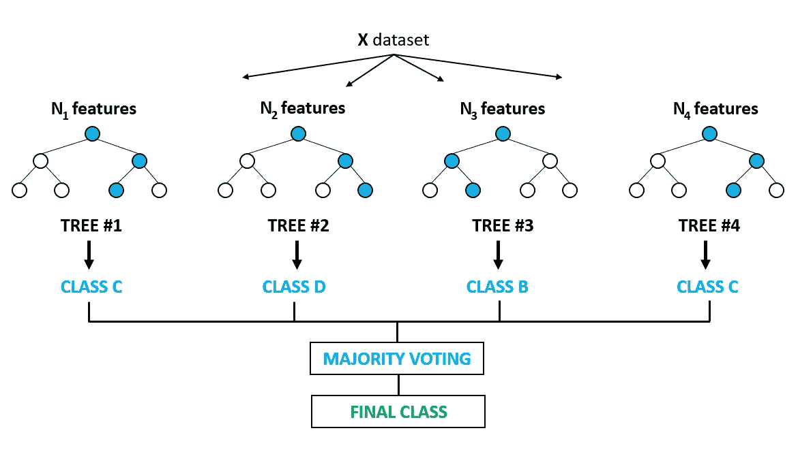
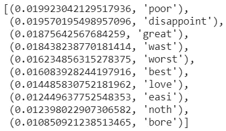
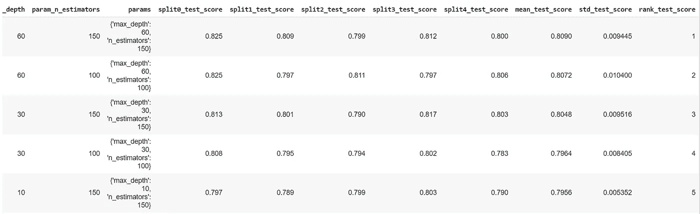

# 亚马逊森林评论，第 2 部分(NLP 的故事)

> 原文：<https://medium.com/mlearning-ai/the-forest-of-the-amazon-reviews-part-2-an-nlp-story-e7441439caf5?source=collection_archive---------4----------------------->


嗨，朋友们，这是基于亚马逊评论的 NLP 分析的第二部分，这里我们将描述我们将应用于我们的数据的机器学习阶段，特别是随机森林模型。

在[第一部分](https://rorjor.medium.com/the-forest-of-the-amazon-reviews-part-1-an-nlp-story-fa98efa892b8)中，我们获得了数据，清理了数据，并在对评论进行标记化和应用矢量器之后构建了一个单词包。

让我们从解释什么是随机森林开始，最初我会说它是决策树的集合，那么什么是决策树呢？

# 决策图表

是一种监督学习算法，主要用于分类问题。根据输入变量中最显著的差异，将数据分成两个或多个同类集合。决策树确定最重要的变量及其提供最佳同质群体集的值。

评估所有输入变量和所有可能的分割点，并选择结果最佳的一个。


一张图胜过千言万语，好吗？

优势:

*   易于解释和可视化模型结果
*   自动特征选择(不受无关特征的影响)
*   不需要标准化/缩放数据
*   缺少的值对结果几乎没有影响

缺点:

*   倾向于过度拟合
*   对数据变化敏感(结果可能会发生巨大变化)
*   训练的好时机

既然已经明白了是决策树，那就去我们的森林吧:)

# 随机森林

创建决策树时出现的一个问题是，如果我们给它足够的深度，树倾向于“记忆”解决方案，而不是概括学习= >过度拟合:(避免这种情况的解决方案是创建许多树并一起工作= >森林:)

一个**随机森林**是决策树结合**打包** ( [引导聚合](https://en.wikipedia.org/wiki/Bootstrap_aggregating))的集合体。该模型获取训练数据，并给每棵树一个特征子集，分配数据的大小是相同的，尽管一些特征在每个子集中随机重复。我们还可以改变分配给每棵树的样本数量(*引导样本*)。



对于分类问题，通常使用**软投票**来组合决策树的结果，这意味着给予结果更多的重要性，其中树更安全。

优势:

*   更好地概括，显著降低 DT 过拟合
*   不平衡数据上的良好性能
*   可以处理大型数据集(许多要素和许多样本)
*   缺少的值对结果几乎没有影响
*   它被广泛用于提取数据集最重要的特征

缺点:

*   功能需要有预测能力
*   它看起来像一个黑盒子，得到的结果很难解释

简单介绍了随机森林模型之后，让我们继续讨论分类问题。

# 构建训练和测试数据

在[第 1 部分](https://rorjor.medium.com/the-forest-of-the-amazon-reviews-part-1-an-nlp-story-fa98efa892b8)中，我们以一包单词的形式获得了我们的特征，并用它生成了一个熊猫数据帧( *X_features_df* )，我们还有自己的标签( *y_amz_rev_part* )。

```
# Split train and test 
X_train, X_test, y_train, y_test = train_test_split(X_features_df, y_amz_rev_part, test_size=0.2)# Class balance ??
print('Clase 0-Bad review: {} - Clase 1-Good review: {}'.format(y_train.count(0), y_train.count(1)))
```

我们检查了我们班级的平衡，没有不平衡的问题:

*0 级-差评:5054-1 级-好评:4946*

# 建立射频模型，拟合和预测

RF 有大量用于调谐的超参数，我们将解释 3 个最重要的参数，我们将在稍后的练习中使用它们。

*   n_estimators:森林中树木的数量。默认值=100
*   max_depth:树的最大深度。如果没有(默认值)，则节点会一直扩展，直到所有叶子都是纯的，或者直到所有叶子包含的样本都少于 min_samples_split 样本。
*   n_jobs:并行运行的作业数量(默认情况下 None=1)。输入-1 以使用所有处理器。

你在 [sklearn](https://scikit-learn.org/stable/modules/generated/sklearn.ensemble.RandomForestClassifier.html?highlight=random%20forest#sklearn.ensemble.RandomForestClassifier) 里有详细的列表。

```
# Now, build a RandomForest with parameters, and fit the model
rf = RandomForestClassifier(n_estimators=50, max_depth=20, n_jobs=-1)
rf_model = rf.fit(X_train, y_train)
```

我们说过，RF 的优势之一是利用它获得最重要的特性:

```
# view the 10 more important features from the model. 
# zip and sort (reverse)
sorted(zip(rf_model.feature_importances_, X_train.columns), reverse=True)[0:10]
```



```
# Predict with X_test and obtain score metrics
from sklearn.metrics import precision_recall_fscore_support as score

y_pred = rf_model.predict(X_test)
precision, recall, fscore, support = score(y_test, y_pred, average='binary')
print('Precision: {} / Recall: {} / Fscore: {} / Accuracy: {}'.format(
 round(precision,3), round(recall,3), round(fscore,3), round((y_pred==y_test).sum() / len(y_pred),3)))
```

精确度:0.792 /召回率:0.803 / Fscore: 0.797 /准确度:0.796

# 努力取得更好的成绩

让我们尝试改变我们认为最重要的模型的超参数(*调整*),以尝试提高我们的预测水平。为此，我们将使用 sklearn 提供的 [GridSearchCV](https://scikit-learn.org/stable/modules/generated/sklearn.model_selection.GridSearchCV.html?highlight=grid%20search#sklearn.model_selection.GridSearchCV) 方法，我们将所有数据传递给它，因为该方法适合并预测，让我们开始编码:

```
from sklearn.model_selection import GridSearchCV

# using GridSearch with 9 combinations
rf = RandomForestClassifier()

# hyperparameters setting
param = {'n_estimators': [10, 100, 150],
 'max_depth': [10, 30, 60]}

gs = GridSearchCV(rf, param, cv=5, n_jobs=-1)
gs_fit = gs.fit(X_features_df, y_amz_rev_part)
```

为了查看结果，我们将创建一个由 grid search(*' mean _ test _ score '*)提供的列排序的 dataframe:

```
pd.DataFrame(gs_fit.cv_results_).sort_values('mean_test_score', ascending=False)[0:5]
```



我们看到了前 5 名，我们必须使用**60 深度**的 **150 估计量**来获得我们模型的超参数的最佳组合。我们将用这些值重新生成 RF:)

考虑到预测值可能较低，因为我们使用了原始数据集(*400 万条评论*)的非常少的数据(*1.2 万条*)。

好了，现在是时候让你用你的 jupyter 笔记本做你自己的探索了，探索这个迷人的 AI 主题的所有边缘。

像往常一样，github 链接附有完整的[情绪分析 jupyter nb](https://github.com/jrercoli/rf_amazon_reviews_part2) 以便您可以自己验证代码。也请关注我的数据科学博客[赋能数据科学](https://rorjor.wixsite.com/empoweredatascience)

感谢您的评论和/或您的喜欢；)