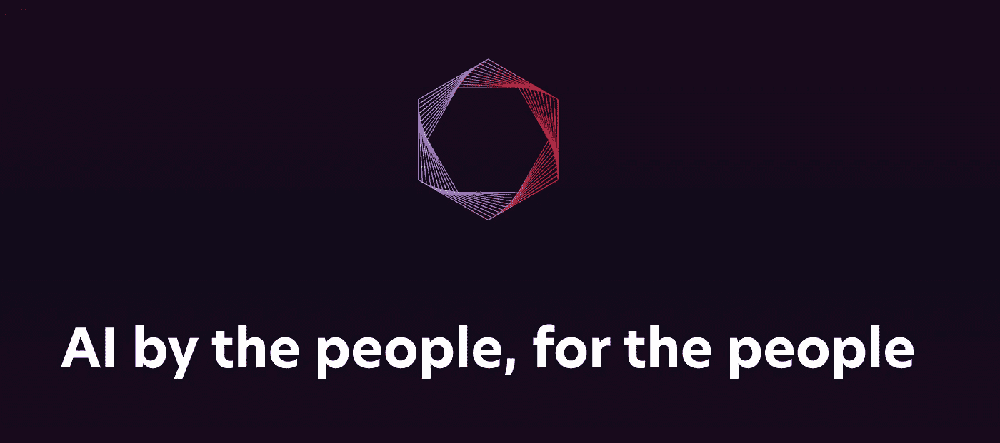

# 人工智能的未来是开源的

> 原文：<https://medium.com/mlearning-ai/the-future-of-ai-is-open-source-b96831ae763?source=collection_archive---------5----------------------->

Stability AI’s official website banner image

2022 年 8 月 22 日， *Stability AI* 发布了流行的文本到图像模型'**稳定扩散**'。这改变了人工智能艺术工具的一切。

稳定性人工智能做了开放人工智能被期待做的事情，即提供一个生成性人工智能模型，任何人都可以免费查看代码，下载代码，并在个人电脑上运行修改后的版本。