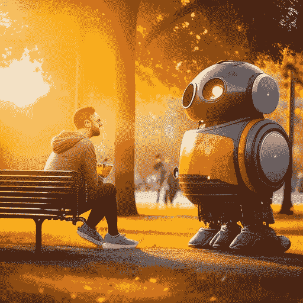

# 聊天机器人的未来:使用人工智能增强你的创造过程

> 原文：<https://medium.com/mlearning-ai/the-future-of-chatbots-using-artificial-intelligence-to-enhance-your-creative-process-8eb4e064ea19?source=collection_archive---------7----------------------->

探索 ChatGPT 的功能和局限性

Image generated by Author using MidJourney

# 概观

ChatGPT 是 OpenAI 打造的工具。

OpenAI 是一家专注于开发和推广有益于人类的人工智能(AI)的研究公司。该公司是由埃隆·马斯克和萨姆…