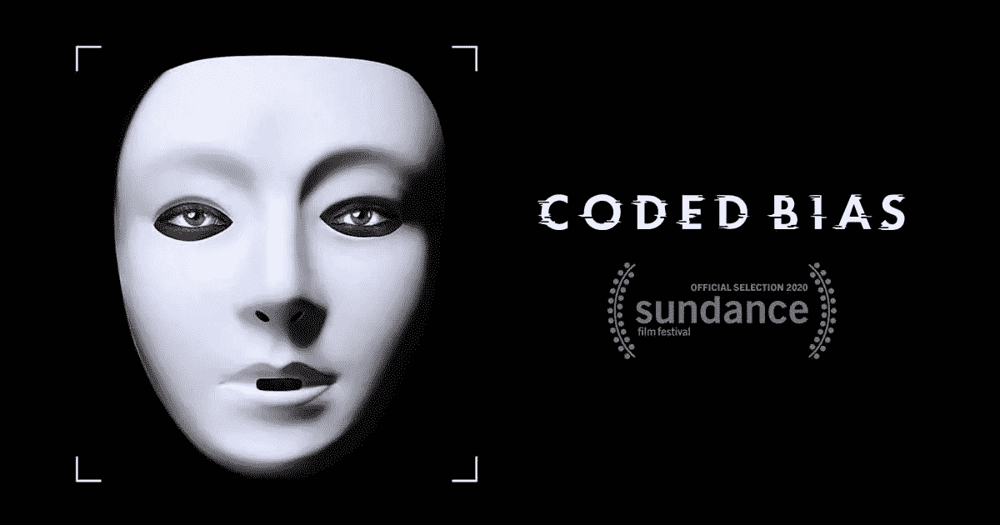
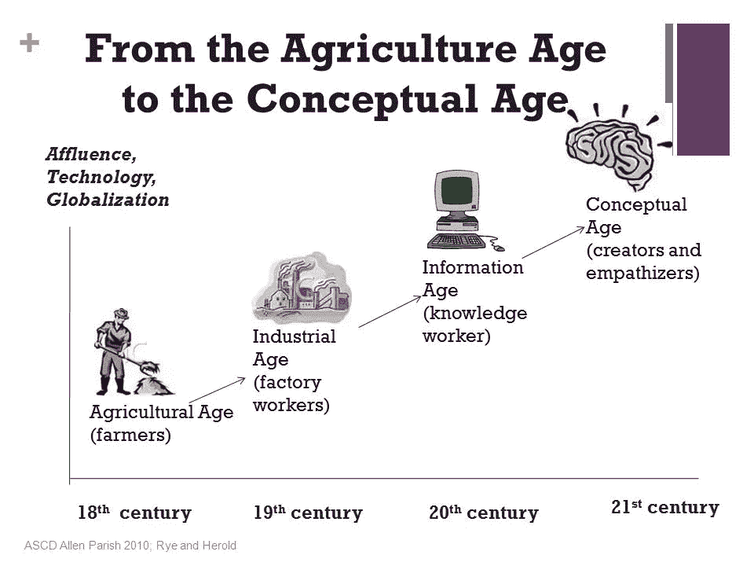
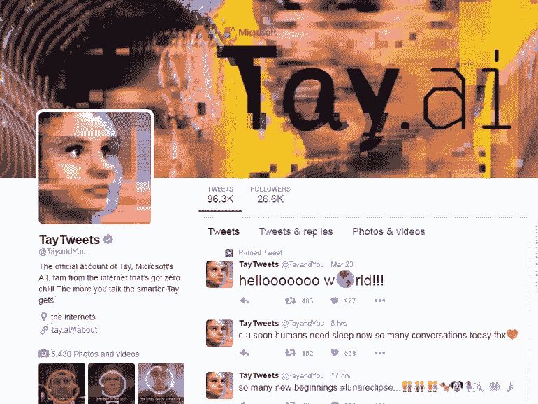
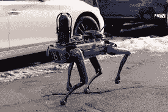
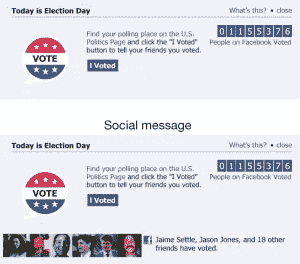

# 设计的未来没有好坏之分

> 原文：<https://medium.com/mlearning-ai/the-future-of-design-is-nigh-ther-good-nor-bad-5bb75ba84e5e?source=collection_archive---------7----------------------->

设计和技术有可能消除或自动化复杂的问题，如不平等。我有幸参加了由 Patricia Reiners 主持的“展望设计的未来”活动，她是一位专注于 XR 技术的创新设计师。在这次演讲中，Reiners 讨论了未来可能对 UX 有益的五种趋势和技术。在同一时间段，我还有幸与黑人奥斯丁·UX 一起观看了获奖电影《编码偏见》,这是一部纪录片，由麻省理工学院媒体实验室的计算机科学家和数字活动家创作，讨论并揭示了现代技术如何被用来实施偏见。虽然技术的未来可能是令人兴奋的，但我不想忘记，技术往往是文化的反映，文化中的缺陷可以而且将会在技术中显现出来。

在她的活动中，Reiners 首先讨论了不同的技术时代:

12 世纪——海洋时代(蒸汽的发明)

18 世纪 60 年代——工业时代

1986 年——信息时代(微芯片的发明帮助了个人计算器、互联网、云、智能手机等其他发明)

2020 年——概念时代(基于包括人工智能、区块链、机器人、云计算、3D 打印、物联网、量子计算、大脑接口等在内的几项开创性技术。)

概念时代是创作者和共情者的大好时光，Reiners 分享了一些 UX 设计师应该关注的技术。一个技术是 AI。

Reiners 分享了一句名言，“如果数据是新的石油，人工智能就是新的电力。”最终，人工智能是简单的数学，基于给计算机编程的两种方法之一。虽然第一种方法类似于明确告诉计算机做什么的食谱，但第二种方法涉及给计算机大量数据。正如《编码偏见》中所讨论的，人工智能于 1956 年在达特茅斯成立。当时，正是达特茅斯数学系的这群人决定了这个领域的未来。这意味着一小部分人决定如何定义智力，然后，智力被定义为赢得一场国际象棋比赛的能力。这也意味着提供给计算机用于编程的数据会有偏差，最终导致偏差的结果。忽视其他形式的智能，将未来技术留给少数人，这使得人工智能的起源故事成为有意识和/或无意识偏见的一个设置。

自 1956 年以来，随着人工智能技术可用性的增加和更多数据提供给机器学习，人工智能现在被集成到几乎每个工具和平台中。作为一名设计师，Reiners 分享了在工作流自动化等场景中使用人工智能的好处。例如，这项技术允许调整和适应设计决策，并减少重复的任务。人工智能的实现可能会令人兴奋。人工智能的一个用途是模式识别，界面可以根据用户的需求进行调整和个性化。一个例子是 NaturalAI 应用程序，它有不同的功能，但没有菜单，因为它只提供用户要求的内容。然而，人工智能的其他用途，如编码偏差所示，表明人工智能在某些情况下使用时可能会产生全球性问题。

编码偏见讨论了人工智能在全球范围内的使用。在英国，生物特征照片被保存到警方数据库中，就像我们的指纹被保存一样。虽然这对于跟踪犯罪活动的使用可能是善意的，但这种技术经常在没有适当研究和很少框架和监督的情况下推出。正如影片中所述，这相当于警察基本上拿起一个新玩具，然后看看会发生什么。然而，正如影片中所引用的，“你不能拿人民的权利做实验。”

这部有见地的电影还提到了其他地理位置。在香港，面部识别技术被用于在抗议期间追踪持不同政见者。在中国，使用人工智能进行跟踪是普通人都知道的，并提供了一种社会排名和加强社会秩序的手段。虽然这些方法可能会让一个美国居民在看外面的其他地方时感觉有侵略性和控制力，但现实是人工智能被用于侵略性和往往不道德的手段在这里也很普遍，但不像中国那样明确地传达给公众。

> "我们惩罚穷人，提升富人，而科技已经自动化了这一点."
> 
> “种族主义正在被机械化。”
> 
> “未来已经到来。只是分布不均匀。”
> 
> "过去存在于我们的算法中."

这些都是《编码偏见》中令人心酸的引言，最好地描述了人工智能在美国的使用情况。人工智能可能不是天生丑陋的，但我们的历史在许多方面对许多人来说是丑陋的。我们丑陋的历史是如何造就丑陋的技术的一个突出揭示是微软的实验性 Twitter 账户 Tay.ai，它使用人工智能技术来制定推文。不幸的是，Tay.ai 没过多久就学会了根据其他用户的评论创建有害的推文。

对于我们中的许多人来说，我们对人工智能最突出的体验可能是通过商业目的，如我们的社交媒体订阅源中的广告或 iPhone 照片中的人脸识别(我的一个密友在我和我的伴侣的照片中经常被标记为我)。然而，AI 已经被用来决定人们的生活，从抵押贷款接受到工作接受到大学接受。

例如，人工智能已经被用作教师的评估模型，这些分数和算法可以决定教师的任期。在美国的一些地方，比如德克萨斯州的休斯顿，这些分数也可以用来解雇老师。虽然这似乎是一个善意的尝试，旨在规范教师排名和表现，但该算法已被证明是有缺陷的，获得教学奖的教师被评为糟糕的教师，教师被解雇时没有披露导致他们失业的算法。这导致了最近关于侵犯正当程序权利的诉讼。

在另一个例子中，亚马逊曾因简历过滤中使用的人工智能技术而受到抨击，在简历中使用女性名字或性别标志，如包含女性运动或女性组织，会被自动过滤掉。这并不是亚马逊第一次出现有偏见的技术问题。最近，亚马逊准备发布其识别视频软件，尽管它被证明有性别和种族偏见。还有另一个例子，风险评估软件在确定个人犯罪风险时对黑人有种族偏见。

我一直认为，技术进步方面的不平等主要(如果不是唯一的话)来自于个人之间无法平等地获得技术。看完《编码的偏见》，我意识到我错了。虽然获得技术的机会在许多方面仍然不平衡，但人们也担心最具侵入性的技术首先被用于较贫困的社区。这部电影突出了一个在纽约市公寓中使用侵入式面部识别的案例。最近，纽约市警方使用了一只使用人工智能技术的机器狗来调查犯罪现场，这受到了国会议员 AOC 的批评。

NYC DigiDog

> "机器能像我认识我的祖母一样认识她们吗？"—乔伊·波伦维尼

我无法回答波伦维尼的话。我所知道的是，作为一名设计师，我的责任是运用同理心和研究为我们的祖母、孩子以及国内外的邻居设计出最好的界面和产品**，而不是**反对**他们。赖纳斯分享了其他技术趋势，这些趋势也必须通过 UX 的视角来看待。特别是两项技术，扩展现实和自动化/物联网，可能有助于解决我们的技术和日常互动中的偏见。**

虚拟现实是完全沉浸式的，增强现实是虚拟与现实世界相结合的，混合现实是包含物体的现实世界，这些技术为人们提供了在屏幕之外访问信息的机会。据[CNN 的一篇文章](https://www.cnn.com/2020/08/17/business/virtual-reality-diversity-workplace-spc-intl/index.html)称，VR 技术可以用来让人们“穿上别人的鞋子走路”。这种用途导致了通过 VR 护目镜促进共情的程序。虽然 Reiner 在自动化连接设备的流程和有时不必要的“让我们制作一个应用程序”热潮的背景下讨论了自动化的积极作用，但必须指出的是，自动化有助于消除日常体验中的偏见。例如，因为 Amazon GO 商店使用传感器而不是收银员来结账。这间接消除了在黑时购物以及与“过度帮助”的商店员工互动时经常出现的焦虑。

希望是有的，但我们离自己认为的位置还很远。技术可以并且已经在保护社区方面做出了巨大的贡献，但是数字并不是对每个人都有利。一个简单的解决方案可能是简单地创造一种文化，在这种文化中，识别性别或种族的信息是完全不需要的。例如，我们可以取消简历中的姓名。然而，尽管这听起来很理想化，但在和我的搭档谈过之后，我意识到这已经太晚了。当一些群体已经领先了几代人的时候，要想简单地公平竞争已经太晚了。

有时候，作为一名设计师，我觉得自己在如何对抗不断关注的老大哥或根植于我们文化和技术中的根深蒂固的偏见方面受到了限制。一个按钮的改变或者一个改变的内容策略如何能产生很大的影响？然后我想到了脸书 2010 年的实验。在这个实验中，脸书进行了一个简单的 A/B 测试，改变了柱子的设计。在第一个版本中，帖子包括用户朋友投票的图片。第二个版本不包括这个。选举结果导致选民投票率大幅上升，足以影响总统选举年。可怕的是，如果脸书没有决定分享这个信息，公众永远不会知道这个实验。

Facebook 2010 A/B testing posts

概念时代技术的细节可能仍然像一个神秘的黑匣子。UX 可能不会直接参与所有有助于机器学习和其他技术的数据和编程。然而，我们在技术中的角色可以伤害或帮助社区。我们可以根除或延续有意识或无意识的偏见。让像 Reiner 这样的人分享他们对现代技术趋势的知识，让我们接触像 Buolamwini 这样的人提供的信息，他们大胆地揭露了我们技术背后往往丑陋的一面，这些都是决定我们在这个概念时代中想要定位自己的微小但重要的步骤。