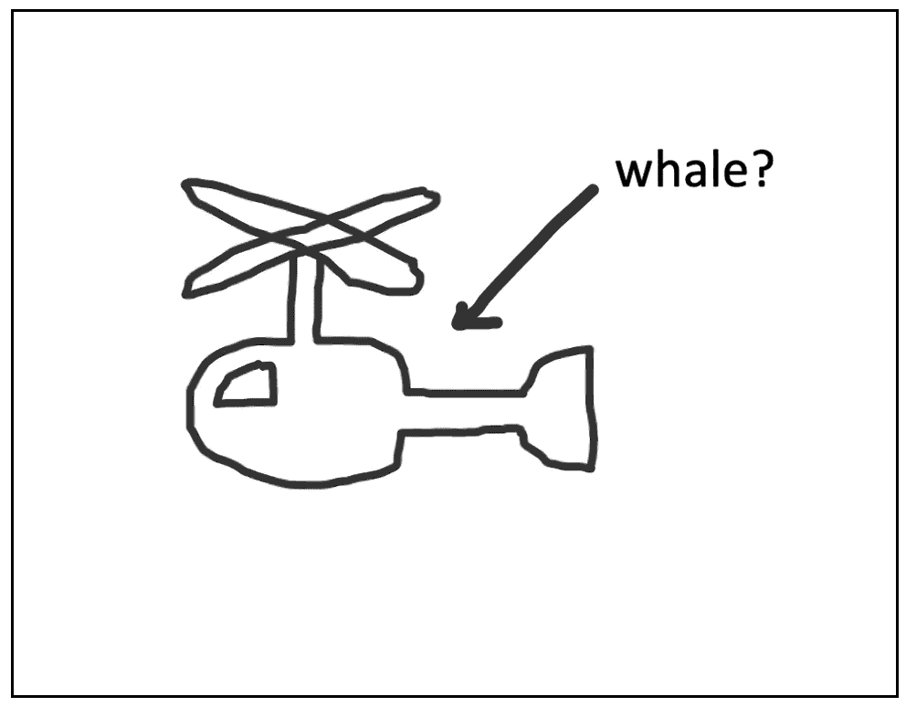

# 机器学习标签平台的未来

> 原文：<https://medium.com/mlearning-ai/the-future-of-machine-learning-labelling-platforms-148d370658c1?source=collection_archive---------5----------------------->

更高的速度、效率和准确性。

***(目前正在找下一份工作)***

我从事医学成像的计算机视觉工作。我们最大的问题之一是为我们的数据集寻找高质量和相关的标签。拥有足够经验和技术知识的医学专家人数很少，而且价格昂贵。

bad labels. Image by Author.

**相信你的模型**

如果你有一个对客户足够好的模型，它对你也足够好。开发人员害怕偏见，但是微妙或主观的偏见比真正的不准确或危险的错误更容易面对。在标签平台中使用您的模型的预测是一种很好的方式，首先使用每个训练数据点作为验证数据点，并向您的标签者展示您的模型的弱点。这应该公开给你的标签员看，而不是藏在研发部门。

**协作**

这是当前平台已经非常好的地方。它为支付解决方案的“溢价”提供了完美的借口。这是你的免费标签服务，你可以独立使用，只需支付一点点费用，就可以在多个标签员和 ML 研究人员之间进行交流。

但这是关键。

这些过程中的延迟足以阻止它们发生。作为一个 ML 从业者，你搜索数据，找到可能的错误，但是可能没有资格或者没有信心去纠正这些问题。如果你真的掌握了重要的领域专业知识，你可以通过强调让你质疑他们所选课程的细节来节省标注者的时间。

**积极学习**

主动学习是选择“正确的”数据点进行标记的任务，其中“正确的”包括有效地改进一些优先级度量。这可以从任何事情到全局 AUC 改进，再到解决特定错误。

请阅读以下内容，了解这些技术的更多详细信息:

[深度学习的主动学习|乔治·皮尔斯| Medium](/@george.pearse/active-learning-for-deep-learning-part-1-e8966434f665)

**交互**

现代机器学习使您能够快速地与数据进行交互。即使在复杂的问题中，高层次的可视化也是非常有价值的。向量数据库使你能够通过嵌入的形式查询你的数据(QDrant 是我最喜欢的)。

 [## 以数据为中心的人工智能矢量数据库

### 为什么您应该将矢量数据库作为 MLOps 平台的一部分。

medium.com](/mlearning-ai/the-many-uses-of-a-vector-database-65cb6cc70b3f) 

你可以问这样的问题:

> 在由任意标签定义的某个集合中，哪些数据点与这个数据点列表最相似，但与另一个列表最不同？

这使您能够专注于一个非常具体的子集，可能是整个错误类别。根据特定标签任务的复杂程度，您可以使用它来生成标签列表，或者应用弱标签。

我在本文中创建了一个概念验证，展示了这一点:

 [## 面向以数据为中心的人工智能的矢量数据库(第二部分)

### 用 QDrant，拥抱脸和 Streamlit 构建应用程序。

medium.com](/@george.pearse/vector-databases-for-data-centric-ai-part-2-ba995053ce05) 

但是 koaning/bulk for NLP 也演示了这是如何工作的。

 [## GitHub - koaning/bulk

### 批量是一个快速开发工具，可以应用一些批量标签。给定一个带有 2d 嵌入的准备好的数据集，它可以生成…

github.com](https://github.com/koaning/bulk) 

*   首先，为你的文本片段生成嵌入(见预训练模型的拥抱脸)。
*   然后，运行降维到 2 维(我推荐 UMAP，因为它的速度和保存全局关系的能力)。
*   最后，与集群进行交互，以快速标记数据点集群。FiftyOne 为图像数据集的分析实现了类似的功能。

 [## 使用图像嵌入-51 0 . 16 . 5 文档

### FiftyOne 提供了强大的嵌入可视化功能，您可以使用它来生成低维…

voxel51.com](https://voxel51.com/docs/fiftyone/tutorials/image_embeddings.html) 

**重复**

重新训练你的模型，生成预测和嵌入，然后再来一次。

**资源**

这是一篇非常优秀但被低估的文章，关于它在医学成像环境中的表现。

 [## 在标记放射学图像中的主动学习性能是 90%有效

### 为了在放射学图像上训练人工智能(AI)系统，图像标记步骤是必要的。标签用于…

www.frontiersin.org](https://www.frontiersin.org/articles/10.3389/fradi.2021.748968/full) 

像水族馆这样的工具，

【水族馆| ML 数据运营平台(aquariumlearning.com)

和鳞核，

[Scale Nucleus:您数据的任务控制](https://scale.com/nucleus)

…正在朝着这个方向前进，但是从我尝试的小技巧中，我知道他们还有一段路要走。或者，也许你必须成为他们最大的客户才能获得全部功能。

让我知道你的想法。如果您对内容感兴趣，请点击关注。

 [## Mlearning.ai 提交建议

### 如何成为 Mlearning.ai 上的作家

medium.com](/mlearning-ai/mlearning-ai-submission-suggestions-b51e2b130bfb)