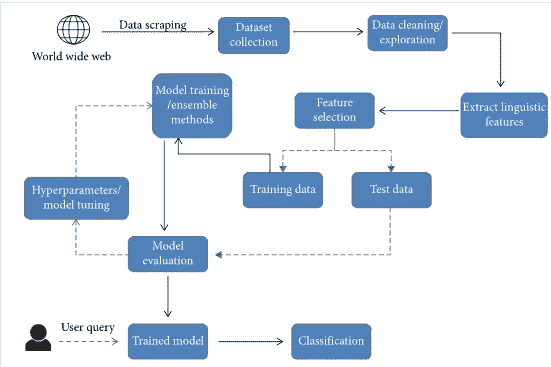

# 机器人新闻业的媒体未来

> 原文：<https://medium.com/mlearning-ai/the-future-of-media-with-robotic-journalism-79cc9ecb68f1?source=collection_archive---------2----------------------->

人类已经见证了技术的发展，从工业革命时期的辅助生产，到如今几乎任何事情都依赖于技术。医疗保健、教育、商业、移动性:所有这些都因技术而变得更好更快，迪拜是先驱，城市现在正计划尽可能地融入技术。

像其他领域一样，自动化新闻可以给多媒体行业带来一场革命。我是在读《机器学习如何预测假新闻》的时候碰到自动化新闻的。假新闻可以通过多种方式使用机器学习来检测，无需人工干预。在概念层面，假新闻被分为不同的类型；然后，这些知识被扩展到多个领域的通用机器学习(ML)模型。做到这一点的方法是事先隔离一些可信的新闻来源。为此，可以维护一些包含来自可信来源的文章的存储库。在数据清洗(去除不必要的单词)之后，从文章中提取语言特征。这可以在 NLP(自然语言处理)的帮助下，使用 TF-IDF 矢量器来完成。为了测试一篇文章，应该将它的语言特征与存储库的可信文章的特征进行比较(对于相同的新闻/领域)。这样假新闻就可以用机器学习检测出来，可以分类为“真”或“假”。有多种算法可以实现这一点(逻辑回归、K-最近邻、支持向量机等等)。像 INJECT 这样的许多其他项目使得预测无偏见的新闻变得更加容易。

[Workflow for training algorithms and classification of news articles](https://www.hindawi.com/journals/complexity/2020/8885861/)

了解假新闻检测的范围远远不止一个项目，这一点很重要。不正确的消息像野火一样传播，因为我们对世界的看法依赖于我们消费的信息，假新闻可能会导致骚乱、损失和错误信息，导致缺乏对真相的认识。今天，大多数媒体机构，甚至独立记者都根据他们的政治利益播放被歪曲和诽谤的新闻。几乎所有的新闻来源都是有偏见的，因此很难判断哪个来源是可信的。因此，将假新闻检测的范围扩大到完全自动化的新闻业会非常有效和可信。

机器人/自动化新闻业并不是最新的热门话题。中国诞生了第一位人形机器人记者，名叫“贾加”，她甚至采访了一家杂志的编辑。

Humanoid Robot Journalist ‘Jia Jia’ in China

天气预报等部门已经依赖于数据仓库和数据挖掘等技术。有明确报告方式的事件(如板球比赛的比分或奥运会的获胜者)也可以使用明确的算法轻松完成。机器人新闻的一个重要特征是提取数据报告:最新的、大量的。自动化新闻和人工新闻一样，包括三个步骤:从数据源中提取有价值的信息，编辑和发布。然而，它也可以去检查事实和删除抄袭。如果有问题，机器人实际上可以进行采访和阅读新闻编辑室的新闻。

然而，机器人新闻面临着许多需要解决的挑战:

1.  现场和自发报道仍然是一个挑战，仍然需要人工干预才能成功。
2.  据报道，在“深度伪造技术”的例子中，名人的脸被转换成其他人说话的视频，看起来如此逼真，以至于很难区分视频的真假。
3.  在面试过程中，机器人可能无法应对政治热点或提出后续问题。

因此，纵观机器人新闻业的近期发展，很难在近期实现完全自动化的新闻业。然而，记者应该使用有效报道和假新闻检测的算法来提高新闻质量。