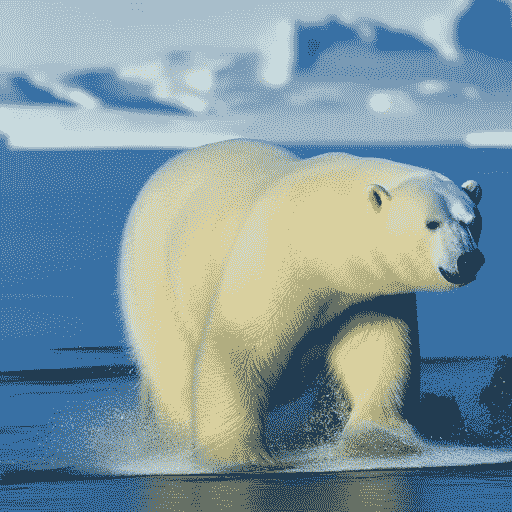
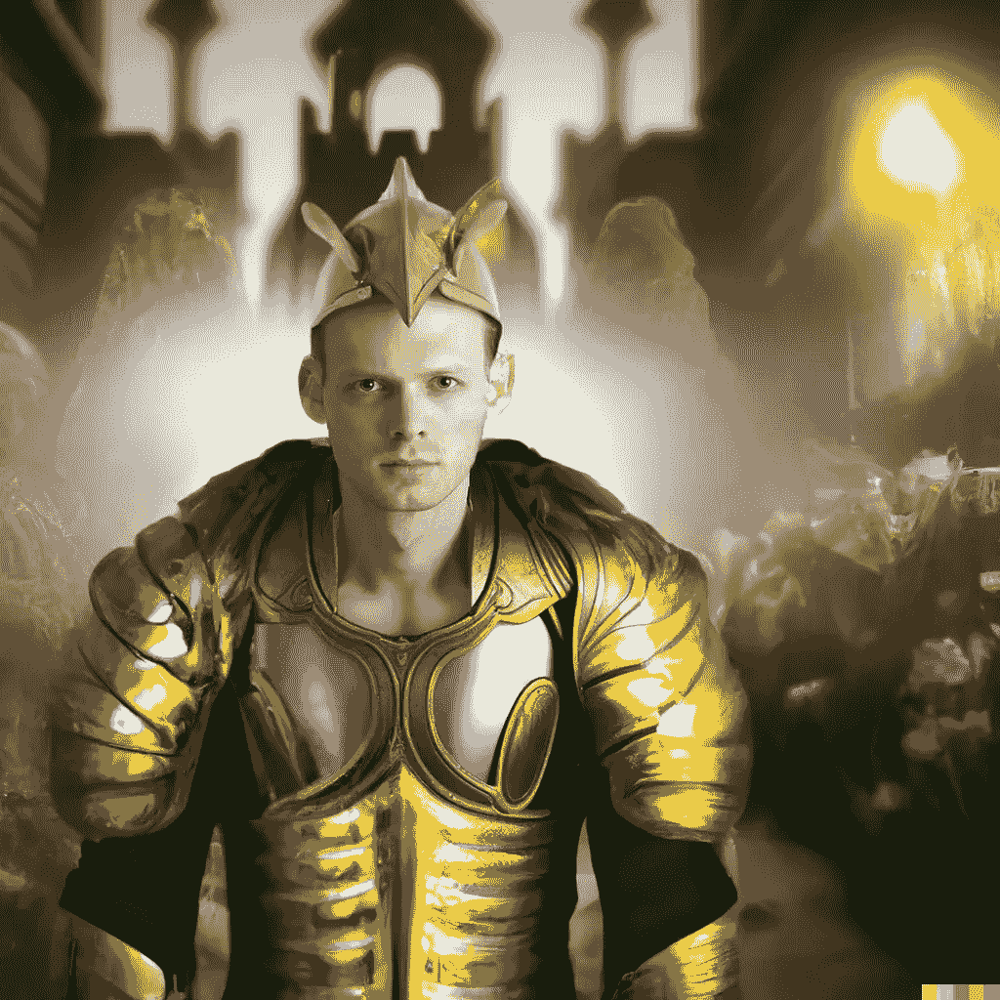

# 人工智能时代摄影的未来

> 原文：<https://medium.com/mlearning-ai/the-future-of-photography-in-the-age-of-ai-356889f2f63a?source=collection_archive---------1----------------------->

## AI 会扼杀摄影的艺术和商业吗？

Polar Bear, Nature Photography by Paula Nirdon, used with permission

艺术家一直面临着艰苦的劳动和精神压力。例如，摄影师不得不忍受携带沉重的设备和冲洗自己的胶卷，到偏远的地方旅行，并经常等待拍摄照片的最佳时机的艰辛。为了拍摄北极熊在自然栖息地的照片，国家地理摄影师保拉·尼尔顿不得不前往北极，在零下的温度下度过几天，等待北极熊从洞穴中出来。

但是如果一台机器能为她做所有这些事情呢？

今天，新兴的人工智能图像合成器，如 DALLE，Midjourney 和 Stable Diffusion，能够创建令人惊叹的照片级逼真图像，[一些艺术家感觉到了压力](/mlearning-ai/artists-up-in-arms-over-new-ai-model-that-can-generate-similar-works-883b25552636)。

现在，完全诚实地说，宝拉·尼尔顿并不真的存在，这张照片中的熊也是如此——它 100%由人工智能生成。很抱歉我骗了你，但我只是想说明一点:

对于摄影行业来说，用机器创造与现实难以区分的图像是可能的，这意味着什么？

毫无疑问，自然摄影不可能、也绝不应该被艾伪造。应该是关于真实的东西。自然摄影是为了捕捉我们周围世界的美丽，并表达保护地球及其自然资源的重要性。如果自然照片是艾伪造的，这将摧毁这种类型的可信度，使它成为又一个商业化的假冒产品。

现代新闻摄影之父亨利·卡蒂埃·布列松解释说，摄影不像绘画。摄影中有一个决定性的时刻，就是摄影师用自己的相机构图，捕捉眼前的场景。

这个决定性的时刻将摄影与绘画以及人工智能艺术区分开来。这就是摄影的独特之处。卡蒂埃-布列松是对的。人工智能图像合成无法取代许多类型的摄影，如新闻摄影、体育和街头摄影，因为这些图像的全部价值源于它们记录了真实的决定性时刻。

然而，在其他类型的摄影中，真实性并不那么重要。专注于为广告或库存摄影创作内容的商业摄影师将受到最沉重的打击。今天，一整天的商业摄影通常需要 750-3000 美元，但在不久的将来，这些摄影师将不得不与成本低廉的像素完美的人工智能生成的图像竞争。

对于商业摄影师来说，这是一个困难的局面，而且，人工智能产生的图像质量只会越来越好，而价格将保持不变。有了谷歌的 DreamBooth 和特拉维夫大学和 NVIDIA⁴的 Textual Inversion 等前沿算法，微调或定制现有的生成式人工智能模型，注入客户的概念、人和产品——生产委托作品所需的所有成分——现在变得可行。这可能导致商业摄影师无法适应这个新世界，无法谋生。

底线是，就像 Photoshop 和数码相机在过去几十年里进入摄影师的生活，改变了拍摄照片的方式一样，人工智能图像合成将对摄影业务产生深远的影响。但并不是所有的流派都会以同样的方式受到影响。

如果你是一名自然或纪实摄影师，继续做你正在做的事情。你的工作的社会重要性不会因为人工智能的崛起而降低，你将永远拥有欣赏你提供的独特视角的观众。

但如果你是一名商业摄影师，我的建议是开始研究如何在你的工作流程中使用人工智能。很快，对知道如何在工作中融入人工智能的摄影师的需求就会很高，最先学会如何做到这一点的人将能够过上非常好的生活。

毕竟，制作一幅强大的、标志性的图像是你的艺术。相机只是一种工具，如果一种新的工具出现，可以帮助你制作出更令人难以置信的图像，你不想成为第一个使用它的人吗？

The author as a knight, hybrid photography + AI inpainting, image by Aron Brand

[1]布兰德·阿隆(2022)。艺术家们对可以生成类似作品的新人工智能模型大动干戈。

[2]伯恩斯坦，亚当(2004)。[公认的当下大师](https://www.washingtonpost.com/wp-dyn/articles/A39981-2004Aug4.html)。华盛顿邮报。

[3] Ruiz，n .，Li，y .，Jampani，v .，Pritch，y .，Rubinstein，m .，& Aberman，K. (2022)。 [DreamBooth:微调主题驱动生成的文本到图像扩散模型*。*](https://dreambooth.github.io/)

[4]戈尔、阿拉卢夫、阿兹蒙、帕塔什尼克、伯尔曼诺、切奇克和科恩-奥尔..(2022).[一幅图像抵得上一个词:使用文本反转个性化文本到图像的生成。](https://textual-inversion.github.io/)

 [## Mlearning.ai 提交建议

### 如何成为 Mlearning.ai 上的作家

medium.com](/mlearning-ai/mlearning-ai-submission-suggestions-b51e2b130bfb)