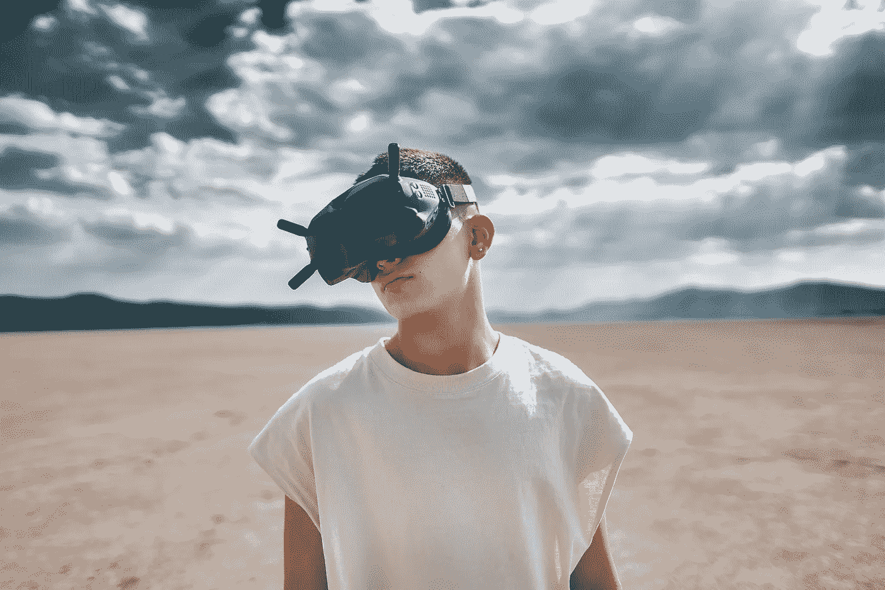

# 超现实写作的未来

> 原文：<https://medium.com/mlearning-ai/the-future-of-writing-in-hyperreality-3e97653df37a?source=collection_archive---------4----------------------->

## 为什么你应该使用虚拟现实/人工智能

Photo by [Jezael Melgoza](https://unsplash.com/@jezael?utm_source=unsplash&utm_medium=referral&utm_content=creditCopyText) on [Unsplash](https://unsplash.com/s/photos/future?utm_source=unsplash&utm_medium=referral&utm_content=creditCopyText)

虚拟现实让计算机生成的世界看起来像真的一样。

而事实并非如此。

考虑下面的例子。电子游戏是呈现虚拟世界并使其更加逼真的一种新方式。很容易使用 VR 来增强我们在现实世界中看到的东西。