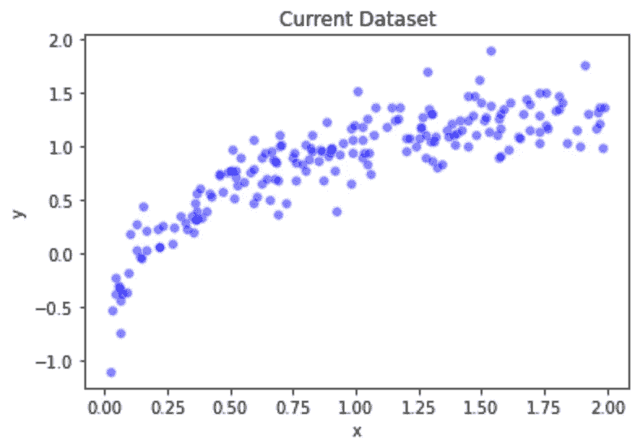
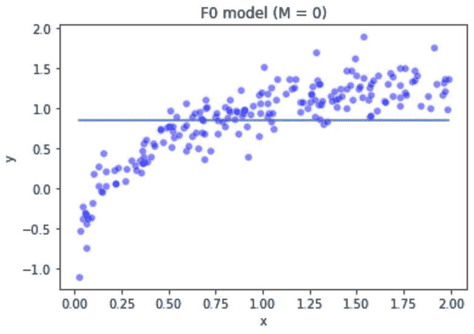
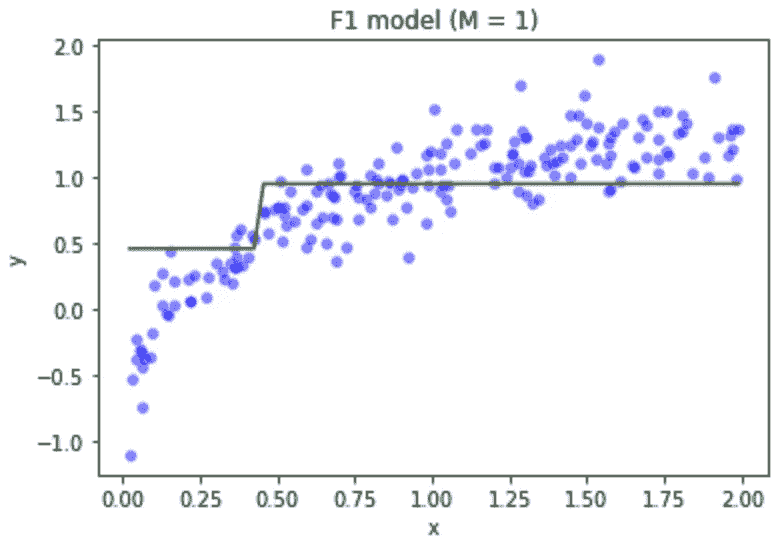
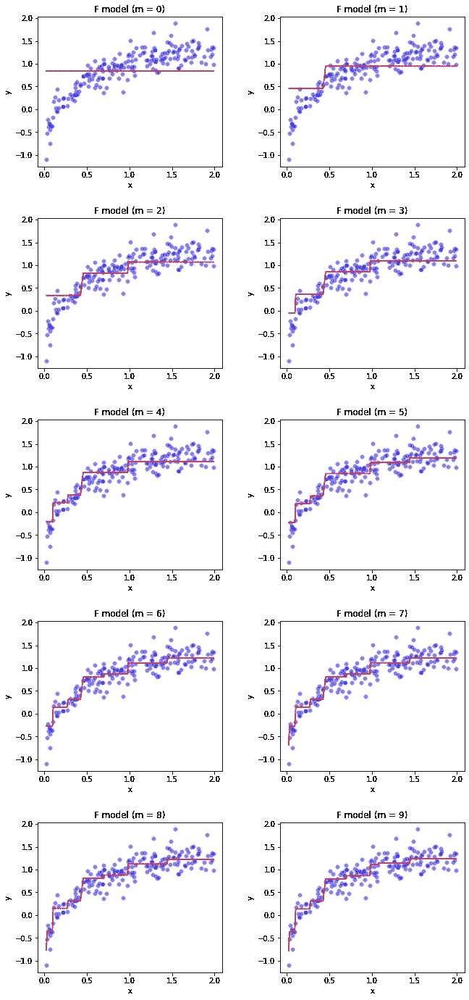

# 梯度推进算法:XGBoost 库背后的秘密

> 原文：<https://medium.com/mlearning-ai/the-gradient-boosting-algorithm-the-secret-behind-the-xgboost-library-efbeb8ebacf0?source=collection_archive---------2----------------------->


Photo by [Chris Liverani](https://unsplash.com/photos/dBI_My696Rk) ([unsplash.com](http://unsplash.com))

# 概观

我四处寻找在 **Kaggle** 竞赛中使用的最常见的数据科学库；原来 **XGboost** 就是其中之一。这个库提供了一个有趣的模型形成过程，可以帮助你避免过度拟合(一个方差很大的模型)。

**XGBoost，**是**极限梯度增强**的简称，是陈天琦开发的 ML 库，目前非常流行。顾名思义，这个库的核心是一个叫做**梯度提升**的算法。这是一个有趣的算法，使用决策树来创建强回归模型或分类算法！

在本文中，我们将弄清楚这个算法是关于什么的。

# 梯度推进算法

基本上，它是一种机器学习算法，结合弱学习器来创建强预测模型。该模型分步骤工作，每一步将以前的模型与新的弱学习器(决策树)相结合，该弱学习器被调整为以残差为目标来建立预测模型。让我们看一个例子:

假设我们有这样一个数据集:



Source: Own Elaboration

我们的任务是创建一个适合这些数据的 ML 模型，所以让我们开始吧！

梯度下降算法从一个“哑”模型开始。通常你可以使用一个常数值的函数(目标的平均值)。

看起来是这样的:



Source: Own Elaboration

显然这不是我们想要的，所以我们给这个模型添加一个决策树，它的目标是 *F0* 的残差。让我们称这个决策树(弱学习者)为 *h0:*

如果我们将它们组合成一个 *F1* 模型，即 *F1 = F0 + h0* ，我们将得到如下结果:



Source: Own Elaboration

如果我们继续并基于 *F1* 和一个新的弱学习者 *h1* 创建一个 *F2* 模型会怎么样:

最后，我们可以为此设置一个通用公式:

如果我们基于 F0 设置公式，我们将得到:

有意思…但是让我们再做一件事！

一般来说，构建预测模型时要处理的一个重要问题是**过拟合**。避免这种情况的一个方法是给弱学习者增加一个**学习率**。

为了创建一个良好的、非过度拟合的模型，模型**应该** **而不是** **记住(记忆)**整个训练集。所以一般公式是:

因此，如果我们计算 10 个循环 *(M=10)* ，这个模型将是这样的:



Source: Own Elaboration

这就是梯度推进！

# 如何在 Python 中从头实现渐变提升

正如我提到的，这种算法是按步骤工作的(逐级方式)，所以您可能会猜测这是一个将重复相同过程的循环，因此算法将是这样的:

```
def gradient_boosting_algorithm(times,learning_rate):

  F0 = y.mean()
  Fm = F0
  trees = []
  row = 1
  column = 1
  #Creating an array where we can store each F function per step
  F_array = []
  F_array.append(np.full((data_size,1),F0))

  for i in range(times):
    treeModel = DecisionTreeRegressor(max_depth = 1)
    treeModel.fit(x,y-Fm)
    Fm += learning_rate*treeModel.predict(x)
    F_array.append(np.copy(Fm))

  return F_array
```

你可以这样绘制每个模型:

```
M = 10
F_array = gradient_boosting_algorithm(times = M, learning_rate = 0.5)
N_columns = 2
N_rows = int(M/N_columns)
idx = 0

#Ploting each loop regression model (Fm)
fig, ax = plt.subplots(nrows=N_rows, ncols=N_columns, figsize=(10,20))
fig.tight_layout(pad=5.0)
for i in range(N_rows):
  for j in range(N_columns):
    sns.scatterplot(data=dataset, x="x", y="y", color="blue", alpha=0.5,ax=ax[i][j])
    ax[i][j].plot(x,F_array[idx],color="red")
    ax[i][j].set_title(f"F model (m = {idx})")
    idx+=1

plt.show()
```

我从 [**Matt Bowers 的文章**](https://blog.mattbowers.dev/gradient-boosting-machine-from-scratch#Implementation) **(全部功劳归于他)**中学到了这个算法和代码，你也可以在我的 [**GitHub**](https://github.com/luismirandad27/ds-gradient-boosting-algorithm-explanation) 中查看如何模拟这个的执行，以及它如何执行 Sklearn 库中包含的 GradientBoostingRegressor 方法。

# 结论

梯度下降是 XGBoost 和 LightGBM 等许多流行库背后的算法。在使用这些模型之前，我认为了解它们在幕后做什么是很重要的。

希望这有助于我在数据科学家之旅中找到它！

**快乐学习！**

关注我:[LinkedIn](https://www.linkedin.com/in/lmirandad27/)|[GitHub](https://github.com/luismirandad27)|[个人网站](https://luismiguelmiranda.com/)

**参考文献**

*   [https://blog . matt powers . dev/gradient-boosting-machine-from-scratch #实现](https://blog.mattbowers.dev/gradient-boosting-machine-from-scratch#Implementation)

[](/mlearning-ai/mlearning-ai-submission-suggestions-b51e2b130bfb) [## Mlearning.ai 提交建议

### 如何成为 Mlearning.ai 上的作家

medium.com](/mlearning-ai/mlearning-ai-submission-suggestions-b51e2b130bfb)