# 逻辑回归的核心

> 原文：<https://medium.com/mlearning-ai/the-heart-of-logistic-regression-2bc2554dfebe?source=collection_archive---------2----------------------->


在本帖中，我们将使用与健康问题相关的数据集开发一个二元分类模型。它是从[kaggle.com](https://www.kaggle.com/nareshbhat/health-care-data-set-on-heart-attack-possibility?select=heart.csv)获得的，根据获得的 14 个特征，它与心脏病发作的可能性有关。

我们将从探索已经干净的数据集(*没有空值*)开始，然后生成逻辑回归模型并评估其性能。

# 逻辑回归

是一种回归分析，用于根据独立变量或预测变量预测分类变量(*一种可以包含有限数量类别的变量，通常为两个*)的结果。这对于将事件发生的概率建模为其他因素的函数非常有用。

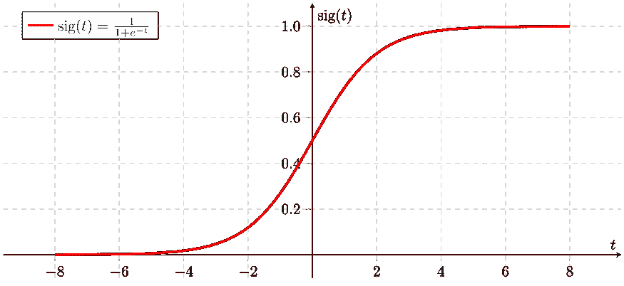

这个过程与线性回归非常相似，只是响应变量是二项式的。结果是每个变量对所观察到的感兴趣事件的比值比的影响。

因此，当因变量本质上是二元时，使用逻辑回归(*或 logit* )。例如，预测是否是垃圾邮件、是否患有 covid、评论是否为正面评论等。

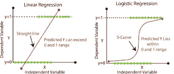

Linear VS Logistic Regression

# 导入库和浏览数据集

```
import matplotlib.pyplot as plt
import pandas as pd
import numpy as np
import seaborn as sns
from sklearn import preprocessing
from sklearn.linear_model import LogisticRegression
from sklearn.model_selection import train_test_split
from sklearn import metrics
# create dataframe from csv file
heart_data = pd.read_csv('./data-science/heart.csv')
heart_data.head()
```

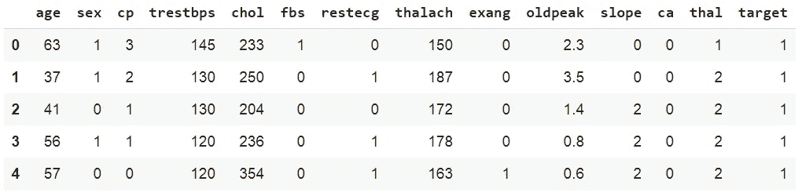

属性信息:

*0)年龄— 1)性别— 2)胸痛类型(4 个值)— 3)静息血压— 4)血清胆固醇(毫克/分升— 5)空腹血糖> 120 毫克/分升— 6)静息心电图。结果(值 0，1，2) — 7)达到的最大心率— 8)运动诱发的心绞痛— 9)旧峰值— 10)运动峰值的斜率— 11)主要血管的数目(0—3)—12)thal:0 =正常；1 =固定缺陷；2 =可逆转的缺陷——13)目标:0=心脏病发作几率降低 1=心脏病发作几率增加*

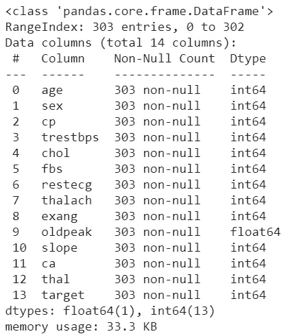

heart_data.info()

让我们开始在现有的数据上做一些探索。在下图中，我们有一个变量之间的热图关联图，包括我们的目标。接近 0 的值表示没有相关性，负值表示与负趋势(越接近-1 越大)和正趋势相关，反之亦然。

```
# Correlation ranges from -1 to +1\. 
# Values closer to zero means there is no linear trend between the 2 variables. 
# Close to 1, more positive correlation, # –1 indicates a perfect negative corr.corr = heart_data.corr()
plt.figure(figsize=(16,9))
ax = sns.heatmap(
    corr, 
    annot = True,     
    vmin=-1, vmax=1, center=0,
    cmap=sns.diverging_palette(10, 240, n=50),
    square=True
)
ax.set_xticklabels(
    ax.get_xticklabels(),
    rotation=45,
    horizontalalignment='right'
)
```

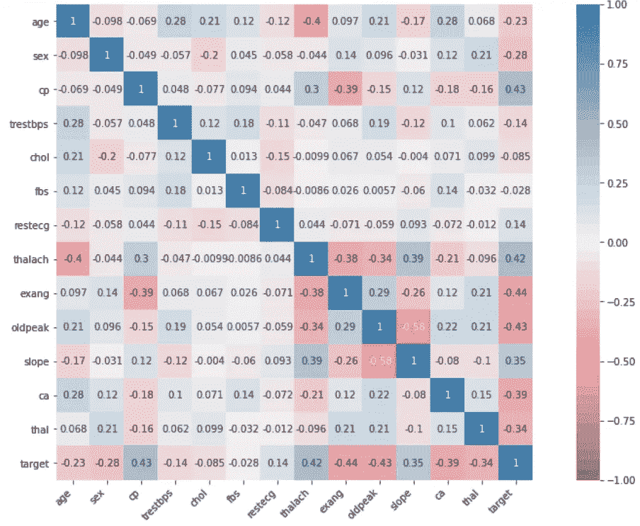

在相关图中，我们看到特征 fbs 和 chol 与目标的相关性接近于 0 ( *没有相关性*)，因此我们认为它们在我们的模型中不重要，我们将继续删除。我们实际上将创建一个新的数据帧( *heart_part* )来保存原来的数据帧，以防我们在某个时候需要重用它

```
# Drop 2 features with poor correlation with target
heart_part=heart_data.drop(columns=['fbs', 'chol'])
```

如果我们想通过 cp ( *胸痛类型*)更好地观察年龄和最大心率( *thalach* )之间的-0.4 ( *负趋势*)的相关性:

```
# Chest pain type (cp) group
# Age VS maximum heart rate (thalach) = -0.4 trend
g = sns.FacetGrid(heart_data, col="cp")
g.map(sns.scatterplot, "age", "thalach", alpha=.7)
g.add_legend()
```

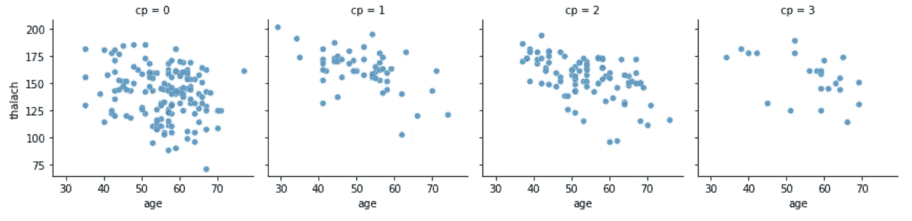

max rate heart VS age — by chest pain type

我们也可以用 seaborn 来形象化两个变量之间的关系，通过一条 sigmoid 线来分隔点。为此，我们将使用带逻辑=真参数的 [lmplot](https://seaborn.pydata.org/generated/seaborn.lmplot.html) 方法。

在下图中，我们看到了目标(*0–1*)对特征 thalach。

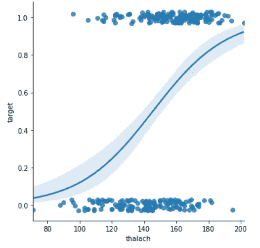

seaborn lmplot sigmoid function (target [0,1] VS max. rate heart)

# 建立我们的逻辑回归模型

我们将首先创建我们的训练和测试数据集，然后验证我们的训练数据中没有**类不平衡**问题

```
# X features and Y labels
X=heart_part.drop(columns=['target'])
Y=heart_part['target']
# Build train and test datasets
X_train,X_test,y_train,y_test=train_test_split(X,Y,random_state=0)
```

**阶层失衡问题**

这是分类模型中出现的一个问题，因为样本在类别中的分布是不平衡的，或者说是偏斜的。当一个或多个类别与其他类别相比在训练数据中具有非常低的样本比例时，会出现这种情况。

**为什么要解决？**

让我们来谈谈“**准确性悖论**”，这是一个自相矛盾的发现，即在预测分析中进行分类时，准确性不是预测模型的一个好指标。例如，如果我们对不平衡数据(*90%的样本来自第 1 类，只有 10%来自第 2 类*)有 90%的准确性，我们的模型将查看数据并决定它能做的最好的事情是预测数据是第 1 类！！在这种情况下，只测量准确性会导致我们在分类中处于误导的位置

**如何解决？**

阶级不平衡并没有解决，它仍然是一个开放的问题，一旦确定，必须解决一些方法来缓解它，这将在未来的帖子中讨论。

因此，我们检查类样本没有过度不平衡。

```
from collections import Counter
Counter(y_train)
```

计数器({0: 105，1: 122})

两个类中的训练数据非常接近，所以在这种情况下我们不应该担心类不平衡的问题。

现在，我们必须对 X 数据进行标准化，使它们处于相同的值范围内，并促进模型的计算

```
# Scale the X data
from sklearn.preprocessing import StandardScaler
scaler = StandardScaler()
X_train = scaler.fit_transform(X_train)
X_test = scaler.transform(X_test)
```

现在我们创建我们的逻辑回归模型

```
# build logistic regression model, train and predict test data
lr = LogisticRegression()
model = lr.fit(X_train, y_train)
lr_predict = lr.predict(X_test)
```

让我们来衡量模型的性能

```
# import data modeling metrics
from sklearn.metrics import confusion_matrix, accuracy_score, classification_report
lr_conf_matrix = confusion_matrix(y_test, lr_predict)
lr_acc_score = accuracy_score(y_test, lr_predict)
print("confusion matrix")
print(lr_conf_matrix)
print("\n")
print("Accuracy of Logistic Regression:",lr_acc_score*100,'\n')
print(classification_report(y_test,lr_predict))
```

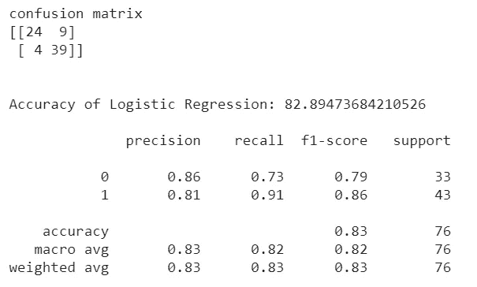

classification_report from sklearn.metrics

为了更好的可视化我们的混淆矩阵，我们将使用 Seaborn

```
df_cm = pd.DataFrame(lr_conf_matrix, columns=np.unique(y_test), index = np.unique(y_test))
df_cm.index.name = 'Real'
df_cm.columns.name = 'Predicted'
plt.figure(figsize = (10,7))
sns.set(font_scale=1.2)
sns.heatmap(df_cm, cmap="Blues", annot=True,annot_kws={"size": 14})
```

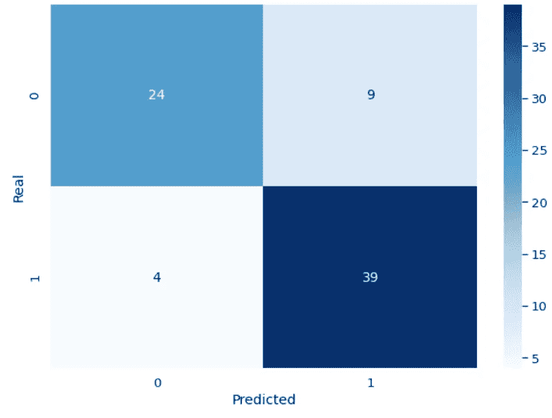

seaborn heatmap confusion matrix

好的，但是所有这些指标意味着什么呢？如果你读过之前关于线性回归的帖子，你应该知道**精度**的值，在这个例子中是 82.89%，还有其他的吗？

**二元分类的度量**

**一)**混淆矩阵

这是一个包含预测值和实际值的 4 种不同组合的表格。

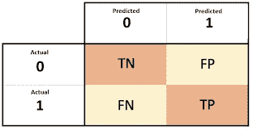

**TN** (真 negat。):预测负面，这是真的

**FP** (错误位置。/类型 1 错误):预测为正，但为假

**FN** (假阴性。/类型 2 错误):预测为负，这是假的

**TP** (真实位置。) :预测积极，这是真的

在我们的例子中，例如，我们有 39 个 TP 和 4 个 FN。这表明我们的模型预测实际 43 个样本中的 39 个样本适合心脏病发作，剩下 4 个样本未被识别为阳性(2 型错误)。在这种情况下，如果我们预测患者会出现严重的健康问题，我们应该最小化最后一个值(FN)。

而该模型已经将 33 个样本中的 24 个识别为阴性，这使得我们有 9 个样本没有被正确地识别为阴性。虽然错误率较高，但不像前一个案例(FN)那样严重，已经确定了 9 个患者样本有心脏病发作的可能性，而实际上没有(FP)。

**b)** **精度** = TP / (TP+FP)

重要说明:如果我们必须避免假阳性，在我们的例子中，我们查看 1 级的值(*心脏病发作的可能性更大* ) = > 39 / (39+9) = 0，8125

**c)** **召回**(也叫*真阳性率*或*灵敏度* ) = TP / (TP+FN)

如果我们必须避免假阴性(这是我们的健康案例)=> 39 / (39+4) = 0，9069，这一点很重要

**d)****F1-得分** = 2。TP / (2。TP)+FN+FP)

将精度和召回率组合成一个值=> 2.39 / (2.39)+4+9 = 0，8571

记住精确度和召回率之间的权衡是很重要的(*我们提高精确度，降低召回率，反之亦然*

简而言之有:

更多**面向回忆的**任务(*如果我们没有检测到积极的*结果会更高)

*   *疾病检测、法律信息的搜索和提取*

更多**面向精度的**任务(*如果我们没有检测到负面的结果*，后果会很严重)

*   *搜索引擎排名，文档分类器*

**e)** **误报率** ( *误报率，漏报率* ) = FP / (FP+TN)

总结当实际结果为负时，预测为正类的频率。

**f)** **ROC 曲线**

接收器操作特性( *ROC 曲线*)总结了使用不同概率阈值的预测模型的真阳性率/召回率( **b** )和假阳性率( **e** )之间的权衡。当观察值在每一类之间平衡时，使用它是恰当的

**ROC/AUC 曲线**

好了，有足够的指标来思考，让我们回到评估我们的逻辑模型。我们已经说过，我们的两个类是相当平衡的，所以最好是查看采用 ROC 曲线值的模型的性能。嘿停在这里！，为什么可视化这个 ROC 曲线很重要？

1.  不同模型的曲线一般可以直接比较，也可以针对不同的阈值进行比较。
2.  曲线 ( *AUC* )下的**面积可以作为模型技巧的总结。**

请记住，当我们预测一个二元结果时，它是正确的预测(真阳性)还是错误的预测(假阳性)。真否定和假否定也会产生同样的紧张。那么，什么是有技巧的模特呢？一个熟练的模型将分配一个更高的概率给一个随机选择的真正的积极事件，而不是一个平均的消极事件。熟练的模式通常用曲线表示，曲线向图的左上角倾斜。

我们将根据我们的数据生成 roc-auc 曲线图，为此，我们必须首先获得一个列表，其中包含我们的分类器模型对每个样本(行)做出的概率预测

```
# obtain prediction for each row of X_test
predictions = model.predict_proba(X_test)# build roc_curve values with y_test and probability 
# predictions of 1 value class (*more chance heart attack*)
fpr, recall, thresholds = roc_curve(y_test, predictions[:, 1])# compute Area Under the Roc Curve
roc_auc = auc(fpr, recall)# Plot Roc-Auc
plt.figure(figsize = (10,7))
plt.title('Receiver Operating Characteristic')
plt.plot(fpr,recall,'b',label='AUC = %0.2f' % roc_auc)
plt.legend(loc='lower right')
plt.plot([0,1], [0,1], 'r--')
plt.xlim([0.0, 1.0])
plt.ylim([0.0, 1.0])
plt.xlabel('Fall-out')
plt.ylabel('Recall')
plt.show()
```

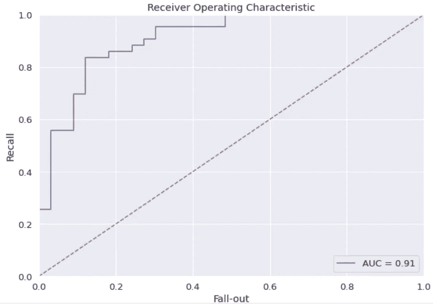

红色虚线将是一个没有技巧的模型，它不能区分类别，并在点(0.5，0.5)处表示，在每个阈值处，它由从图的左下方到右上方的对角线表示，并具有 0.5 的 AUC。

一个能力完美的模型被表示在一个点(0，1)上。我们的 ROC 曲线用蓝线表示，优于随机的 0.5 AUC ( *红色虚线*)。

像往常一样，github 链接附有完整的[逻辑回归 jupyter 笔记本](https://github.com/jrercoli/logistic_regression_heart_attack)，这样你可以自己验证代码。

也请关注我的数据科学博客 [EmpowereDataScience](https://rorjor.wixsite.com/empoweredatascience)

好了，伙计们，现在是时候使用 [Scikit-Learn](https://scikit-learn.org/stable/index.html) 通过逻辑回归模型项目生成您自己的二元分类，并推进您的数据科学职业生涯了，再见。

感谢您的评论