# 欧洲粒子物理研究所大型强子对撞机中的希格斯玻色子机器学习挑战

> 原文：<https://medium.com/mlearning-ai/the-higgs-boson-machine-learning-challenge-in-the-cern-large-hadron-collider-8520b709686d?source=collection_archive---------3----------------------->

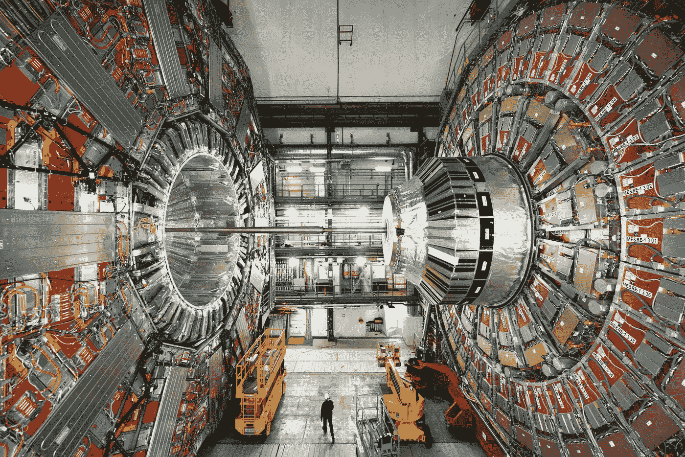

The Large Hadron Collider

# 1.介绍

欧洲核子研究组织，被称为 T2 CERN，是一个欧洲研究组织，运营着世界上最大的粒子物理实验室。CERN 也是万维网(WWW)的发源地。LHC 实验每年产生约 90 千兆字节的数据，另外 25 千兆字节的数据来自欧洲粒子物理研究所的其他(非 LHC)实验。有 20 多个实验——国际合作。

你可能已经知道，欧洲粒子物理研究所是著名的**希格斯玻色子**被发现的地方。它是一个粒子，解释了为什么物体有质量，没有它，物体就没有质量。正如我们所知，这意味着没有恒星，没有星系，甚至可能没有生命。

## 1.1 问题

这个问题的简单定义是，我们试图将事件分为两类:

*   (1)**信号**事件和
*   (2) **背景**事件。

这里的“信号”事件是“希格斯玻色子的ττ衰变”,而“背景”事件是每一个其他希格斯玻色子发生的非ττ衰变。它本质上是一个二元分类挑战，就像分类肿瘤是良性还是恶性的机器学习挑战一样。

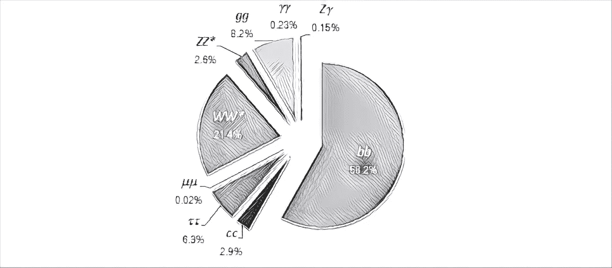

正如我们所看到的，希格斯玻色子衰变为两个τ轻子(τ-τ)只是希格斯玻色子实际衰变的 6.3%。实际上，希格斯玻色子在几乎 60%的时间里衰变为两个底夸克( *bb* )。然而，数据集**而不是**仅包含 6%的信号事件和 94%的背景事件。背景事件少了很多。三分之一的事件被标记为信号，剩余的三分之二的事件被标记为背景。

## 1.2 数据集

数据集是从 [CERN 开放数据门户](http://opendata.cern.ch/)获得的。在[笔记本](https://github.com/Brighton94/higgs-boson-machine-learning-project)中，我列出了每个特性的含义。

但是，这里有一些开始使用的细节:

*   所有变量都是浮点数，除了 PRI_jet_num 是整数
*   以 PRI 为前缀的变量(用于基元)是由探测器测量的关于束团碰撞的“原始”量。
*   以 DER 为前缀的变量(衍生的)是从原始特征计算的量，这些特征是由 ATLAS 的物理学家选择的
*   可能发生的情况是，对于某些条目，某些变量是无意义的或无法计算的；在这种情况下，它们的值为 999.0，超出了所有变量的正常范围

*看起来像* ***这样的值丢失值*** *可能已经被 CERN 的科学家用一个异常值代替了。特别是，我注意到丢失的值或* ***NAN*** *条目(如果有)可能已被替换为不在特征值范围内的异常值；使用的异常值为 999。*

为了将粒子对撞机实验中收集的大量数据转化为对自然的精确测量，粒子物理学家必须在高维数据中找到微妙的模式。为此，粒子物理学家使用复杂的计算机模拟，这些模拟编码了我们对基本粒子碰撞、附加辐射模式、粒子衰变、强子化、与探测器的相互作用以及传感器读数的理解。*不幸的是，用计算机模拟分析粒子碰撞数据经常面临一个根本性的挑战。*

*模拟实现了一个正向过程:给定一个物理参数值，它们可以生成合成观测值。然而，在科学过程中，物理学家感兴趣的是逆问题:给定观测数据，物理参数最可能的值是什么？在频率主义者和贝叶斯统计框架中，这种推断所需的关键量是似然函数，或作为参数函数的观察数据的概率密度。然而，一般来说，计算似然函数是不可能的——这种困难是数据分析的一个基本问题。*

多年来，已经开发了不需要易处理的似然函数的参数推断的不同方法。这些方法统称为基于模拟或无似然推理技术。

**LHC 粒子物理实验的主要阶段有:**

*   从氢中产生质子，加速到 0，99999999 c(这里的“c”是光速)
*   将一束质子撞在一起(碰撞被称为“事件”)
*   将原始检测机信息转换为“点击数”(像素)
*   重建粒子轨迹——“轨迹”、“喷射”、“簇射”
*   识别粒子的类型
*   重建衰变结构
*   过滤有意义的事件
*   分析统计属性

从下面的转折点开始，抛物线的右半部分也突出显示了这些主要阶段:

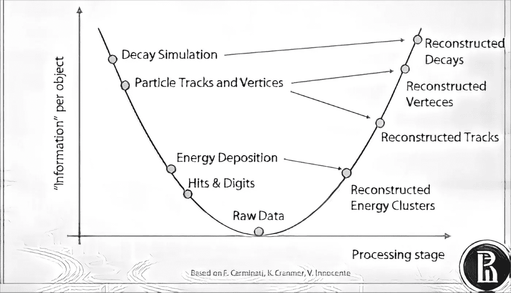

Picture Based on F.Carminati, K.Cranmer and V.Innocente

请注意，如果你从“原始数据”转折点沿抛物线向右走*，你会沿着我在上面描述的路径。这张图片来自探测器记录和 CERN 科学家收集的原始信息→重建点→轨道段→轨道候选者和顶点→某种衰变。同时，有非常强大的软件和模块可以用来模拟发生在探测器层面和亚原子层面的每一步。实际上，有一些事件发生器可以产生类似模式的信号，它们允许您估计您可以从检测器获得什么样的响应。下面是我把我听说过的常见模拟软件包整理出来的一张图片: *Geant* 、 *Genie* 和*皮媞亚*。*

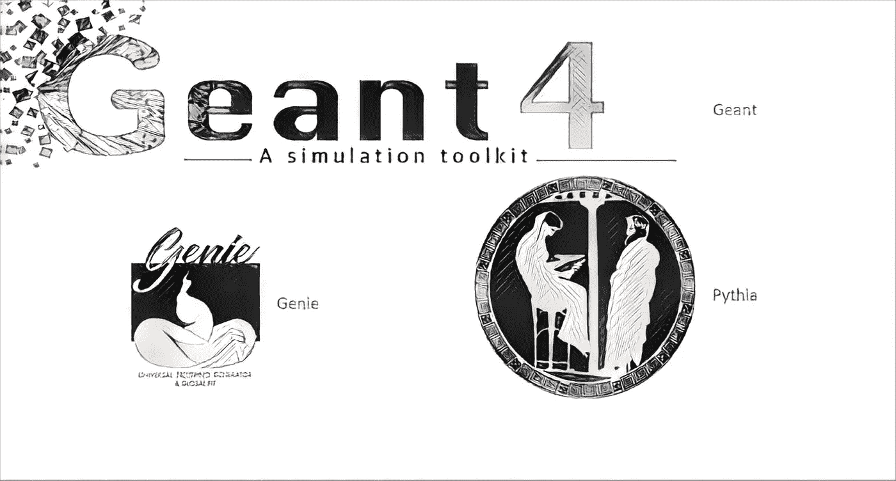

Pictures obtained from the simulation package links: Genie — [http://www.genie-mc.org/](http://www.genie-mc.org/), Pythia — [https://pythia.org/](https://pythia.org/), Geant — [https://geant4.web.cern.ch/](https://geant4.web.cern.ch/). More info about simulation packages at [https://arxiv.org/pdf/1101.2599.pdf](https://arxiv.org/pdf/1101.2599.pdf)

用于模拟数据的方法也可以应用于真实数据。

# 方法学

在这一部分中，我将讨论和描述我所做的探索性数据分析(EDA)、我所执行的推断性统计测试，以及使用了什么机器学习及其原因。

Kaggle 上过去可用的数据和假设最大化的指标被称为*近似中值显著性* (AMS):

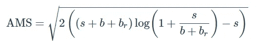

我选择使用**对数损失度量**而不是 AMS 度量，这是为比赛设计的。对数损失度量是基于概率的最重要的分类度量之一。虽然很难解释原始的对数损失值，但是对数损失仍然是比较模型的一个很好的度量。对于任何给定的问题，较低的测井损失值意味着更好的预测。

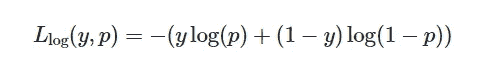

其中 *y* 是**真标签**，而 *p* 是 *y* = 1 的概率。

**注意，与 AMS 指标不同，对数损失严重惩罚了预测非常错误的模型**。例如，如果 *y* = 1，并且一个模型预测 *p* 是*近似为零*，那么就只剩下括号内的第一项(因为 1—*y*= 0)，如果 *p* 几乎为零，那么第一项就会很大。这是因为 log(0)是负无穷大*，括号外的负号意味着–log(0)是正无穷大*。**

## *探索性数据分析*

*从我执行的 EDA 中，我发现没有缺失值，这可能是因为 CERN 的科学家可能用不在要素值范围内的异常值替换了缺失值。特别是，他们似乎已经用–999 取代了无意义和缺失的值(如果有的话)。*

*总的来说，每列有 818238 行数据，包含用异常值-999 替换的数据的 11 列是:*

1.  *"`DER_mass_MMC`":有 124602 行值= -999*
2.  *"`DER_deltaeta_jet_jet` ": 580253 行值= -999*
3.  *"`DER_mass_jet_jet` ": 580253 行值= -999*
4.  *"`DER_prodeta_jet_jet` " : 580253 行值= -999*
5.  *"`DER_lep_eta_centrality` ": 580253 行值= -999*
6.  *"`PRI_jet_leading_pt` ": 327371 行值= -999*
7.  *"`PRI_jet_leading_eta` ": 327371 行值= -999*
8.  *"`PRI_jet_leading_phi` ": 327371 行值= -999*
9.  *"`PRI_jet_subleading_pt` ": 580253 行值= -999*
10.  *"`PRI_jet_subleading_eta` ": 580253 行值= -999*
11.  *"`PRI_jet_subleading_phi` ": 580253 行值= -999*

*正如人们所料，这个数据集有一个类不平衡。在现实生活中，几乎总是存在阶级不平衡。正如我们在下图中看到的那样，衰变为两个τ轻子的希格斯玻色子也不能幸免于这个问题:*

*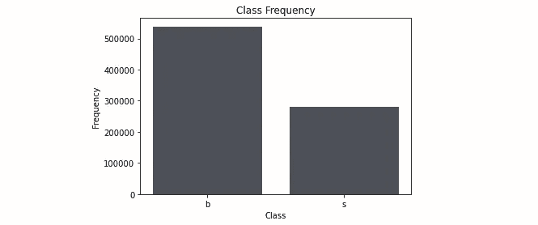*

***Class frequency plot:** this class imbalance suggests that we should use a stratified-shuffle splitting validation strategy.*

*我还计算并绘制了**互信息**分数。*

*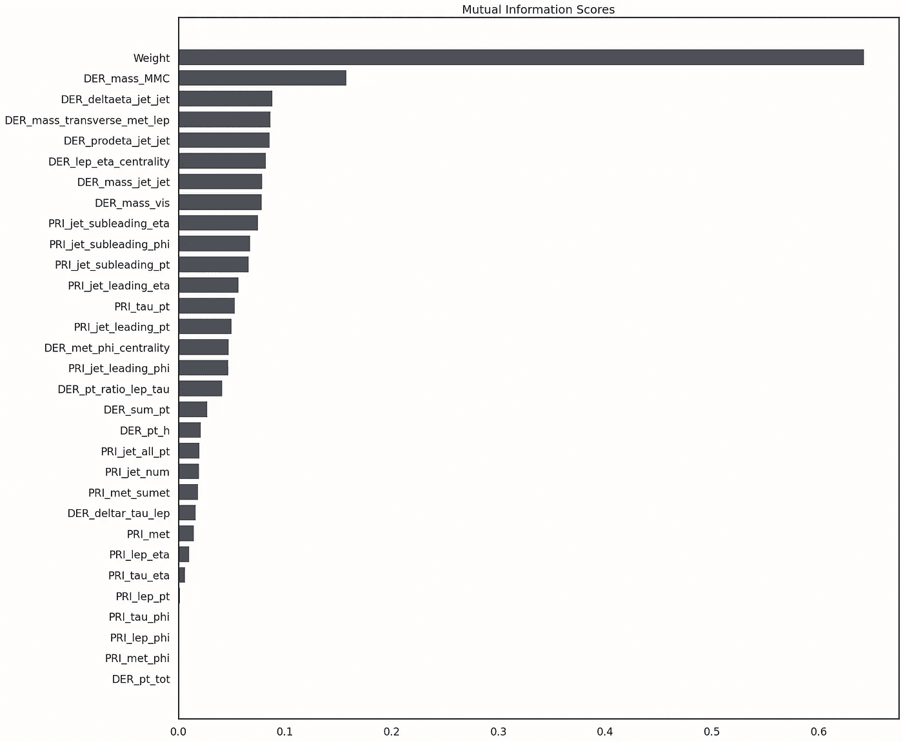*

***Mutual information scores:** What’s surprising here is that most of the variables prefixed with DER (for DERived) are variables that contain the most outliers (the outlier -999). Some of these variables have about two-thirds of such outliers, yet they contain so much more information about the target variable than the variables that neither have outliers nor missing values. This is a somewhat surprising result and, luckily, I didn’t drop the columns because they contain mostly outliers!*

*正如我们所看到的，‘`Weight`’特性包含了更多关于目标变量的信息，这也可以被认为是存在数据泄漏(稍后在‘我发现了什么’一节中有更多关于这一点的信息)。*

## *思考模型*

*由于明显的类别不平衡，我使用的数据分割策略是 [**分层混洗分割**](https://scikit-learn.org/stable/modules/generated/sklearn.model_selection.StratifiedShuffleSplit.html) ，以在我训练我的模型之前，在训练和验证数据中保持相同的类别比例。*

*基本上有 4 种常见的机器学习模型。线性的、基于树的、基于 kNN 的和神经网络模型。作为我的第一次尝试，我尝试了线性模型，因此我必须检查特征之间的相关性，即我必须检查所谓的**多重共线性**。*

***多重共线性**发生在多元回归模型中的一个预测变量可以通过其他预测变量以高精度进行线性预测的时候。这可能导致扭曲或误导的结果。幸运的是，决策树和提升树算法天生对多重共线性免疫。当他们决定分割时，树将只选择一个完全相关的特征。然而，其他算法如逻辑回归或线性回归也不能避免这个问题。*

*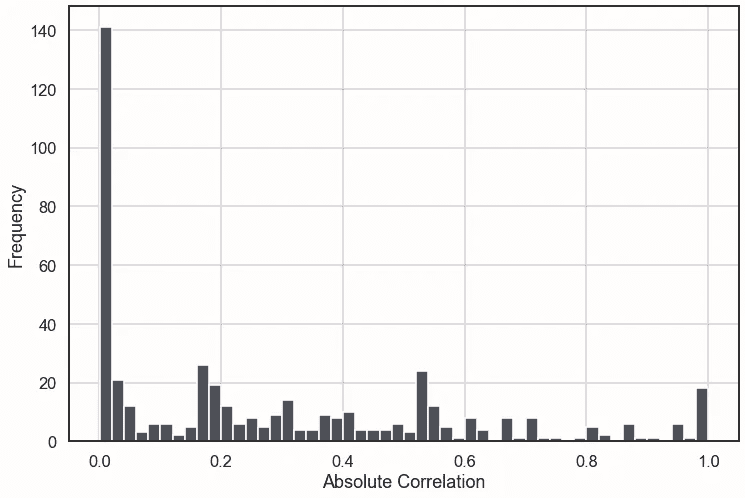*

*The absolute correlation here is just the absolute value of the correlation.*

*正如我们所看到的，大多数特征之间的相关性为零，这对我的线性模型来说是个好消息，但我发现有 496 对特征显示出强正/负相关性(即绝对相关值大于 0.8)。*

*另一个模式，似乎是一个不错的选择，是 KNN 模式。然而，我很快意识到，如果我从 1 到 40 的范围内训练 KNN 模型，将需要很长时间来确定最佳 k 值。KNN 模型的缺点是，由于距离计算，它们需要花费大量时间来训练和进行预测。然而，尽管有这个缺点，我仍然使用了 KNN 模型，它实际上比所有的线性回归模型都要好。*

# *我发现了什么*

## *数据泄漏和质量指标*

*`'Weight'`特征包含关于目标变量`'Label'`的信息。在我们的模型中包含这个特性会导致 [**数据泄露**](https://www.kaggle.com/alexisbcook/data-leakage) 。如果在训练模型之前没有去除`Weight`特征，这将导致**完美的分类器**，因此你将得到的是模型过于乐观。特别是，选择逻辑回归模型并使用 L1 正则化(LASSO)或 L2 正则化(RIDGE)技术将产生完美的分类器。数据泄露可以用我[笔记本](https://github.com/Brighton94/higgs-boson-machine-learning-project/blob/main/atlas-higgs-challenge.ipynb)开头定义的以下两个公式来解释:*

*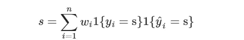***

*从上面两个公式可以看出，权重 *w_i* 告诉你一些关于目标变量的事情(事件标签是 *s* 还是 *b* )。出于这个原因，`Weight`列被简单地从特性列表中删除，以提供给我的模型。以下是没有数据泄漏的正确混淆矩阵:*

*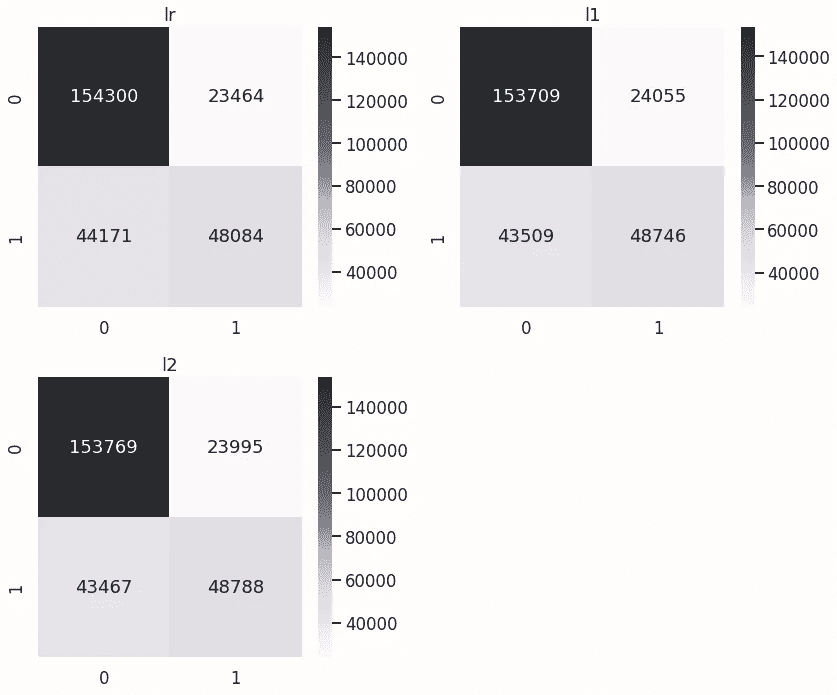*

*如我们所见，使用 L1 正则化(Lasso)的逻辑回归模型比使用 L2 正则化(Ridge)技术的表现稍好；使用正则化比仅使用正则逻辑回归模型(Lr)稍有改进。线性模型可以通过使用主成分分析(PCA)等降维技术来改进，但问题是我们的大多数值都是弱相关的，如果特征之间有很强的相关性，PCA 是有用的，所以我怀疑 PCA 不会有帮助或产生巨大的影响。所以这个项目的主要焦点很快转向了基于树的模型和神经网络。*

*目前，我使用了一个基于树的模型——梯度推进(GB)和一个简单的神经网络(NN)。梯度推进模型是目前编写时最好的模型。*

*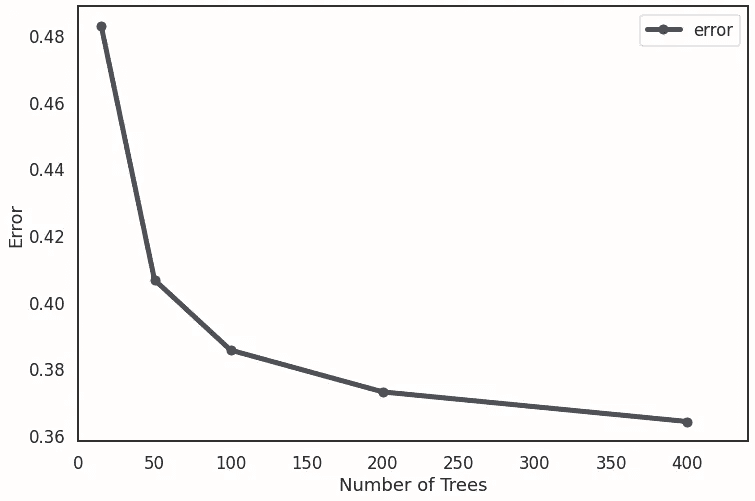*

*The error, in this case the log-loss, started to plateu between 200 and 400 trees.*

*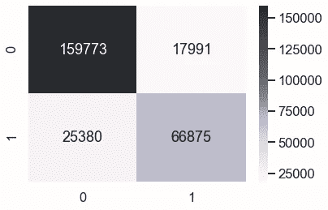*

*The gradient boosting classifier confusion matrix.*

*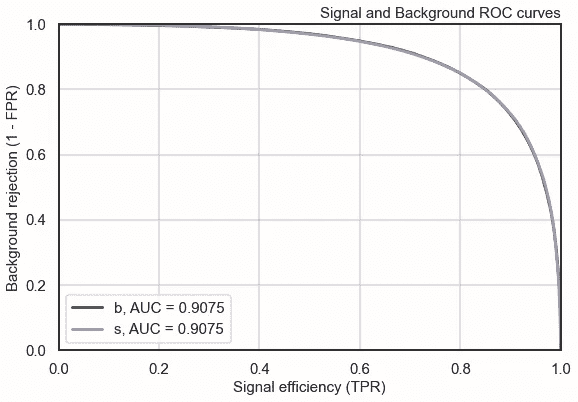*

***The ROC Curve of the Gradient Boosted Classifier. NB:** In the machine learning community, the ROC curve is plotted as a dependence of the true positive rate (TPR) from the false positive rate (FPR). However, in the high energy physics community, the ROC curve is plotted as the dependence of the one minus false positive rate (1–FPR) from the true positive rate. The 1–FPR is called the **background rejection** and the TPR is called the **signal efficiency**.*

*正如我们可以从 ROC 曲线中看到的，梯度增强分类器表现良好，并且远远优于线性模型，即使没有对超参数进行任何微调或使用 4 重交叉验证。然而，神经网络没有梯度推进模型做得好，但它比我尝试过的任何线性模型都好。也许一些预处理、特征工程、添加更多隐藏层和超参数调整可能会使我的 keras 神经网络的性能更好。也许比梯度推进模型更好。*

*结论:梯度增强分类器是用于确定事件是背景还是信号的最佳分类器；准确度为 0.84。使用的第二好的分类器是两个隐藏层的 keras 神经网络；一个隐藏层有 100 个神经元，另一个隐藏层有 60 个神经元。两个隐藏层都使用了 ReLu 激活函数，精度为 0.83。*

# *后续步骤*

*   *改进 keras 神经网络。*
*   *特征工程(需要一些粒子物理知识)。*

# *我没做的事*

*   *模型组装。虽然梯度推进是一个集合，我没有做各种各样的模型集合。*
*   *尝试为我的基于 kNN 的模型找到最佳 k 值。我想在 1 到 40 的范围内找到最好的 k 值。这意味着我必须训练 41 个 kNN 模型，训练它们需要很多时间，因为距离的计算。也许正确实现本文中的步骤将有助于加快确定最佳 k 值的过程:[用 20 行代码使 kNN 比 Scikit-learn 快 300 倍！](https://towardsdatascience.com/make-knn-300-times-faster-than-scikit-learns-in-20-lines-5e29d74e76bb)。或者，你可以试着正确地实现这个[的代码和思想，KNN (K 近邻)死了！](https://pub.towardsai.net/knn-k-nearest-neighbors-is-dead-fc16507eb3e)博客文章—作者声称:*

> *"*人工神经网络(近似最近邻)万岁，他们比 sklearn 的 KNN 快了 380 倍，同时提供了 99.3%的相似结果*"*

*谢谢你看我的博客。点击 [**此处**](https://github.com/Brighton94/higgs-boson-machine-learning-project/blob/main/atlas_higgs_challenge.ipynb) 查看我在 github 上的笔记本。*