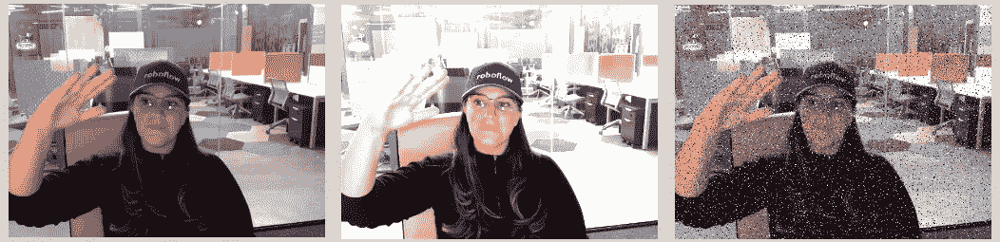
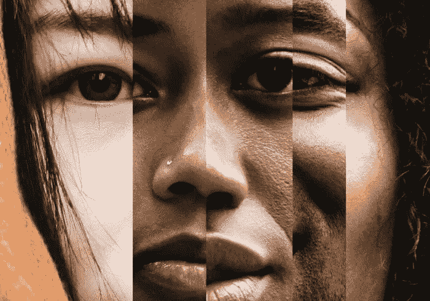
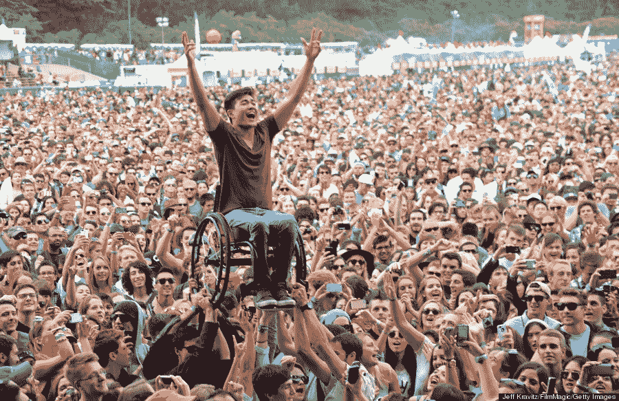

# 人类是有缺陷的

> 原文：<https://medium.com/mlearning-ai/the-humans-are-flawed-1f96a5a6196b?source=collection_archive---------0----------------------->

(但人工智能机器不必如此)

总的来说，计算机视觉是一项雄心勃勃的事业。

我们正在开发能够像我们看到的那样看待世界的技术——识别简单的物体，如树木和羊角面包，以及更复杂的事件，如石油和甲烷泄漏。今天，模特甚至可以阅读车牌和收据。计算机视觉已经在改变我们的世界，它的应用既广泛又惊人。

当我们谈论代表性数据的重要性时，我们通常指的是我们正在教导模型检测的对象周围的环境*的上下文。例如，如果我们正在训练一个模型来识别轮胎上的凸耳螺母，我们会希望我们的数据集包括在明亮和昏暗的灯光下，不同类型的轮毂盖上，以及轮胎的任何角度或旋转的凸耳螺母的图像。*

Image Augmentations (right to left): Original, Brightness, Noise

当然，当我们遇到物体本身的显著差异时——例如，在人类探测中——这些相同的租户是正确的。考虑一下装有微型照相机来检测手的存在的皂液分配器；如果你只是根据白人/白种人的手的图像来训练那个模型，那么肥皂是不会分发给任何黑皮肤的人的。将此推断为自动驾驶汽车的行人检测，训练集中代表性数据的重要性变得既明显又紧迫。

> *在许多方面，这些模型反映了我们自己的文化偏见，不仅突出了我们的源数据集的多样性，而且可能(更广泛地)突出了我们的世界观的多样性。*

我们教我们的模型就像你教一个孩子一样——但是在现实世界中，我们无法控制的力量会影响儿童的发展。当训练计算机视觉模型时，这是不正确的，这对于视觉架构师来说既是优点也是缺点。机器学习不受外界影响，只有当工程师采用了[主动学习](https://blog.roboflow.com/what-is-active-learning/#:~:text=Active%20learning%20is%20a%20machine,can%20best%20improve%20model%20performance.)——或者我们收集推理数据以反馈到我们的训练集的过程——模型才会得到改善，因为它在野外遇到了真正的多样性。

因此，模型性能的差异几乎总是可以归因于人为错误和/或疏忽——所以在许多方面，这些模型反映了我们自己的文化偏见，不仅突出了我们的源数据集的多样性，而且可能(更广泛地)突出了我们的世界观的多样性。

# 我们应该如何定义多样性？

当然，当我们着手建立一个可以在任何背景或能力下检测人类的模型时，皮肤色素不是我们必须考虑的唯一变量。根据模型本身的独特用例及用途，我们可以预见它在部署中可能会遇到许多变量。

我在下面列出了几个，虽然这个列表远未穷尽，但它(至少)旨在开始对话，并证明包容性是计算机视觉领域的一个重要组成部分。

# 易接近

信不信由你，直到 1992 年，州或地方政府建造的公共场所和建筑才被要求对残疾人完全无障碍。从那时起，我们已经走了很长的路，以确保不仅我们的政府大楼，而且我们的整个社区，对各种能力的人都是无障碍的——但仍有工作要做。随着不同行业探索并在现有工作流程和新产品及服务中采用计算机视觉，将可访问性放在首位至关重要；我们忽视了这一点，就有可能使我们的社会在过去三十年中取得的进步付之东流。

相关性的应用无处不在。考虑这样一种模型，它在人们进入公共场所时对他们进行计数(以保持容量等于或低于消防标准)，或者可以通过确定有多少人排队等候游乐园的最佳游乐设施来评估等待时间——这些模型知道识别坐着的人和站着的人吗？用拐杖还是拐杖？

# 宗教多样性

根据定义，计算机视觉仅仅依靠图像来发挥作用。它是一种基于视觉数据(输入)进行训练的技术，因此只能通过解释视频镜头或静止帧来生成模型预测(输出)。就此而言，计算机无法“看到”宗教、精神甚至道德——因此，很自然地，这种技术无法或多或少地包含基于人类固有信仰的人类主体。

这当然是真的，但是模特*可以*看到服装的变化——对我们中的一些人来说，我们的服装不仅反映了我们是谁，还反映了我们的信仰。举例来说，如果你正在训练一个模型来检测人耳，当你的模型遇到耳朵被头饰，头发覆盖物，包裹物或装饰性珠宝部分遮挡时，它将如何反应？

我们可以确保我们的模型对这些不同的表示做出响应，方法是将它们作为我们数据集中的已知差距来主动解决。这可能意味着加入穿着罩袍、长袍、帽子和头巾的人的图像——这种意识将提高所有人的模型性能，无论他们的宗教信仰如何。

# 性别流动性

六月是骄傲月，如果我在这个话题中忽略了性别认同和性取向的许多充满活力和相互交织的复杂性，那将是我的失职。一些计算机视觉应用程序可能需要模型根据人们偏好的性别表达来理解和区分他们。这里有一个发展视觉技术的机会，它存在于异质规范框架之外——直到今天，这个框架一直以我们可能尚未完全意识到或欣赏的方式限制着各行业的创新。

空中旅行就是一个很好的例子。大多数机场的 TSA 人体扫描仪要求工作人员在乘客进入机器接受扫描前按下“女性”或“男性”图标。这些扫描仪没有为代理人提供性别中立的选项，这是一个必然的遗漏，导致定期和不必要的搜身。这项技术的发展并没有考虑到主体不可避免的流动性；因此，这是一台效率较低的机器。

我们现在知道，技术在塑造我们对许多边缘化群体的文化理解(和接受)方面发挥着关键作用。计算机视觉也不例外。事实上，可以说我们正在建立为我们世界的未来奠定基础的模型。未来应该是什么样子？谁被机器“看见”，谁被留下？

# 让计算机视觉大众化

创建有代表性的数据集不仅出于道德原因很重要，它也符合良好的商业模式。考虑和识别我们的模型在野外可能遇到的变化(以多样性的形式)的过程总是会产生更好的性能。

我今天提出的问题触及了所有民主制度共有的一个弱点:计算机视觉能逃脱人类条件的固有偏见吗？毕竟，模型只是和创建它们的人一样公平。这种技术没有种族主义或能力主义的概念，没有对任何特定宗教或信仰的偏好，也不受性别二元制的限制——这些是独特的人类特征，它们在我们的一生中直接或间接地教给我们。

当我们开始创造一个被计算机视觉极大改变和显著改善的世界时，我们有责任确保这些影响跨越国界和信仰——建造代表我们最好的一面的机器，改善我们的生活和保护我们的星球，这些机器永远不会学习自动化人类的缺点。