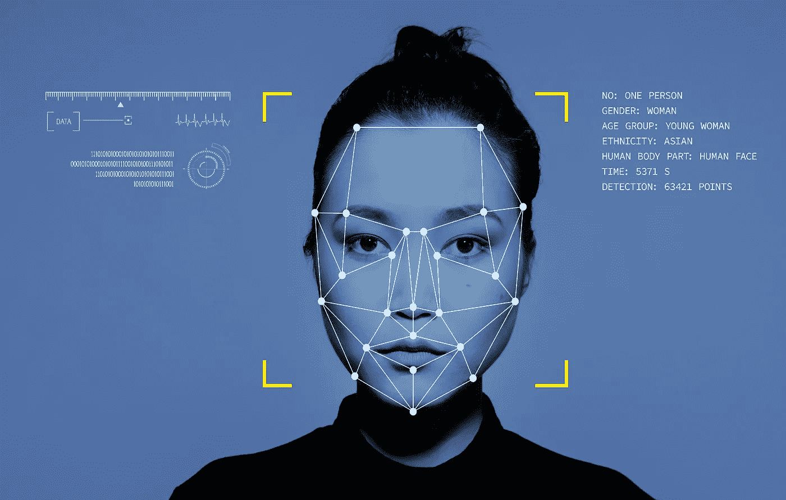
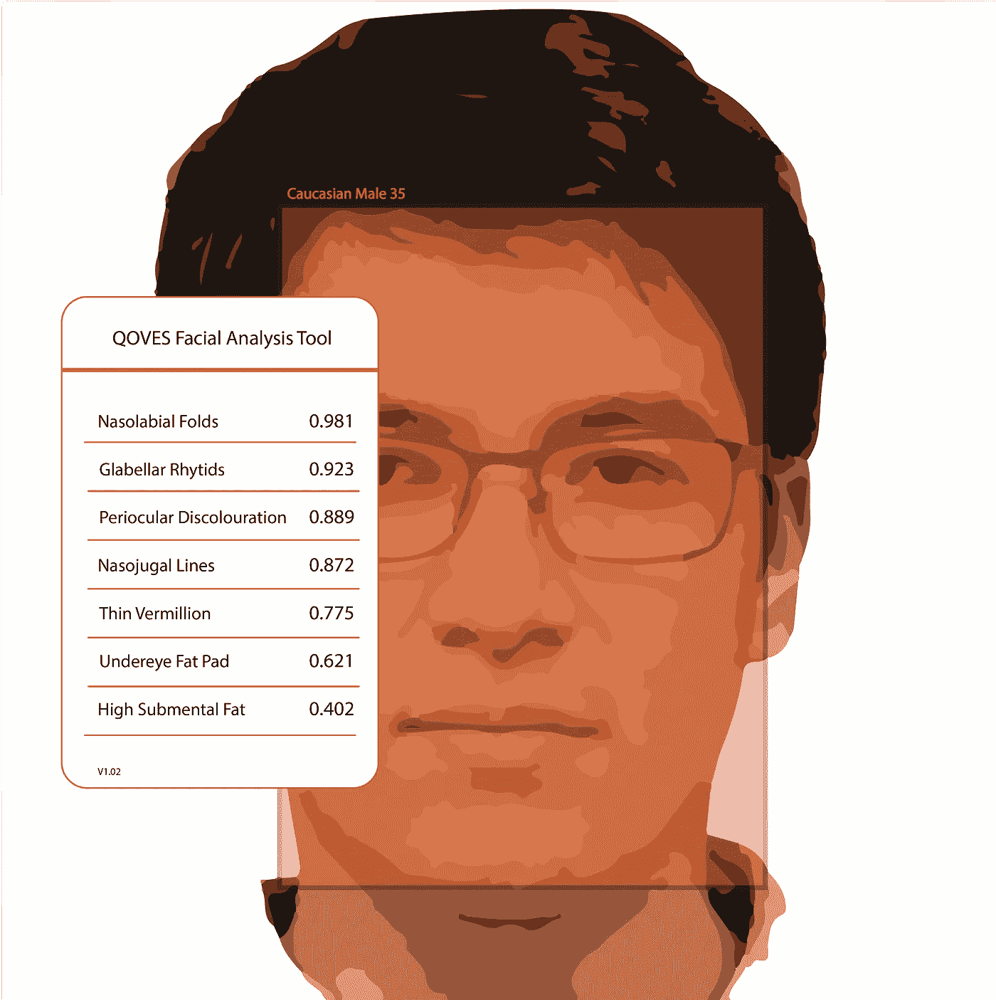

# 美国的信息混乱

> 原文：<https://medium.com/mlearning-ai/the-information-disorder-inside-of-us-15ea8052aabf?source=collection_archive---------1----------------------->

## 将幻想与现实混为一谈的美容算法是一种普遍的——也是有害的——错误信息形式

1999 年有了 RateMyFace。该网站允许用户对他人提交的照片的吸引力进行评级。2000 年，这个想法以《热不热》开始，这启发了像 YouTube 这样的社交媒体网站。最著名的是，马克·扎克伯格在 2003 年为哈佛学生推出了他的衍生产品和脸书的前身 Facemash。2007 年，因为 ImHot 把评分低于 7 分的人从网站上删除，使这个概念变得更毒。这一切都发生在算法渗透到我们生活的方方面面之前。

外观判断是最吸引人的应用程序中最吸引人的功能之一。Instagram Explore 页面决定了哪些面孔和身体会获得最多的喜欢。Snapchat 过滤变形的特征，以符合“理想”的美容标准。FaceTune 允许个性化探索你*可能*长什么样。像 PrettyScale 这样的应用还是老一套，给用户打分，这次是面部分析技术。

我们现在对这些影响有了更好的认识。从 [Instagram Face](https://www.newyorker.com/culture/decade-in-review/the-age-of-instagram-face) 到[Snapchat dismorphia](https://www.washingtonpost.com/news/morning-mix/wp/2018/08/06/patients-are-desperate-to-resemble-their-doctored-selfies-plastic-surgeons-alarmed-by-snapchat-dysmorphia/)再到 [FaceTune 热潮](https://www.womenshealthmag.com/beauty/a33264141/face-filters-mental-health-effect/)，算法引发的焦虑已经导致数百万人寻求整形手术或整容服务，试图让自己或他人看起来像改变后的版本。心理健康、青少年自信、多样性和包容性以及身体行为都因此受到影响——尤其是在年轻女孩中。

[Qoves Studio](https://www.qoves.com/) facial assessment tool uses machine learning to tell you how beautiful you are — or aren’t — and tell you what you can do about it with plastic surgery and other cosmetic recommendations.

麻省理工学院指出，年轻女孩已经成为一项实验的对象，这项实验展示了技术如何改变身份的形成，我们如何表现自己以及与他人的关系。《T2 卫报》报道的算法反映了以欧洲为中心的美丽偏见，对有色人种女孩造成了更多潜在的伤害。即使是那些选择不使用过滤器的人，也很难避免过滤掉的内容。欧盟人工智能伦理项目[的夏尔巴人](https://www.project-sherpa.eu/)指出，约会应用使用美容算法来匹配他们认为同样有吸引力的人。与此同时，像抖音这样的社交媒体平台也部署了一种类似的技术，通过好看的人来推广内容。想象一下，知道你的约会前景或者你在线内容的成功取决于你的吸引力。

鉴于后果如此严重，这项技术应该被允许走多远？AR 滤镜和“[美颜算法](https://www.tiktok.com/@benthamite/video/6838386972445248773?lang=en)”在什么点上从好玩走向危险？

一种思考方式是——图像改变技术背后的技术与其他被篡改的媒体如 [deepfakes](https://us18.campaign-archive.com/?u=cad39199e7b151d43fefde7d6&id=0bd489a734) 相差不远。结果是相似的。两者都可能导致破坏性的错误信息。人们正被引导以误导的、不准确的方式看待这个世界和他们自己。

像所有形式的错误信息一样，金融激励承诺推动影响我们如何看待自己的技术。世界经济论坛执行主席克劳斯·施瓦布提出了这可能导致的结果。“新技术正在融合物理、数字和生物世界，影响所有学科、经济和行业，甚至挑战关于人类意味着什么的想法。”

在我们对[信息紊乱](https://us18.campaign-archive.com/?u=cad39199e7b151d43fefde7d6&id=999245e361)的研究中，我们将定义扩大到包括有意或无意误导造成伤害的媒体形式。随着越来越多的用户接受人工智能和 AR 过滤器，关于另一种类型的障碍——对我们内部的影响——的对话不容忽视。

更多关于导航信息混乱的更新，请订阅媒体天才[时事通讯](https://solveforx.webershandwick.com/newsletter)。

认识大学生或应届毕业生吗？万博宣威的两个媒体天才暑期项目现已开始接受申请。[奖学金](https://mediagenius.webershandwick.com/fellowship/)是一项为期六周的带薪媒体、文化和科技项目。交流是围绕感兴趣的话题每周一次的课程和社区。