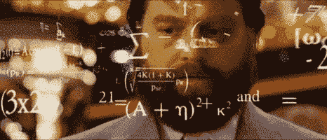
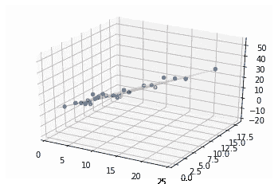
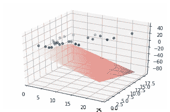
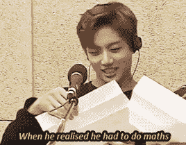
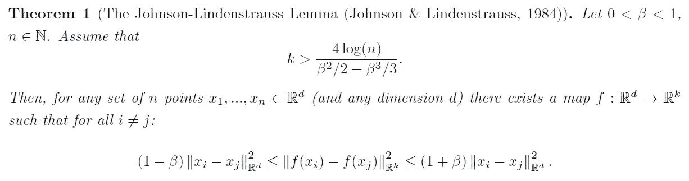
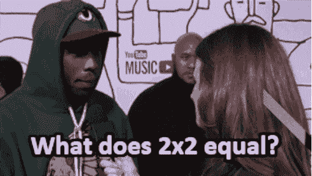

# Python 中的 Johnson-Lindenstrauss 引理

> 原文：<https://medium.com/mlearning-ai/the-johnson-lindenstrauss-lemma-ef10698d0dc6?source=collection_archive---------4----------------------->



## 如何使用 Python 利用 JL 引理？

本文讨论了降维领域的一个惊人成果。毫无疑问，这是关于欧几里德域中维数约减的最有力和令人满意的陈述之一。它是以数学家威廉·b·约翰逊(1944—)和乔拉姆·林登·施特劳斯(1936—2012)的名字命名的，他们在 1984 年证明了这一点。

## 内容

*   JL 引理暗示了什么？
*   JL 引理的形式定义。
*   Python 中的工作示例。

## JL 引理暗示了什么？

> 直觉上，JL 引理是这样说的:**如果你选择一个随机子空间并投影到它上面，点之间的成比例的成对距离将*可能*被保留**。

不管你有什么样的点集，这都是正确的。想知道为什么，考虑一下我画的这个玩具例子。(注意，选择这个例子是因为我们可以可视化三维，而不是因为 JL 引理的数学在这里有用！仅仅是为了直觉*。)*

***

One the left we have an optimal PCA projection, and on the right we have a random projection. Both are projected from dimension 3 to dimension 2.* 

*你会注意到，在右边的例子中，有些飞机似乎比其他飞机“更好”。你也许可以把右边的点集投影到任何平面上，几乎可以肯定它也是一样糟糕的。然而，左边的数据似乎靠近一个平面，因此“靠近”数据的平面似乎“不太坏”*

*因此，一方面，JL 引理表明成对距离不可能被扭曲。另一方面，几何学告诉我们一些投影比其他的“更好”。这种不匹配揭示了随机投影的一个有趣的事实:*

*   ***成对距离并不能揭示降维的全部内容。**JL 引理无法解释为什么右边数据集中的一些投影比其他投影差。它告诉我们的是，成比例的成对距离没有过度扭曲。*
*   ***不过，还是挺有用的。**例如，如果您正在运行近似最近邻或其他方法，您可以选择一个随机投影，在保持大部分正确的同时显著降低维度。*

*因此，在某些方面，JL 引理似乎是正确的，因为成对距离对降维并不像我们希望的那样重要。尽管如此，有趣的是，它们对随机投影如此抗拒，这值得我们去探究为什么。*

## *JL 引理的形式定义*

****

*基本上，这表明大约。对于一些 *k* >对数( *n* )/ *β* ，其中 *n* 是点数， *β* 是误差容限，很有可能地图 *f* 不会将任意两点之间的成对距离改变超过(1 *β* 的一个因子)。*

*关于 JL 引理，有几件事要记住，它可能会帮助你确定它何时适用于你的问题。*

*   *它声称将高空间降低到“中等”空间。对于极小的空间，如 1 维空间，这种方法不太适用。*
*   *JL 引理指出，我们对 *k* (记住，我们映射到一个更低的维度 *k* )的选择应该仅仅基于点的数量 *n* 和我们的误差容限 *β* 。*

## *Python 中的工作示例*

*查看我的 Colab 笔记本，获取完整代码。*

**

*首先，我们采样 5 个随机数据点，其 huuuuuuuuuuge 维度为 *10000* 。*

```
*import numpy as np
from sklearn import random_projection# init the number of data points n and sample the random data points
n = 5
X_large = np.random.rand(n, 10000)
X_large.shape*
```

*接下来，我们计算 JL 引理对我们的数据集成立所需的最小维数。*

```
*from sklearn.random_projection import johnson_lindenstrauss_min_dim# calculate mininimum number of random projection required by JL
min_dim = johnson_lindenstrauss_min_dim(n_samples=n, eps=0.1)##### min_dim = 1379*
```

*现在我们可以执行随机投影。*

```
*# perform random projection
transformer = random_projection.GaussianRandomProjection(n_components=min_dim)
X_small = transformer.fit_transform(X_large)
X_small.shape*
```

*最后，我们计算高维数据集和低维数据集的每个点之间的欧几里德距离。*

```
*from sklearn.metrics.pairwise import euclidean_distances# euclidean distance between points in original large dimensions
euclidean_distances(X_large, X_large)##### That gives the following point-pairwise distances
[[ 0\.        , 40.62866384, 40.98203556, 40.68316198, 40.66748849],        [40.62866384,  0\.        , 41.23296197, 40.42156429, 40.62927887],        [40.98203556, 41.23296197,  0\.        , 41.29828264, 41.06729139],        [40.68316198, 40.42156429, 41.29828264,  0\.        , 40.99215274],        [40.66748849, 40.62927887, 41.06729139, 40.99215274,  0\.        ]]# euclidean distance between points in reduced small dimensions
euclidean_distances(X_small, X_small)###### That gives the following point-pairwise distances
[[ 0\.        , 40.22947225, 40.76984244, 41.23327281, 40.23943891],        [40.22947225,  0\.        , 40.53902276, 41.5846761 , 40.20033872],        [40.76984244, 40.53902276,  0\.        , 41.55588154, 42.22873298],        [41.23327281, 41.5846761 , 41.55588154,  0\.        , 42.20924386],        [40.23943891, 40.20033872, 42.22873298, 42.20924386,  0\.        ]]*
```

*正如我们所见，欧几里得距离保留得相当好！*

***关注我:** [推特:@ r3d _ robot](https://twitter.com/r3d_robot)
[Youtube:r3d _ robot](https://www.youtube.com/channel/UC-47UN9znQBo3ItNj8Ghspw/featured)*

***[](/mlearning-ai/mlearning-ai-submission-suggestions-b51e2b130bfb) [## Mlearning.ai 提交建议

### 如何成为 Mlearning.ai 上的作家

medium.com](/mlearning-ai/mlearning-ai-submission-suggestions-b51e2b130bfb)*