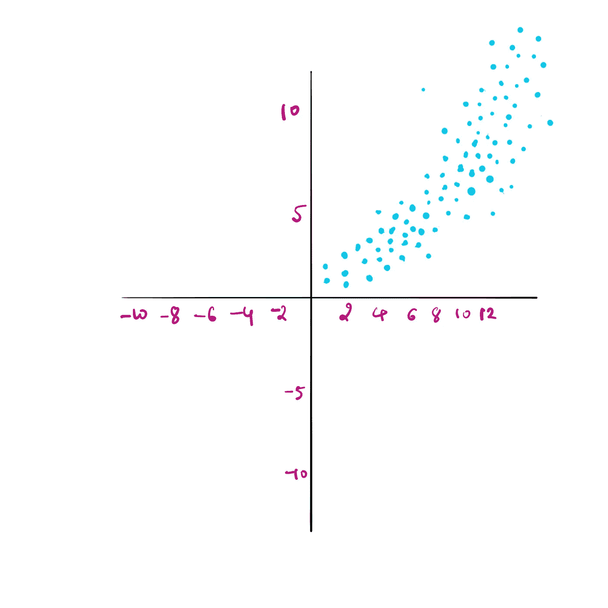
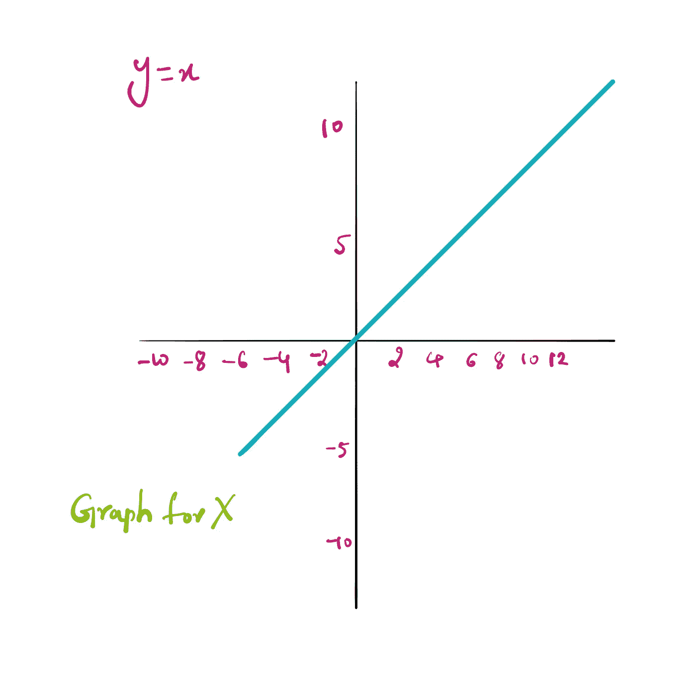
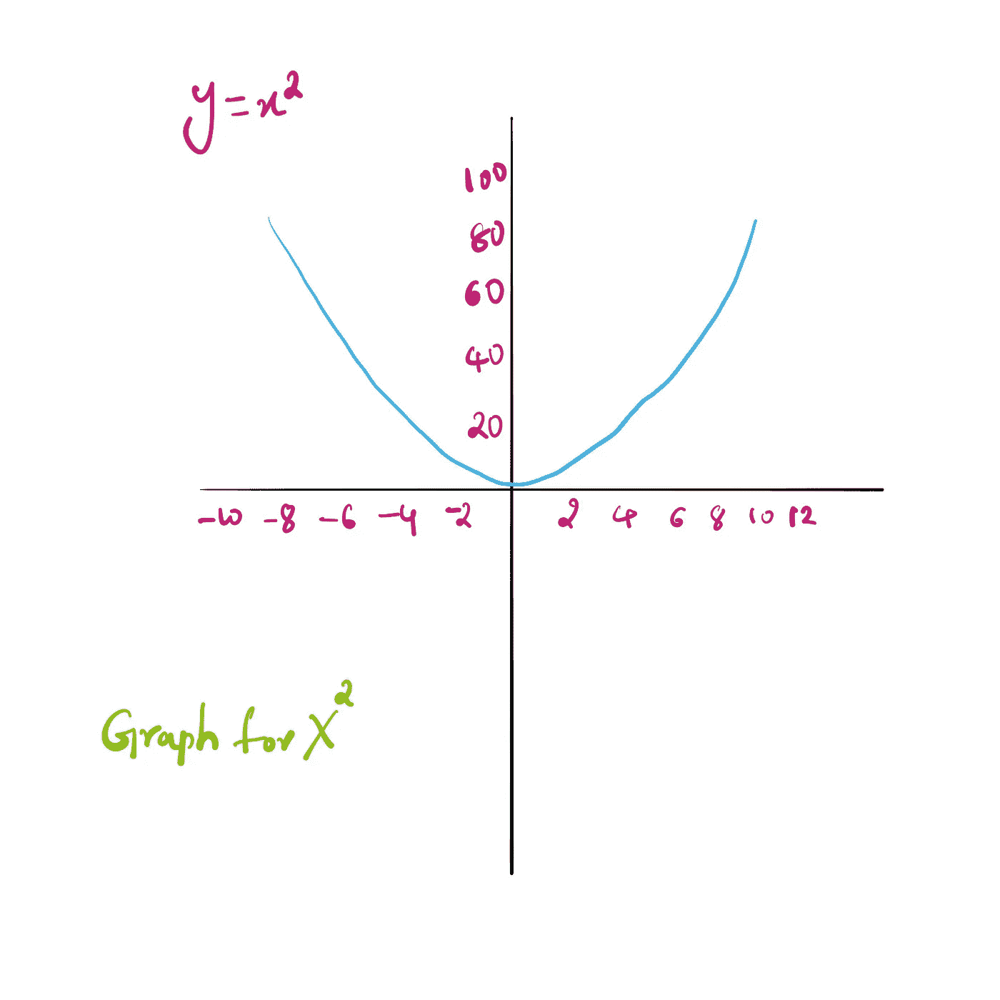
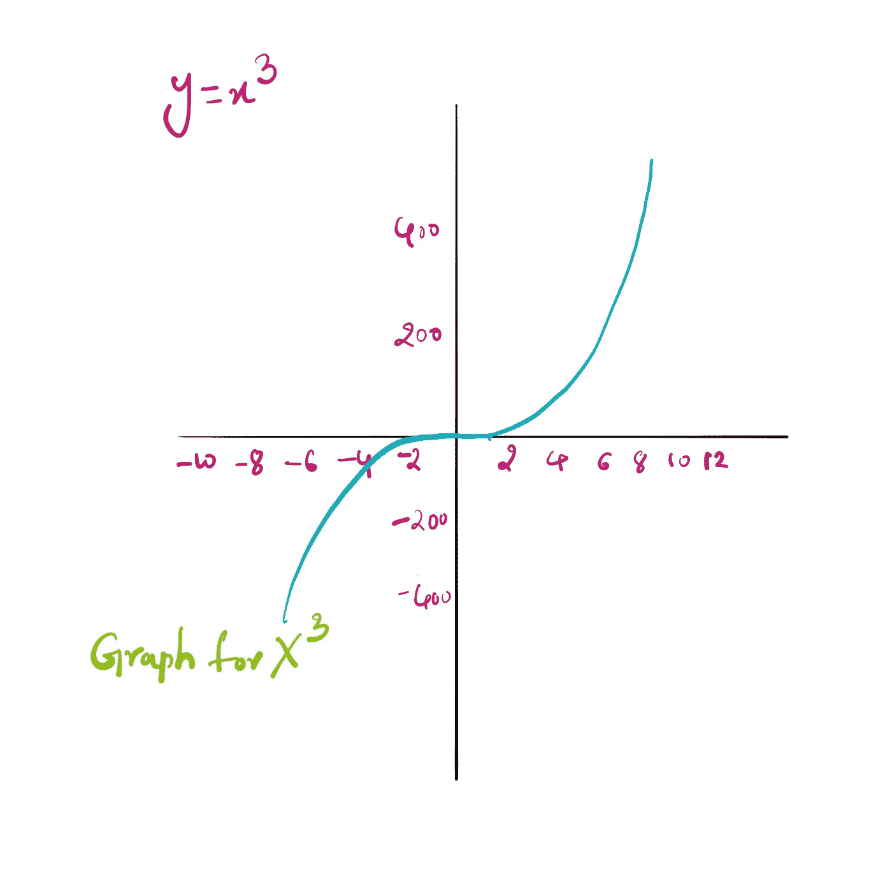
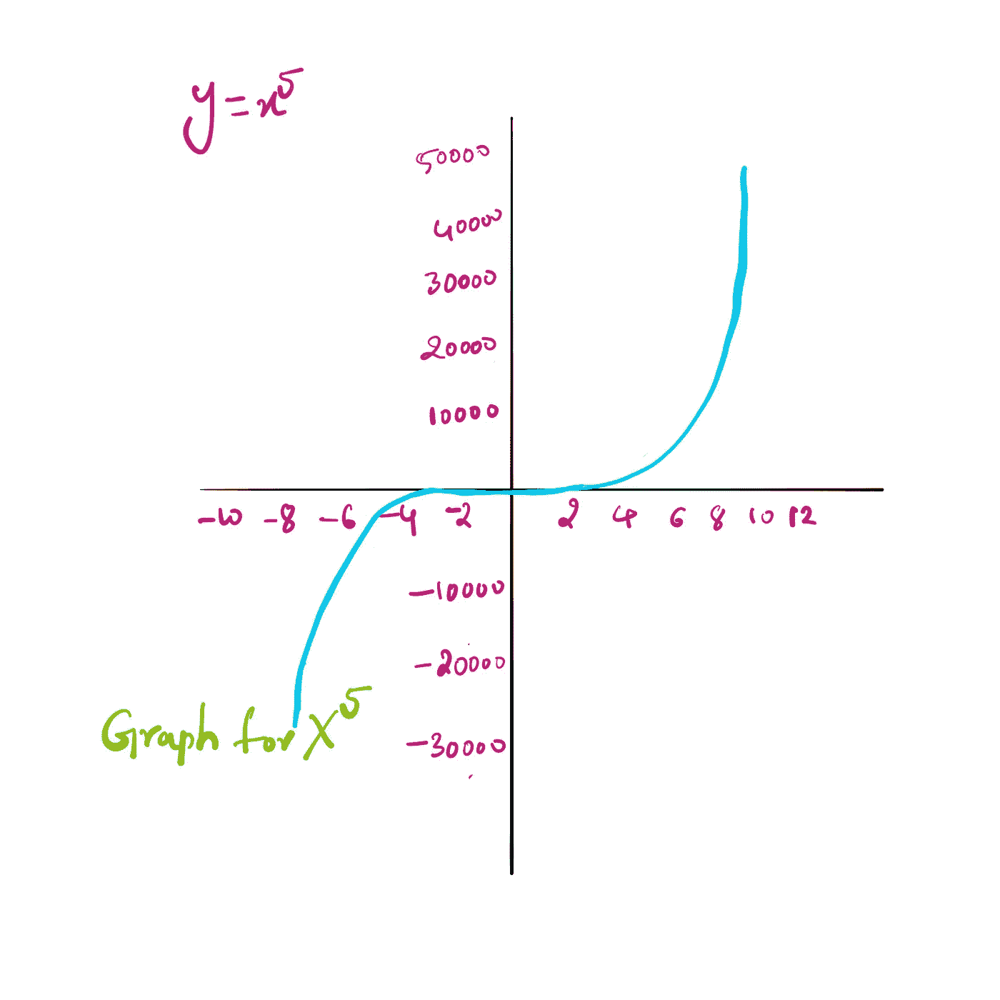
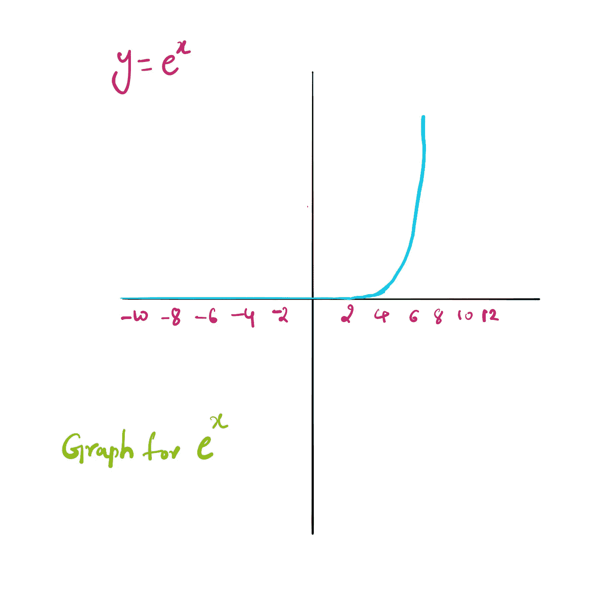
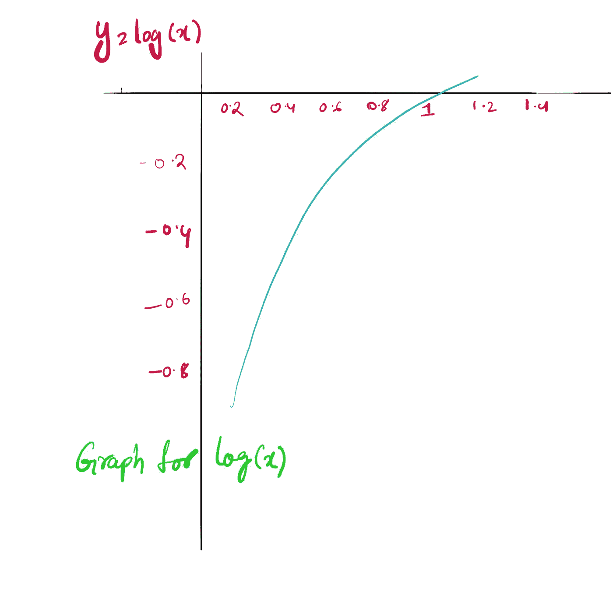

# 最蹩脚却又最重要的事情——数据拟合

> 原文：<https://medium.com/mlearning-ai/the-lamest-thing-yet-important-data-fitting-1d4ed0c888f0?source=collection_archive---------8----------------------->

还记得线性代数吗？我知道你有…但是我在拟合一些数据的时候忘记了最基本的东西。

看看下面的散点图，告诉我什么函数可以符合这些数据。

虽然我随机地放了这些点，但我猜你会有一些函数，可以拟合上面的数据，对吗？

上面的函数可以是任何东西…但是，如果你唯一记得的是指数函数，那么这篇文章就是为你准备的！

我在我的 ML 讲座上，我们的教授问了我们这个问题，我所能记得的是指数。但是，我从不关心其他功能。它可以是任何多项式函数。x，x，..任何功能。

为了以防万一，下面找到了各种函数的图，在拟合数据时可能会派上用场。

这篇文章是关于我们作为数据工程师需要记住的基本事情之一。

数据拟合愉快！

 [## Mlearning.ai 提交建议

### 如何成为 Mlearning.ai 上的作家

medium.com](/mlearning-ai/mlearning-ai-submission-suggestions-b51e2b130bfb)