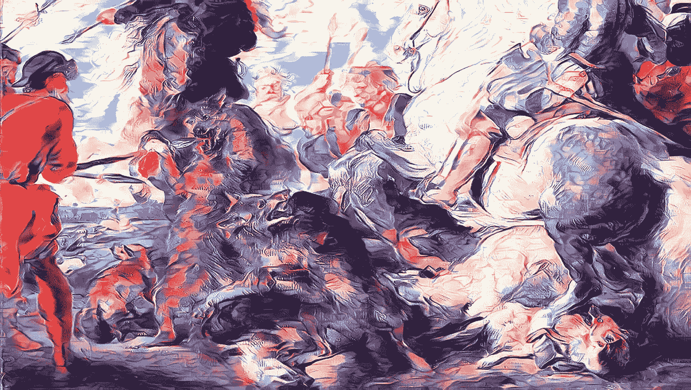

# 先锋派的独狼

> 原文：<https://medium.com/mlearning-ai/the-lone-wolves-of-the-avant-garde-51d70f29a5d3?source=collection_archive---------8----------------------->

## 机器学习艺术

## 新生代人工智能艺术家:野性与孤独

**(A)+(B) Style Transfer GANs by** [**MLearning.ai**](https://mlearning.substack.com) — Copy after Rubens’s “Wolf and Fox Hunt”ca. 1824–26 Sir Edwin Henry Landseer British

艺术家在社会中的角色随着技术的发展而变化。艺术家在使用新工具方面总是走在时代的前面。它从木炭开始，使洞穴墙壁上的仪式不朽，以**机器学习**结束。这就是艺术家如何打开一个…