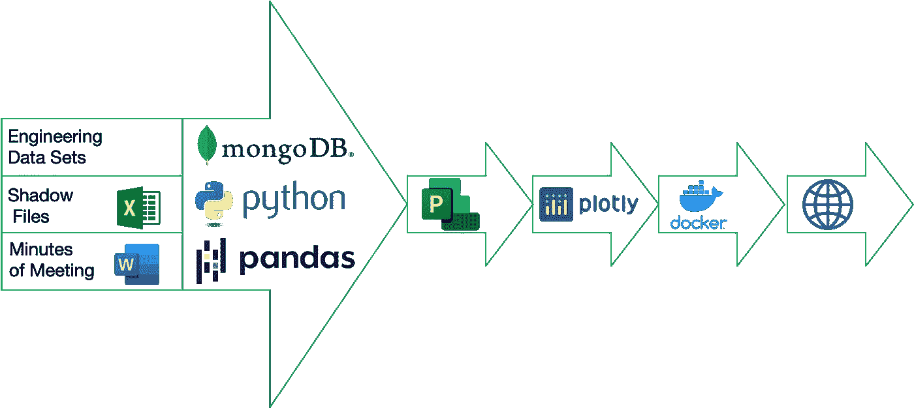

# 管理机器

> 原文：<https://medium.com/mlearning-ai/the-management-machine-e61d13985de6?source=collection_archive---------3----------------------->

自动化项目经理的角色:一个关于创新思维过程的故事

# 介绍

管理机器的故事是关于应用一个创新的解决方案来解决项目管理中无处不在的“不可避免的差距”问题:项目的现实和项目经理(PM)业务表现之间的差距。PMs 投入了大量的人力和物力来从项目的利益相关者、工程系统的数据集、影子文件、会议纪要等重要文件中提取状态信息。

尽管尽了最大努力，项目经理的业务介绍与项目的最新信息仍有距离。这种距离，即“不可避免的差距”，在每一次会议中都存在，这是一些重大负面影响的原因。

# 彻底解决差距问题的途径

在解决差距问题的一些早期努力(其中一项获得了荣誉奖)之后，一个最终价值数十亿美元的物流改造项目带来了永远消除“不可避免的差距”的机会。

对于这样一个大型项目，当务之急是重新考虑在应用项目管理的最佳实践中找到一个更高效和有效的过程。

确信我几十年的进步的业务和项目管理经验，自动化 PM 角色的愿望不能再被忽视了。为了制造这台机器，必须召集 14 年的编程经验。然而遗憾的是，那段经历已经被储存和搁置了 25 年。所以 Medium 和 Google，我目前唯一的技术伙伴，填补了“如何做”的空白。

另一个障碍是说服其他人接受自动化 PM 角色的想法。该机器基于证据的令人惊讶的仪表板以及与强大的内部支持者的合作，帮助该机器成为管理机器。

## 机器的设计目标

为了永远缩小项目的现实和计划之间的差距，必须满足两个设计目标:

1.  通过无可争议的业务状态展示，提供自动收集并展示实时、完整、真实的项目数据的能力。为了获得怀疑者的信任，将 Microsoft Project 集成到系统流程中是绝对必要的。
2.  通过让项目涉众独自做他们最擅长的事情来实现一个绝对非破坏性的系统。机器必须逐步调整自己以适应组织，而不是相反。

The Management Machine process and architecture

完全达到了设计目标。

管理机器产生的微软项目计划支持实际上无限数量的任务、各种里程碑以及它们之间的相互依赖性的有组织的分层树。

还创建了一个全面的业务项目仪表板系统。它支持网络，具有交互性，所有利益相关方都可以全天候使用。

# 远远超出了技术突破

利益相关者的管理开销已经减少到零:

1.  多余的状态会议消失了。
2.  利益相关者现在有动力保持他们的计划是最新的。
3.  项目监管已经消失。
4.  准备高管演示文稿—没有了。

# 结论

这台机器的创造表明，不接受任何感知的商业现实的表面价值。在项目管理中，“不可避免的差距”被认为是自然的一部分。

为了分析和理解原因及其影响，需要花时间仔细研究正在发生的事情，并最终揭示一个明确的根本原因。在我们的情况下，根本原因是“不可避免的差距”。用手电筒照着那个方向，激发了创造力。

管理机器创新解决方案不仅简化了项目管理程序，还改变了相关业务的语言和文化。听到“没有管理机器，我们是如何管理的？”是最大的赞美。

如需讲解视频和一些截图，请访问[我的网站](https://www.themanagementmachine.com)