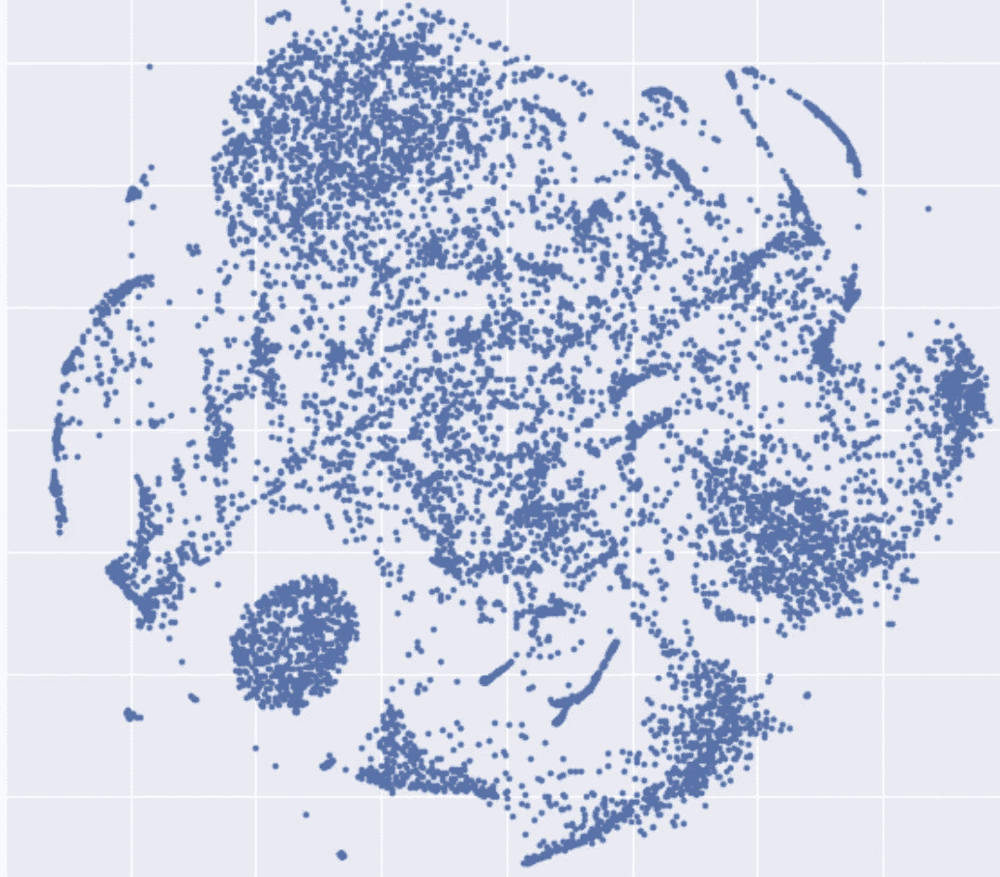

# 面向以数据为中心的人工智能的矢量数据库(第 1 部分)

> 原文：<https://medium.com/mlearning-ai/the-many-uses-of-a-vector-database-65cb6cc70b3f?source=collection_archive---------5----------------------->

向量数据库是 MLOps /数据工程领域的最新工具之一。它们被设计成在嵌入的最近邻查询中是有效的，同时提供了一个简单的 CRUD 接口用于可维护性。

> 嵌入是深度学习模型层相对于输入(单个数据点)的输出。它们是习得的表征，在这种表征中，同类的物体被投射到彼此附近。

Image by author.

最佳矢量数据库使您能够将元数据查询(例如，您希望结果所属的数据集分割或类)与最近邻请求(例如，返回没有相同标注的输入示例的最近邻)结合起来。这对于最近邻库(如 Faiss 和 Annoy)来说很难实现，因为索引是预先建立的，不能过滤。要获得相同的结果，您需要返回过量的最近邻，然后在之后应用过滤器。

如果你不熟悉，我推荐 tensorflow 嵌入式投影仪来开发直觉(MNIST 与图像是最好的)。

 [## 嵌入式投影仪-高维数据的可视化

### 可视化高维数据。

projector.tensorflow.org](https://projector.tensorflow.org) 

尽管重要的是要注意，嵌入通过 PCA、T-SNE 或 U-MAP 经历维度减少，以便被投影到 3 维中。

这篇文章:

 [## 并不是所有的矢量数据库都是相同的

### Milvus、Pinecone、Vespa、Weaviate、Vald、GSI 和 Qdrant 的详细比较

towardsdatascience.com](https://towardsdatascience.com/milvus-pinecone-vespa-weaviate-vald-gsi-what-unites-these-buzz-words-and-what-makes-each-9c65a3bd0696) 

在比较当前可用的最佳产品方面做得很好，但是您实际上可能想要使用矢量数据库做什么呢？以下内容与图像分类问题最为相关。

# 1.主动学习

在验证集中发现错误并想修复它？在标注的未标注数据集中获取与您的错误最近的邻域，然后重新训练。重复上述步骤，直到问题减少或解决。如果最近邻查询没有返回许多相似的示例，请考虑使用一个包，该包使您能够增加这些实例的扩充数或权重。

# 2.单元测试结构

确定了一个特别昂贵的特定类型的问题(例如，不能区分勺子和叉子)并希望监控您的进度？检索标记集合中错误实例的最近邻居，提供问题描述，并跟踪性能如何随时间变化。

# 3.最接近的反事实

认为你的训练数据集的标签可能不一致？查看带有不同标签的最近实例。考虑让你的专家审查这些例子并达成共识，在你的标签规则中增加进一步的描述，或者把它们作为培训标签员的例子。

在这里，你可能会更好地使用类似 KNN 一致性的东西，或者简单地看看你的模型和标签之间最大的分歧。最接近的反事实是伟大的，但它是相当手动的，与更系统的方法相比，不能很好地扩展。

# 4.查找标签错误的实例

你的模型是否犯了一个看似简单的错误？检查训练集中最近邻的错误标记的实例，并且首先检查你实际上有一些在训练集中相似的实例。

理想情况下，您希望您的矢量数据库直接从您的实时 ML 服务中更新，这样您就可以随时访问最新的嵌入，而不必为该任务维护单独的批处理管道。让我知道你是否有矢量数据库的任何其他用途(特别是如果在图像分类中有价值的话)，我会把它们添加到列表中。

让我知道你的想法。如果您对内容感兴趣，请点击关注。

 [## Mlearning.ai 提交建议

### 如何成为 Mlearning.ai 上的作家

medium.com](/mlearning-ai/mlearning-ai-submission-suggestions-b51e2b130bfb)