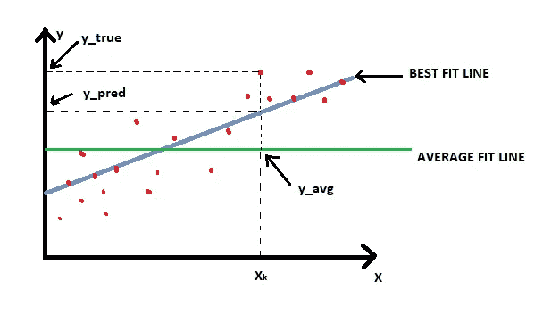
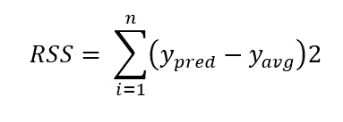
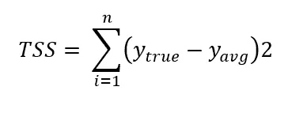
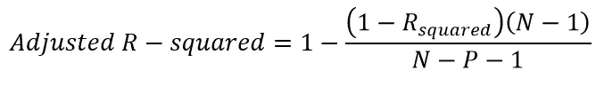
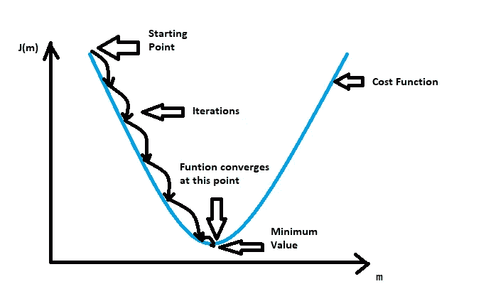

# 线性回归背后的数学。

> 原文：<https://medium.com/mlearning-ai/the-mathematics-behind-linear-regression-fb4db1ebd7b5?source=collection_archive---------2----------------------->

在这篇文章中，我将用最简单的方式解释与线性回归相关的各种数学概念。

Typical Linear Regression plot

线性回归是一种机器学习算法，属于监督学习方法，其中历史数据被标记并用于根据预测值/自变量确定输出/因变量的值。顾名思义，因变量和自变量之间的关系被假定为**线性。**

基于预测变量的数量，有两种类型的线性回归算法:

**简单线性回归:**只用一个预测变量来预测因变量的值。直线的方程:y = c + mX。在哪里

y:因变量

x:预测变量

m:定义 X 和 y 之间关系的直线的斜率，也称为 X 的系数

c:拦截

**多元线性回归:**用多个预测变量来预测因变量的值。

直线的方程:y = c + m1x1+ m2x2 + m3x3 … + mixi(很多预测变量 x1，x2 … xi)。

(m1、m2 … mi 是各自的系数)

如果你想了解一个线性回归模型是如何从零开始建立的，请参考我下面的文章:

[https://medium . com/mlearning-ai/linear-regression-simple-explain-with-example-FBA 51 b 2c 181d](/mlearning-ai/linear-regression-simple-explanation-with-example-fba51b2c181d)

线性回归的目的是为给定的 X 和 y 变量找到**最佳拟合线**，这样我们就可以在上述方程中获得 c 和 m 的最佳值。现在要做到这一点，我们需要正确理解上面的图表。

对于每一个 X 值，比如 Xk，根据我们的数据，有一个 y 值，比如 y_true。我们的回归线也给了我们一个 y 值，比如 y_pred。为了便于理解，我们能画出的最好的直观的线是通过所有 y 值的平均值的线，比如 y = y_avg。

所以现在我们有了 y_true，y_pred 和 y_avg。让我们看看他们是如何联系的。

y_true - y_pred 给出了与 Xk 相关的误差项，也称为残差。基于 y_true 值，这些误差项可以是正的或负的。所以我们取这些剩余项的平方，以避免负号。所有这些残差的总和称为残差平方和(RSS)。这就形成了我们的成本函数。我们需要最小化这个成本函数，以便获得线性回归线的斜率(m)和截距(c)的最优值，我们将在本文中进一步了解。

Residual Sum of Squares equation

与平均值相比，解释平方和给出了回归线给出的值中存在多少变化的度量。

Explained Sum of Squares equation

总平方和给出了与平均值相比，观察值中存在多少变化的度量。

Total Sum of Squares equation

从上面的等式和图中，我们可以验证:

***TSS = ESS + RSS***

**决定系数(R 平方)**

对于图中所示的回归线，决定系数是衡量因变量中有多少方差是由自变量解释的。简而言之，R 平方告诉我们，对于给定的数据，我们的模型拟合得有多好。

R 平方的值在 0 到 1 之间。接近 1 的值通常意味着模型是很好的拟合，或者更具体地说，自变量解释了因变量中的大量方差。

所以直观上我们可以写成 RSS = ESS/TSS。

因此，R 平方= (TSS-RSS)/TSS。

因此， ***R 平方= 1- (RSS/TSS)。***

对于线性回归来说，这是一个重要的等式。

# **调整后的 R 平方**

在建立多元线性回归模型时，当我们向模型中添加变量时，R 平方值继续增加。但是如果增加的变量并不重要呢？这可能会不必要地使模型变得复杂，并增加过度拟合的机会。为了解决这个问题，有一种方法叫做调整后的 R 平方。

如果添加的变量不重要，调整的 R 平方会惩罚模型。

Equation for Adjusted R-squared

其中 N 是数据中样本点的数量，P 是预测变量的数量。

这也是 w.r.t .线性回归非常重要的概念。

一个好的线性回归模型总是具有彼此接近的 R 平方值和调整后的 R 平方值。但是，调整后的 R 平方值始终小于 R 平方值。

# **梯度下降**

为了得到最佳拟合线，我们必须最小化潜在的成本函数，在我们的例子中是 RSS，如上所述。迭代优化和封闭形式优化是用于最小化所讨论的潜在成本函数的两种流行算法。

在闭于解中，我们只需找到函数的导数，并使它等于 0，我们就得到最小值。但是当数据是多维的时，这就变得复杂了。

虽然当数据集较小时，封闭形式的解决方案是优选的，但是梯度下降对于较大的数据是有用的，并且它也是不太复杂和便宜的选择。梯度下降迭代运行，直到达到成本函数的最小值。为了了解更多，让我们考虑下图。

Gradient Descent method

J(m)是我们的成本函数，我们可以看到，我们希望达到函数收敛的点(达到最小值)。换句话说，我们想要达到一个点，在这个点上我们的函数值是最小的。所以我们分步进行，也称为迭代。

学习率是我们向最小化方向移动的速度。学习率越大，我们错过最小值点的机会就越大。因此，保持较小的学习速率是明智的。这可能会使过程变得缓慢，但这是值得的。

**m1 = m0 -(学习率)。(dJ/dm)**

其中:m1 是迭代给出的下一个点

m0:当前迭代的起点

我们知道我们的成本函数是 RSS = (y_pred-y_avg)

用‘c+MX’等于 y_pred。我们得到一个函数，其中有两个未知数 **m** 和 **c** 。

我们取这些函数的偏导数，一次 w.r.t 到 **m** 一次 w.r.t **c** 并使它们等于 0。我们得到两个方程和两个未知数。求解这两个方程，我们得到了 m 值和 c 值。

因此，在梯度下降中，当我们的函数到达它收敛的点时，RSS 变得最小，我们得到斜率( **m** )和截距(c)的最佳值。

因此，我们可以说回归线 **y = mx+c** 是最佳拟合线。

**结论:**涉及到的数学很多，在学习线性回归的同时，但我已经尽量用简化的方式解释了线性回归背后的主要数学概念。希望大家喜欢读这篇文章。

谢谢你。

**【https://www.linkedin.com/in/pathakpuja/】**可以在 LinkedIn 上联系我:

****请访问我的 GitHub 简介获取 python 代码:***[***https://github.com/pujappathak***](https://github.com/pujappathak)*

****如果你喜欢我的文章，请随时评论并给出你的反馈。****