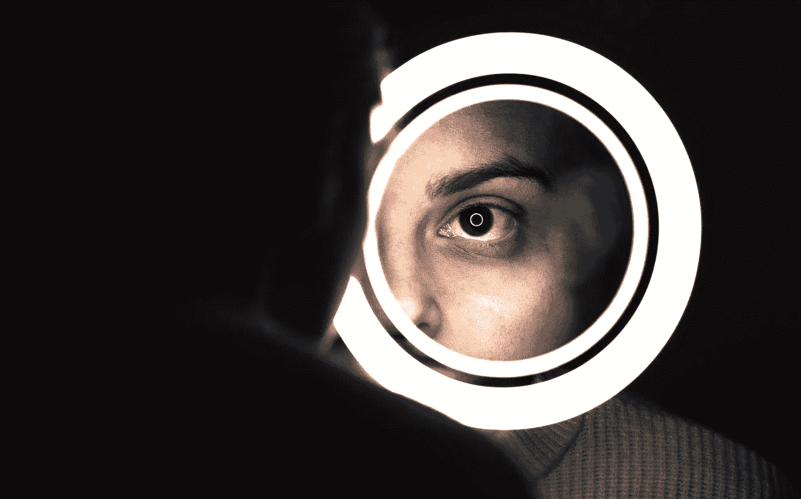

# 毫升镜

> 原文：<https://medium.com/mlearning-ai/the-ml-mirror-1bb85c0486ca?source=collection_archive---------3----------------------->

## 调整

## 利用机器学习理解他人

Photo by [Alex Gruber](https://unsplash.com/@alex_gruber?utm_source=unsplash&utm_medium=referral&utm_content=creditCopyText) on [Unsplash](https://unsplash.com/s/photos/mirror?utm_source=unsplash&utm_medium=referral&utm_content=creditCopyText)

大多数人认为他们了解自己。他们相信自己所看到的。但事情并不总是那么简单。当你照镜子时，你只看到你想看到的，而不是别人可能看到的。因此，例如，如果有人经过[并注意到我们的眼睛布满血丝，或者…](/the-power-of-poetry/how-to-ask-questions-12c03ef0eae2)