# 机器学习中特征缩放的现代规则

> 原文：<https://medium.com/mlearning-ai/the-modern-rules-of-feature-scaling-in-machine-learning-236b1ce4f818?source=collection_archive---------6----------------------->

*使用 Scikit-Learn 和 Python 进行特征缩放的完整指南*

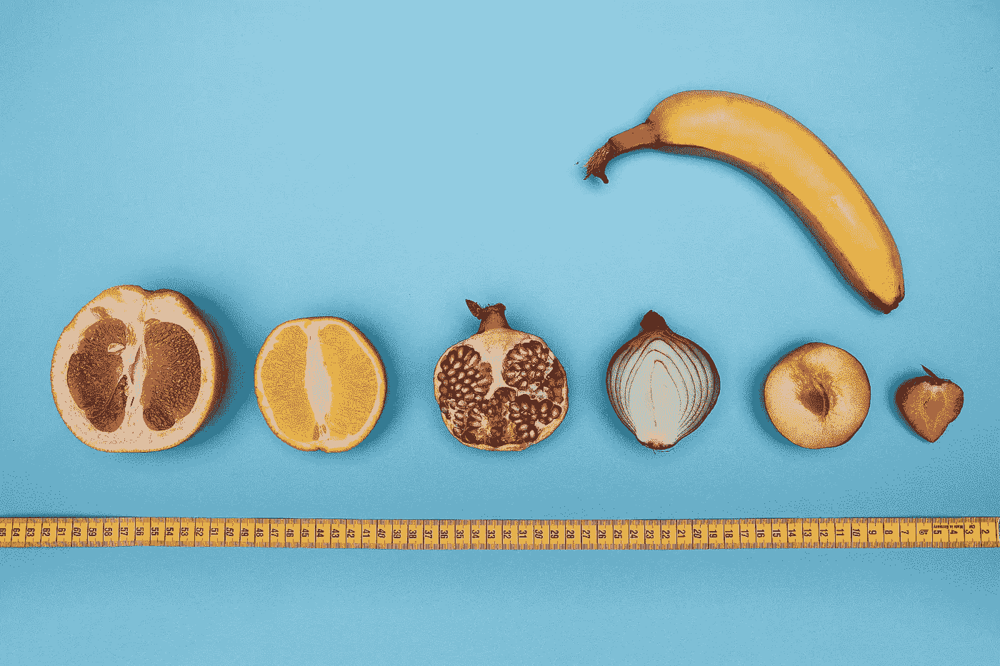

Fruits And Vegetables of different sizes. Image source: [Unsplash](https://unsplash.com/photos/4BRysALhyuw)

## 什么是缩放？

缩放是机器学习的重要组成部分。

说到这里，并不是所有的机器学习算法都需要缩放。在使用这些算法时，您应该事先知道这一点。

需要特征缩放的算法:

*   KNN(K-最近邻)
*   神经网络
*   线性回归
*   逻辑回归

不需要特征缩放的算法:

*   决策树
*   随机森林
*   adaboost 算法
*   朴素贝叶斯

现在，让我们借助一个例子来理解为什么需要缩放。

假设我们要做蓝莓香蕉冰沙。现在，如果我们在牛奶中加入一个香蕉和一个蓝莓，会发生什么？你会说，很明显，奶昔会以香蕉味为主，因为它的体积比蓝莓大。

另一方面，专业的思慕雪制作师会将蓝莓和一根香蕉以正确的比例混合在一起，以获得绝佳的口感。

机器学习中的缩放在本质上类似于这个类比。我们将有多个功能，它们都有自己的大小。现在，如果我们像这样将它们拟合到我们的模型中，那么具有最高值的特征将主导结果。

因此，通过缩放，我们将所有特征放在一个范围内，比如说在 0 和 1 之间，然后将其输入到模型中。这样，我们可以从我们的模型中得到一个无偏的结果。

讨论最多的两种缩放方法是:

1.  `Normalizatoion`
2.  `Standardization`。

*特别说明—标准化和规范化都不会改变数据的分布。*

**正常化**通常将值重新调整到[0，1]的范围内。

它可以表示为

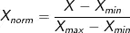

这里 x-min 和 x-max 是特征 x 的最小值和最大值。

**标准化**通常会重新调整数据，使平均值为 0，标准差为 1。

它可以表示为

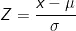

其中，μ是特性的平均值，可以表示为

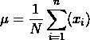

σ是该特征的标准偏差。

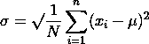

## 为什么我们需要缩放？

当我们将这些特征输入到我们的机器学习模型中时，它将预测一个结果，并将它与实际结果进行比较。然后它纠正自己，然后再重复一次。在这个过程中，它会理解一些我们看不到的隐藏模式。

因为模型只依赖于我们提供的数据，所以在将数据输入模型之前，我们对数据进行适当的清理和处理变得非常重要。

## 用例

让我们看一个实际的用例，假设你想使用机器学习来预测苹果股票的价格。

我们将使用 [yfinance](https://github.com/ranaroussi/yfinance) 包从[雅虎财经](https://finance.yahoo.com/)下载股票数据。

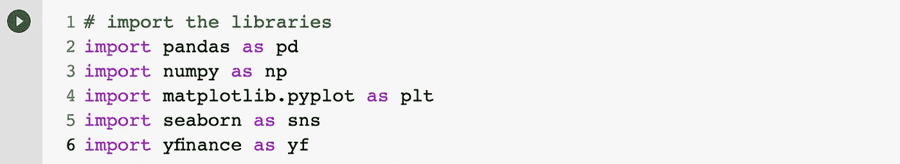

让我们为 AAPL 证券交易所下载一年的数据。然后，我们移除所有其他列，仅保留`Close`和`Volume`列。这些将是我们的`features`。

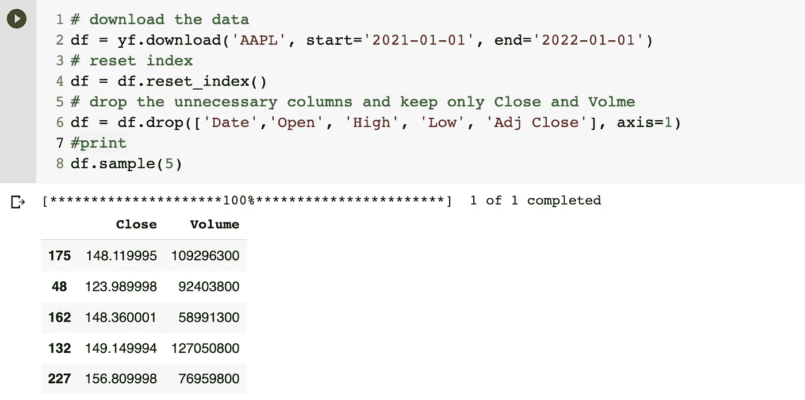

让我们看看这些特征的含义。

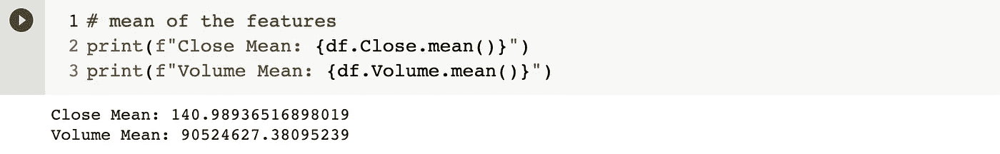

由此可见`Close`的意思和`Volume`的意思有很大的不同。如果我们将这些数据反馈给我们的模型，它肯定会影响我们模型的性能。

让我们检查一下我们的特征分布。

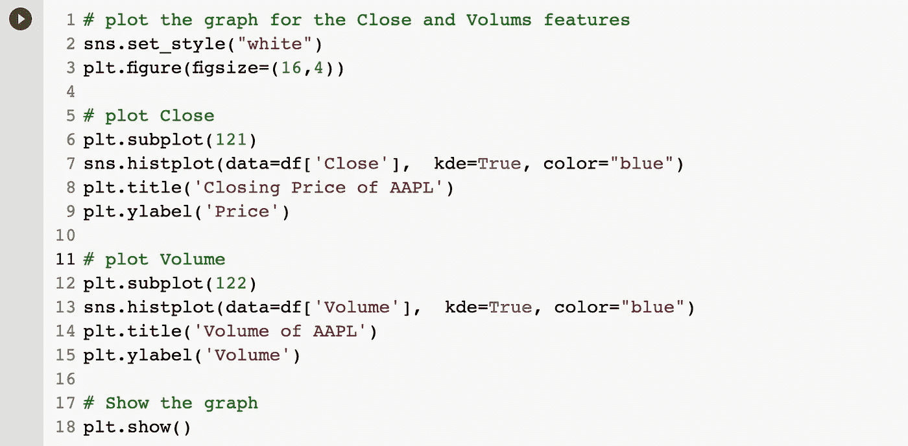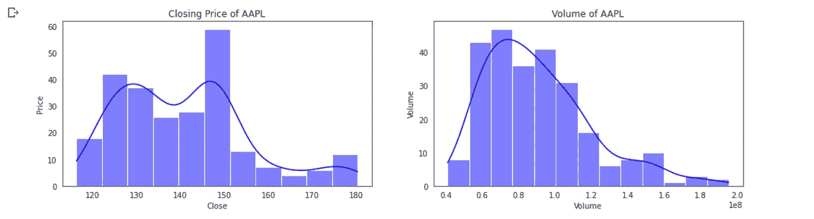

如开始所讨论的，缩放可以使用

*   正常化或
*   标准化。

在 sci-kit-learn 中，我们将这些库命名为:

*   最小最大缩放器
*   标准定标器

让我们一个接一个地看看他们。但在此之前，我们需要将数据帧转换成 NumPy 数组。

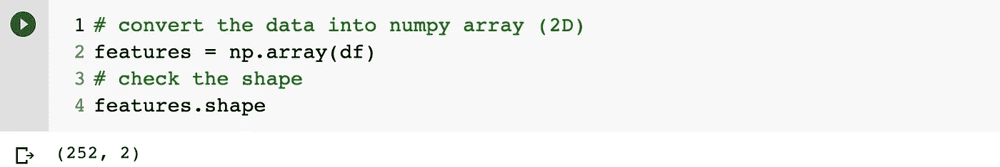

现在让我们看看它的含义

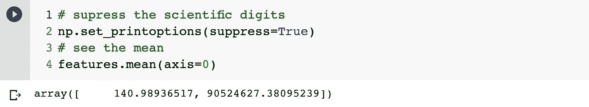

和标准偏差

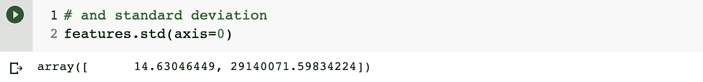

## 标准定标器

在 [Scikit-Learn](https://scikit-learn.org/stable/) 中，该库被称为[标准化器](https://scikit-learn.org/stable/modules/generated/sklearn.preprocessing.StandardScaler.html)。

> 请记住，在标准化中，特征的平均值将为 0，标准差将始终为 1。

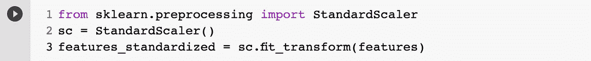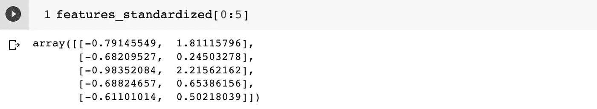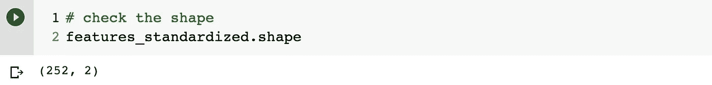

缩放后，让我们检查平均值和标准差。

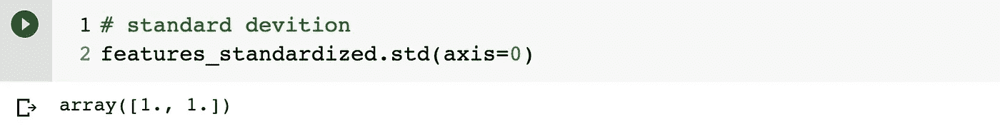

因此，我们使用 StandardScaler 实现了缩放。但是让我们看看直方图，看看分布是否改变了？

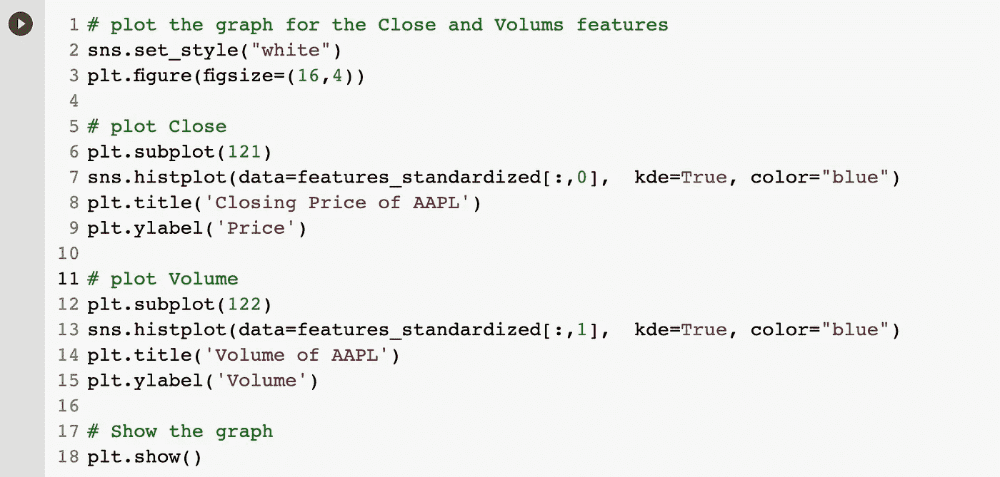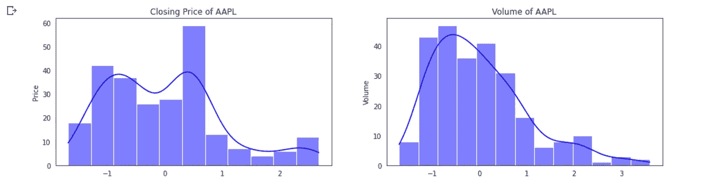

正如我们所看到的，分布是相同的，但是数据是以相同的比例缩放的。

## 最小最大缩放器

我们不会尝试[最小最大缩放器](https://scikit-learn.org/stable/modules/generated/sklearn.preprocessing.MinMaxScaler.html)进行归一化。

> 归一化是从原始范围对数据进行缩放的过程，以便所有值都在 0 和 1 的新范围内。

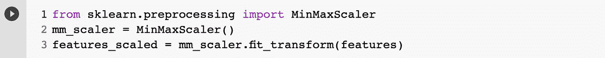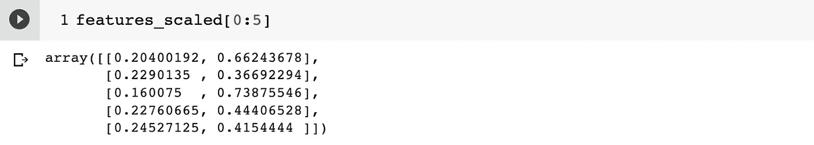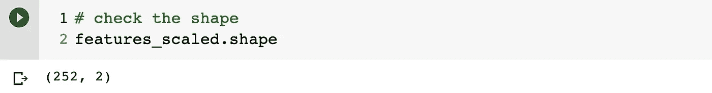

让我们看看我们特征的最小值和最大值。理想情况下，它应该介于 1 和 0 之间。

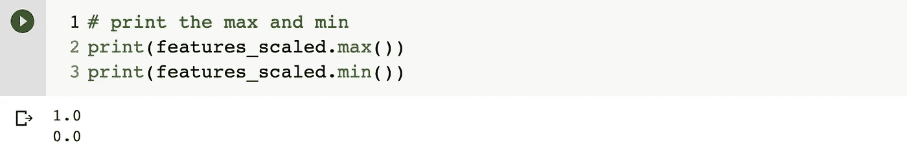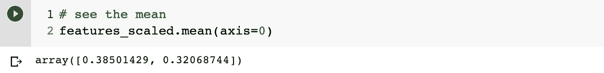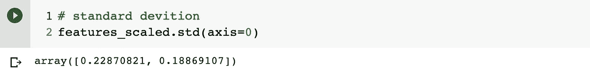

所以我们可以看到，使用最小最大缩放器，我们可以在 0 和 1 之间分割数据。现在让我们再次检查特征的直方图，这样我们就可以放心，分布没有改变

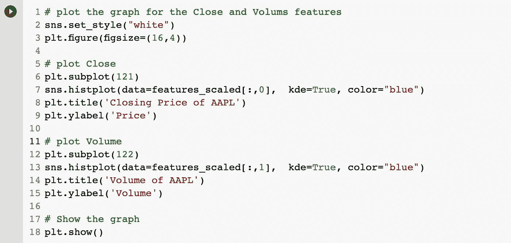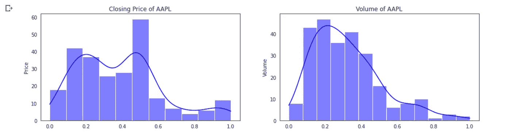

因此，我们已经看到，规范化和标准化只是将不均匀的特征带到了一个尺度上，而没有改变数据的分布。这些方法确实有助于从您的模式中获得更好的结果。

## 奖金票据

## 使用定标器:

当您将整个要素集分解为训练数据集和测试数据集时，需要注意的是，您需要将训练数据发送给 fit 函数一次，然后才能为训练集和测试集生成转换后的数据。如果您忘记这样做，您会得到不同的数据集。

> `StandardScaler.fit(features_train)`
> 
> `StandardScaler.transform(features_train)`
> 
> `StandardScaler.transform(features_test)`

## 进料数据:

切勿将整个数据集放入标准量表，因为这可能会导致模型学习测试的一些特征，从而导致有偏差的结果。我们的模型无论如何都不会看到测试集的特性。这可能会导致数据泄漏。

## 请记住:

变换测试数据集时，要素的精确平均值不会为 0，标准差不会为 1，因为变换中使用的定标器基于定型集。这绝对没问题。

## 最后:

总结一下我们在本文中学到的内容:

1.  什么是特征缩放
2.  何时使用它
3.  主要的两种缩放类型-标准化和规范化
4.  用例。

希望这篇文章能增强你对机器学习中特征缩放的理解。如果你喜欢文章，就留个赞，评论一下。我很想听听你的想法。

 [## Mlearning.ai 提交建议

### 如何成为 Mlearning.ai 上的作家

medium.com](/mlearning-ai/mlearning-ai-submission-suggestions-b51e2b130bfb)