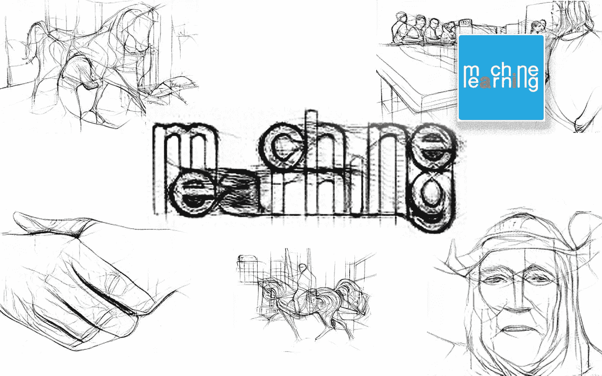

# 用于绘图生成的全新高质量解决方案[演示]

> 原文：<https://medium.com/mlearning-ai/the-new-high-quality-solution-for-drawing-generation-demo-87b41060d4b4?source=collection_archive---------2----------------------->

## [机器学习艺术](https://mlearning.substack.com)

[https://mlearning.substack.com](https://mlearning.substack.com)

[**艺术家**](https://evartology.substack.com/p/-in-the-art-world-there-is-a-lot?s=w) 长期以来一直对将**抽象图像**转化为他们可以看到和欣赏的东西的想法感兴趣。例如，为了创作一幅好的**图**，艺术家们经常探索如何从一幅图像中提取 **3D 形状**和**语义含义**。