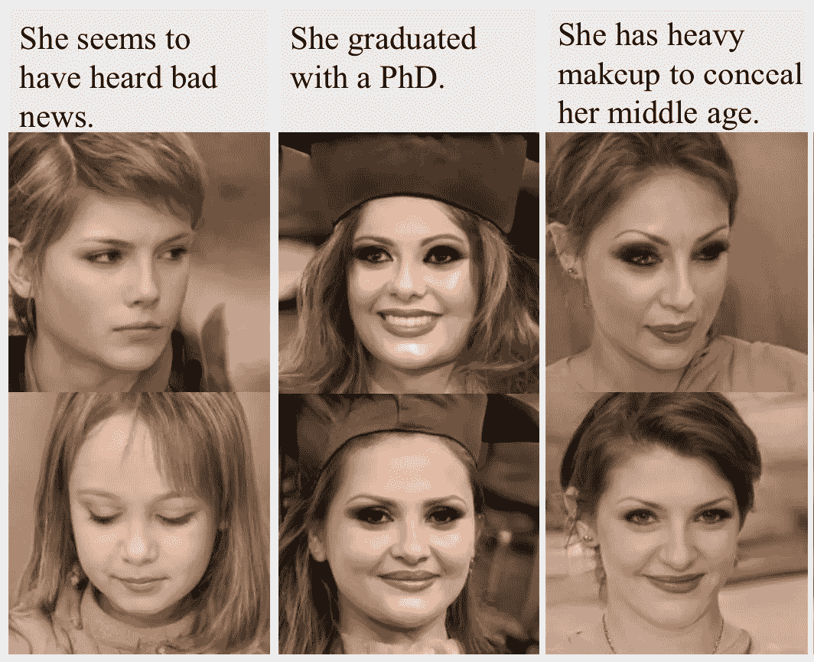

# 新方法——面部处理

> 原文：<https://medium.com/mlearning-ai/the-new-method-face-manipulation-55efb800b8d9?source=collection_archive---------2----------------------->

## [机器学习艺术](https://mlearning.substack.com)

## **文字面对面****[DALL E**2**](https://mlearning.substack.com/p/a-good-alternative-to-dalle-2-that?r=z7zu8&s=w&utm_campaign=post&utm_medium=web)*禁止而不能**

**

This Emotion Does Not Exist [— Machine Learning Art](https://mlearning.substack.com/p/a-good-alternative-to-dalle-2-that?r=z7zu8&s=w&utm_campaign=post&utm_medium=web)** 

**作为社会交往中最重要的视觉线索之一，人脸至少有数千个词来描述其广泛的形状、颜色、发型、表情、情绪等。此外，为了满足元宇宙日益增长的需求，社交媒体**