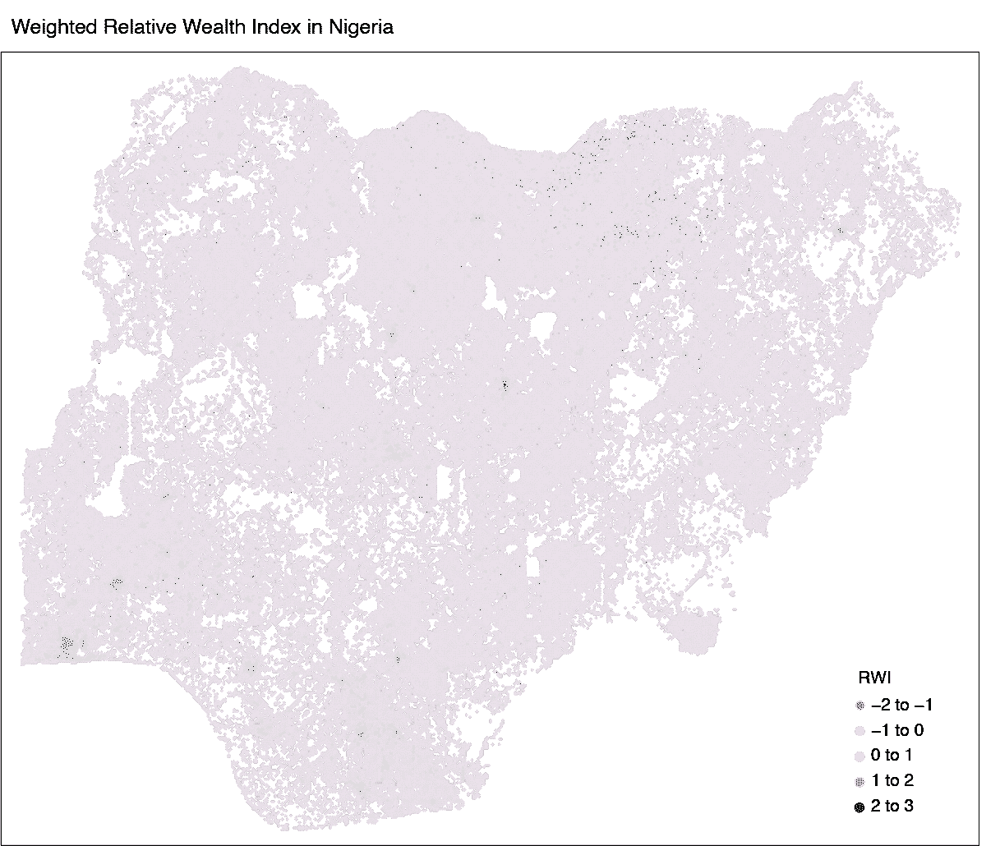
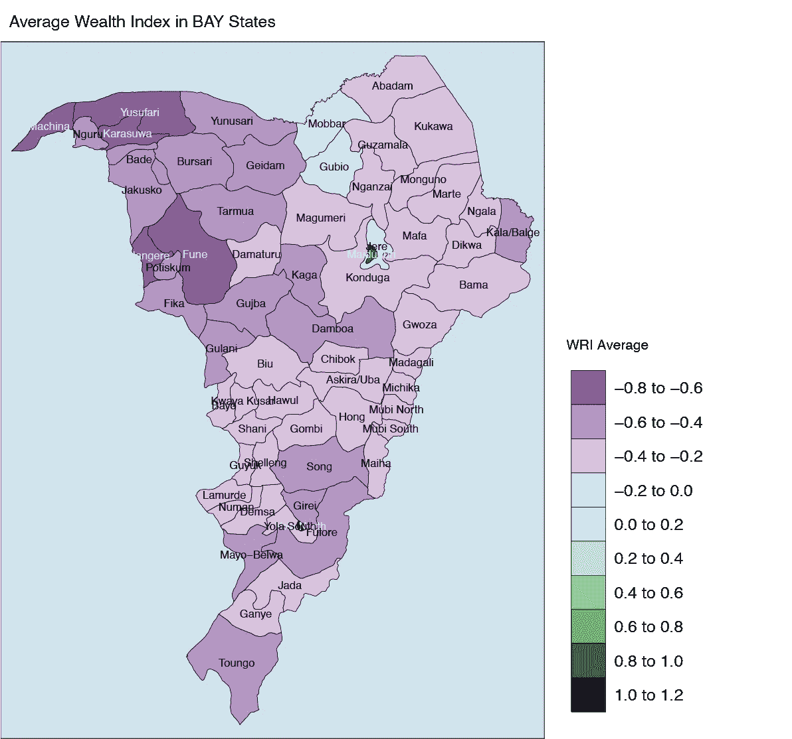

# “一分钟地图”——用 R tmap 软件包创建静态地图:尼日利亚元财富指数案例

> 原文：<https://medium.com/mlearning-ai/the-one-minute-map-static-and-interactive-maps-creation-with-the-r-tmap-package-6f919b57d7f7?source=collection_archive---------11----------------------->

**是的，你没看错！**这篇文章与 Missy 或鲁大著名的“一分钟人”歌曲无关，但它直接介绍了 R 中的一系列数据分析应用程序，尤其是如何在一分钟内创建和处理 R 和 Rstudio 中的地图！！

这是我将在[媒体](https://medium.com/u/504c7870fdb6?source=post_page-----6f919b57d7f7--------------------------------)上为数据科学家和爱好者分享的一系列文章的第一篇，让他们更多地使用 r

在本节课中，我将用不到一分钟的时间带您体验用 R 中的“tmap”包创建静态地图的顺利过程。

# 关于数据

作为一名人道主义数据科学家，我专注于冲突、贫困和脆弱性是我研究的主要驱动力的领域，因此我以尼日利亚为例来绘制“加权相对财富指数”，该指数是由 [Meta](https://medium.com/u/4e7a97edbbf7?source=post_page-----6f919b57d7f7--------------------------------) Data for Good 团队使用包含超过 10 万个观察结果(记录)的大型数据集制作的。数据集只有 4 个变量，经度，纬度，wri 和误差。更多关于数据及其背后的研究由[Meta](https://medium.com/u/4e7a97edbbf7?source=post_page-----6f919b57d7f7--------------------------------)这里很好的解释。

# 静态地图

使用 R 中的“tmap”包，我能够使用 dots 技术创建第一张 WRI 地图。

要创建一个点状地图，您需要一个带有经度和纬度的数据集以及一些指示器来为您的地图添加更多信息，或者您需要一个 *shapefile* 来将所有信息嵌入到其相关组件中。

在“tmap”包中，通过设置坐标变量和 CRS 投影系统，使用 st_as_sf 将数据集转换为地理标准文件:

wrimap

I then used tm_shape and tm_dots to inform the console that I am creating a dots map:

tm_shape(wrimap) +
tm_dots(alpha = 0.8，col = "rwi "，palette = "PRGn "，
stretch.palette = TRUE，size = 0.01)+

布局是“tmap”中的可选项目，用户可以在此调整可视化参数:
tm_layout (frame = TRUE，bg.color = "transparent "，
legend.title.size = 1，
legend.text.size = 0.6，
legend.position = c("right "，" bottom ")，
legend.bg.color = "white "，
legend.bg.alpha = 1，
main.title = "尼日利亚加权相对财富指数"，

这是显示尼日利亚加权相对财富指数的结果图。

# 深入研究 RWI 的数据

该图显示了该国北部地区和南部地区之间的巨大财富差异，北部地区的负指数往往很低，而南部地区根据指数看起来更富裕。

同样，作为一名人道主义数据科学家，我更关心冲突可能是不太富裕环境的驱动因素的领域。

在这方面，我将绘制博尔诺州、阿达马瓦州和约贝州地方政府区域(LGA)的平均 RWI。

可以从人道主义数据交换(HDX) [网站](https://data.humdata.org)下载地方政府机构的形状文件。

使用“SpatialEco”包中的“point.in.poly”函数，我将 LGAs 信息添加到我的点形状文件中。然后，我使用“dplyr”软件包计算了每个地方政府区的 WRI 平均值。

然后要求“Tigris”包将具有 WRI 均值的新数据帧连接回 LGAs shapefile:

lga_rwi wri_mean，
"ADM2_EN "，
"ADM2_EN "，
how = "left") #将 rwi 平均值加入 lga 形状文件

现在是时候使用“tmap”包中的 tm_fill 函数将我们的 RWI 数据映射到 LGA 上了:

wri . LGA . mapTM _ shape(LGA _ rwi)+
TM _ fill(col = " wri "，
palette = "PRGn "，
stretch.palette = FALSE，
n = 10)+
TM _ borders(col = " black "，
LWD = 0.5)+
TM _ text(" ADM 2 _ EN "，
size = 0.7)+
TM _ layout(【T

如你所见，除了迈杜古里和约拉这两个主要城市之外，这三个州的地方政府区都有财富减少的趋势，这两个城市的 WRI 达到了 0.8 到 1.2 之间的正数，这也被认为是相对较低的。

在接下来的会议中，我们将使用不同的数据集进行一些空间相关性分析，这可能有助于我们揭示在这种背景下 RWI 较低的原因。

 [## Mlearning.ai 提交建议

### 如何成为 Mlearning.ai 上的作家

medium.com](/mlearning-ai/mlearning-ai-submission-suggestions-b51e2b130bfb)