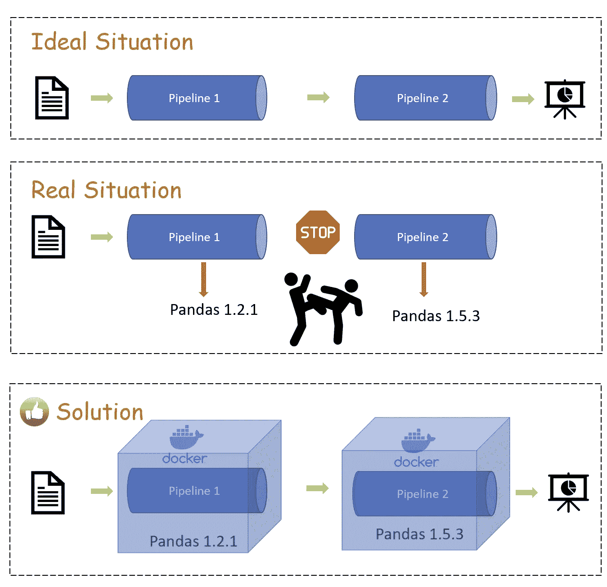

# Python 项目中的另一个重要文件——docker file

> 原文：<https://medium.com/mlearning-ai/the-other-important-file-in-python-project-dockerfile-a8bacc6c152d?source=collection_archive---------3----------------------->

在运行数据管道的同时处理开源库版本冲突是非常烦人的。这就是为什么我们需要[码头工人](https://www.docker.com/)！

Docker 创建不同的容器来避免版本冲突。容器本身可以被认为是一个独立的开发环境，另一个容器中的设置不会影响另一个容器。这就是为什么，创造一个…