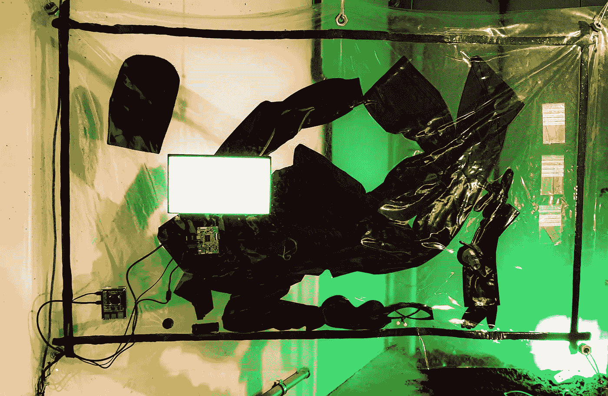

# 人类消失后的宇宙

> 原文：<https://medium.com/mlearning-ai/the-post-human-universe-2bc085d1fa65?source=collection_archive---------9----------------------->

## [机器学习艺术](https://mlearning.substack.com)

## [人工智能在艺术市场中的作用是什么？](https://www.getrevue.co/profile/evartology/members)

[MLearning.ai](https://linktr.ee/mlearning)

有人问，

*“如果艺术最大的价值是人的想象力，人工智能艺术还有什么意义？”*

这个问题既有见地，又令人警醒。探索人工智能如何有助于艺术家之间的合作关系至关重要