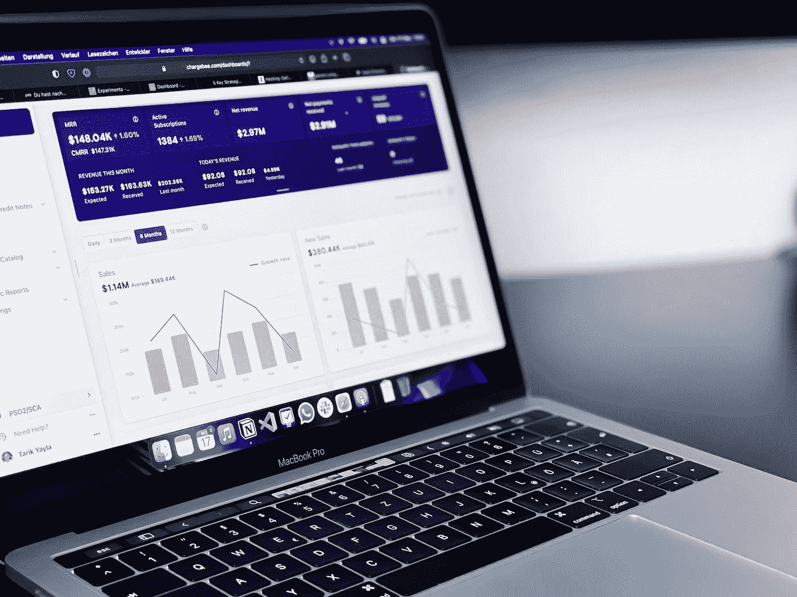

# 预测分析的力量

> 原文：<https://medium.com/mlearning-ai/the-power-of-predictive-analytics-539847771e53?source=collection_archive---------4----------------------->

## 关于预测分析如何应用于各种行业的博客

Photo by [path digital](https://unsplash.com/@pathdigital?utm_source=medium&utm_medium=referral) on [Unsplash](https://unsplash.com?utm_source=medium&utm_medium=referral)

# 你的企业有数据吗？

预测分析是一个包含许多术语和概念的大词。就是用数据来预测你未来在哪里的想法。在商业中，预测分析被公司用来计算下一步该做什么决定。预测分析有许多不同的用途。企业使用预测分析来预测他们的产品会有多成功，他们会赚多少钱，他们会得到多少客户。预测分析还用于预测客户的未来行为。企业将使用这些信息来预测客户何时离开，他们是否会购买多种产品，或者他们是否会再次光顾该企业。预测分析有许多不同的用途。企业使用预测分析来预测他们的产品会有多成功，他们会赚多少钱，他们会得到多少客户。预测分析还用于预测客户的未来行为。企业将使用这些信息来预测客户何时离开，他们是否会购买多种产品，或者他们是否会再次光顾该企业。

世界在变，企业也必须随之改变。他们必须跟踪各种数据，并在做出明智的决策之前搞清楚一切。随着大数据的出现，企业所做的一切现在都可以被跟踪。企业现在可以分析他们的数据，进而对他们的业务、产品以及整体业务的发展方向做出更明智的决策。数据收集的速度比以往任何时候都快，这推动了预测分析。预测分析是查看收集的数据并对未来数据做出预测的过程。预测分析被用来确定消费者想要什么，下一个大时尚会是什么，如何销售产品，以及许多其他事情。预测分析的使用和需求只会越来越多，这是每个企业都应该关注的事情。

# 实施预测分析有什么好处？

预测分析是一个强大的工具，可以帮助您做出更好的决策。这也是一个宽泛的术语，包含许多不同的工具和技术。在这篇博文中，我们将以亚马逊为例，重点讨论预测分析如何帮助你做出更好的商业决策。亚马逊是公司如何利用预测分析实现增长的一个很好的例子。亚马逊是世界上第二有价值的公司，市值超过 4000 亿美元。除了其他方面，亚马逊以其推荐而闻名。这些建议基于数据和统计。但是它们为什么这么好呢？

预测分析是一种强大的分析工具，允许企业所有者和领导者准确预测可能对企业不利的趋势。预测分析的一些最大优势包括:识别即将发生的事情-在问题发生之前，预测分析允许企业主识别即将发生的事情。识别已经发生的事情—预测分析允许企业主识别已经发生的事情。这可能是耗费公司资金的事情，也可能是业务不可或缺的一部分。预测未来的变化—借助预测分析，企业主可以预测他们可以对其业务做出的未来变化，以增加其成功的机会。

预测分析是一种工具，企业可以使用它来更好地了解他们的数据，并做出更明智的商业决策。预测分析的目标是使用数据创建预测未来的算法。因此，这是一个非常强大的工具，企业可以用它来增加利润。以下是实施预测分析的一些好处。1.改进的利润预测分析可以结合来自多个来源的数据，帮助企业做出更明智的决策。例如，它可以使用关于消费者及其行为的数据来帮助企业就销售哪些产品做出更好的决策。

# 预测分析的未来是什么？

预测分析是当今几乎每个企业最关心的主要话题之一。这实际上是一个非常重要的话题，值得讨论，因为预测分析的未来与目前几乎所有业务的成败直接相关。预测分析可以定义为使用历史数据预测未来事件的过程。这是一个非常强大的过程，几乎在世界上的每个行业都在使用。世界各地的企业都在使用预测分析来提高决策的准确性。他们使用它来提高员工的绩效，跟踪客户的绩效，提高整体效率，并提高企业的整体成功。

预测分析的未来是业务的新领域，也是每个企业都应该关注的问题。预测分析是一种新的破坏性趋势，正在慢慢开始彻底改变商业世界。预测分析是一个相对较新的术语，在基础层面已经存在很长时间了。预测分析是开发和使用数学模型和算法来预测未来事件和趋势的科学。预测分析是预测的另一种说法，已经使用了很多年。使用预测分析的方法有很多种，结果往往令人惊讶。公司现在使用预测分析来帮助他们更好地管理业务和进行决策。它还用于市场营销和销售，并有助于改善客户体验。

# 如何在您的企业中实施预测分析？

预测分析用于制定商业决策。例如，一家公司可能使用预测分析来预测客户流失(客户离开企业)或确定客户对报价做出反应的可能性。预测分析由数据驱动，数据越多，预测就越准确。数据是不断被创建的，因此您总是可以找到新的数据集来帮助您改进预测。预测分析可以通过多种方式实施。可以用于个人使用，也可以用于企业级实现。它也可以被企业用来改善他们的产品和服务，或者被政府机构用来改善公共安全。

预测分析是使用历史数据预测未来趋势的过程。它经常在商业中被用来预测未来的趋势和机会。它还可以用来识别数据中表示问题或机会的模式。您可能想知道如何在您的业务中使用预测分析，或者如何在该领域起步。在最基本的层面上，任何已经实施 CRM 系统的公司都已经在使用预测分析来帮助他们做出决策。但要让它更强大，你需要开始考虑预测分析不仅仅是一个销售工具。

Photo by [Alexas_Fotos](https://unsplash.com/@alexas_fotos?utm_source=medium&utm_medium=referral) on [Unsplash](https://unsplash.com?utm_source=medium&utm_medium=referral)

> **结论**

知识就是力量，预测分析将帮助您了解什么最适合您的业务。

 [## Mlearning.ai 提交建议

### 如何成为 Mlearning.ai 上的作家

medium.com](/mlearning-ai/mlearning-ai-submission-suggestions-b51e2b130bfb)