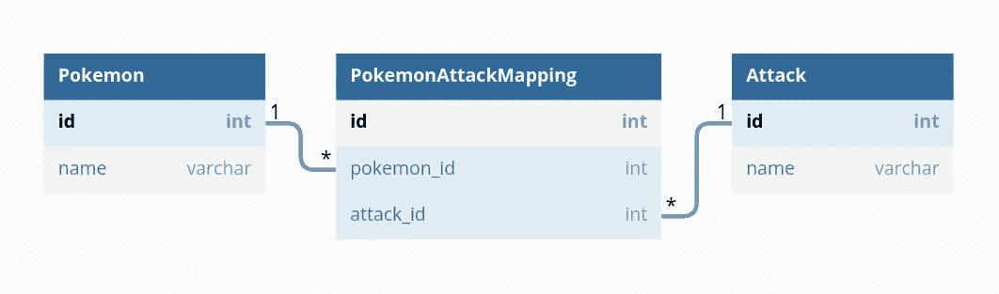

# REST 的语用问题

> 原文：<https://medium.com/mlearning-ai/the-pragmatic-problems-with-rest-412769849a75?source=collection_archive---------10----------------------->

这个故事是关于我的个人偏见，基于我在印度一家领先的纯互联网公司工作的经历，即“ *REST 可能与现代 web 开发*无关”。这是我第一稿的标题，我和读者都不确定这是否有意义

Photo by [Kyle Simmons](https://unsplash.com/@kas923?utm_source=medium&utm_medium=referral) on [Unsplash](https://unsplash.com?utm_source=medium&utm_medium=referral)

像所有结构良好的智能技术故事一样，我们将花时间来定义 RESTful web 开发，而不是真正的要点。然而，我们可能不想去参考 Roy Fielding 的原始论文中 REST 的通常定义，而是如何为客户创建 RESTful web 应用程序。

这是一个周一的早晨，你刚刚在办公室喝了一杯咖啡，你的产品经理提出了设计一个 PokeDex 应用程序来支持 4 个主要工作流的要求

1.  客户端将需要获取一个有适当细节的口袋妖怪列表。
2.  每个口袋妖怪都会有一个攻击列表。
3.  口袋妖怪攻击可以独立要求详细资料。
4.  可能会出现需要与特定攻击相关联的口袋妖怪的情况。

Photo by [Jeremy Bezanger](https://unsplash.com/@unarchive?utm_source=medium&utm_medium=referral) on [Unsplash](https://unsplash.com?utm_source=medium&utm_medium=referral)

不考虑编程语言和相关框架，构建一个 RESTful web 应用程序，即一个为 web 创建但由 REST API 作为接口的应用程序，包括

*   **数据建模** —在关系数据库上，这可以用 3 个表来解决，即-口袋妖怪、攻击、口袋妖怪攻击映射

Photo by author

*   **资源建模**——根据需求中的定义，两个数据实体可以形成 4 个嵌套的资源，就这样——

1.  口袋妖怪——在/pokemon/上的 CRUD 操作
2.  每个口袋妖怪的攻击——对/pokemon/attack/的 CRUD 操作
3.  攻击——对/attack/的 CRUD 操作
4.  与攻击相关的口袋妖怪——在/attack/pokemon/上的 CRUD 操作

*   模式定义—RESTful API 中最棘手的部分是客户端用户界面的契约定义。最初的 REST 架构为所有客户端定义了“统一接口”的约束，因此，我们只能定义一个静态模式一次。在这一点上，后端开发人员必须在 ***欠取*** 与 ***过取*** 之间做出选择，并且更偶尔地，他们会选择过取，以避免客户端进行额外的网络信息调用。

在成功交付 API 之后，项目经理将 UI 设计交给前端工程师。网页必须列出每个口袋妖怪的名字，可能还有一些细节，但完全忽略了嵌套数组和其他细节。他们在响应上运行一个循环，并将所需的信息加载到组件中(与 UI 专家交叉验证)。

这就是 REST 面临的挑战。让客户端负责引擎状态会增加渲染适当数据和优化网络调用的大量责任，以便在嵌套资源上执行正确的写操作。

在一个典型的软件开发团队中，个人贡献者的关注点各不相同，这只会导致为每个 web 表单或页面重新设计专用端点的冲突和协商。在 REST 流行之前，传统 web 就是这样工作的。为了支持产品的交付，工程师们乐意牺牲文学架构，采用任何方便的东西。

 [## Mlearning.ai 提交建议

### 如何成为 Mlearning.ai 上的作家

medium.com](/mlearning-ai/mlearning-ai-submission-suggestions-b51e2b130bfb)