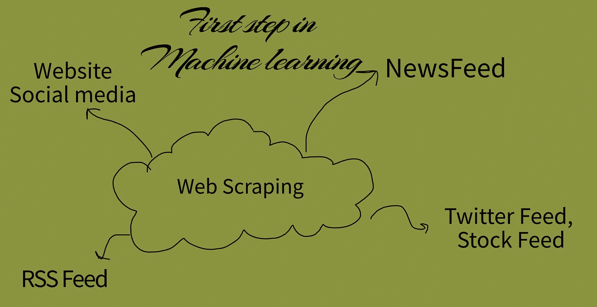
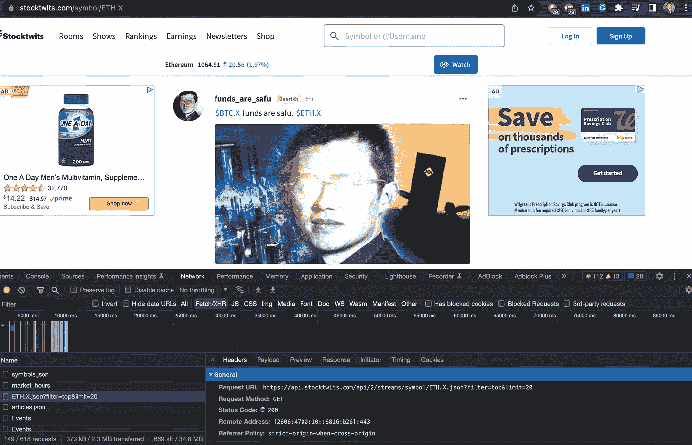
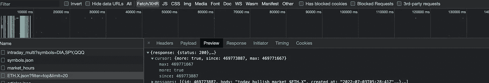
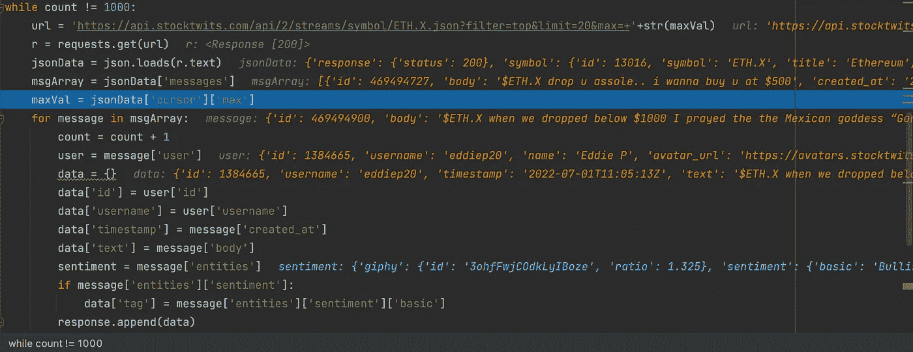

# 所有机器学习的先驱:网络搜集:技术、工具和实现(教程 1)

> 原文：<https://medium.com/mlearning-ai/the-precursor-to-all-machine-learning-web-scraping-technique-tools-and-implementation-tutorial-49e54c06caa3?source=collection_archive---------5----------------------->

这是两个网页抓取教程的第一部分。点击第二部分的链接:

 [## 所有机器学习的先驱:网络搜集:技术、工具和实现(教程…

### 查看我的第一篇使用 JSON response 进行 web 抓取的文章:

medium.com](/@afsarequebal/the-precursor-to-all-machine-learning-web-scraping-technique-tools-and-implementation-tutorial-ffcdfd02fa64) 

网络搜集:这是一种从网络上识别和检索数据的艺术。

**问题陈述:**从标签为$ETH 的最后 1000 条推文中提取文本。x(以太坊)发布在 Stocktwits 上:

**解决方案:**

**第一步:确定要使用的网站:**

[**https://stocktwits.com/symbol/ETH.X**](https://stocktwits.com/symbol/ETH.X)

**第二步:**数据是 HTML 内容的一部分还是通过 javascript 调用获取 JSON 呈现的？在这种情况下，会进行 GET API 调用。

**步骤 3:在网络选项卡中识别 GET call** ，并根据屏幕上的内容进行验证。这里，GET 调用是

[**https://api.stocktwits.com/api/2/streams/symbol/ETH.X.json？filter = top&limit = 20**](https://api.stocktwits.com/api/2/streams/symbol/ETH.X.json?filter=top&limit=20)

但是，如果我们重复调用这个 API，我们将继续得到相同的 JSON。

**第 4 步:深入研究响应:**JSON 中有一个字段 max，我们可以将它作为参数发送，以获得低于该值的输出。这个字段(max)在每个 API 调用中更新，我们可以在下一个调用中使用它。

[**https://api.stocktwits.com/api/2/streams/symbol/ETH.X.json？filter = top&limit = 20&max = 469771667**](https://api.stocktwits.com/api/2/streams/symbol/ETH.X.json?filter=top&limit=20&max=469771667)

**第五步:从代码**中调用如下最终 API。接收到的 JSON 可以被解析得到相关信息并进一步存储。

[***Github 代码链接:***](https://github.com/afsarequebal/webscraping/tree/master)

 [## GitHub-afsarequebal/网页抓取

### 此时您不能执行该操作。您已使用另一个标签页或窗口登录。您已在另一个选项卡中注销，或者…

github.com](https://github.com/afsarequebal/webscraping/tree/master)  [## Mlearning.ai 提交建议

### 如何成为 Mlearning.ai 上的作家

medium.com](/mlearning-ai/mlearning-ai-submission-suggestions-b51e2b130bfb)