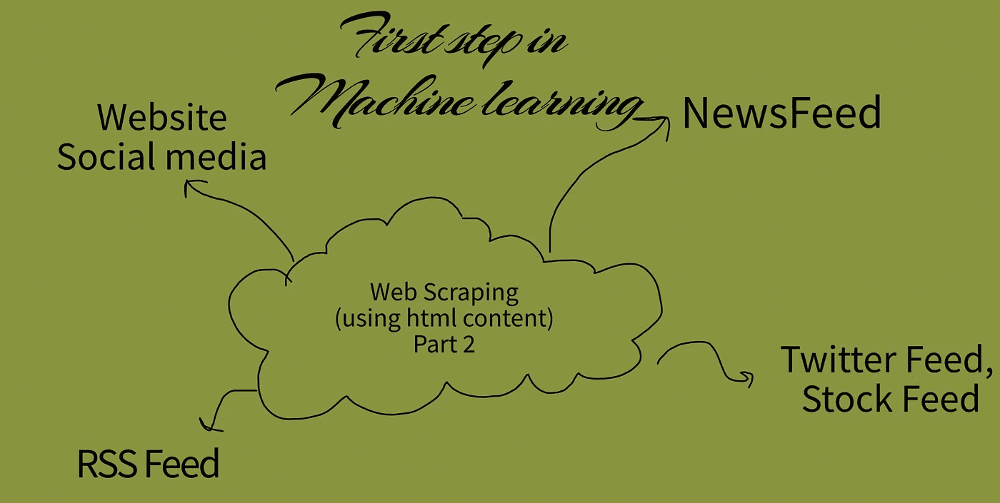
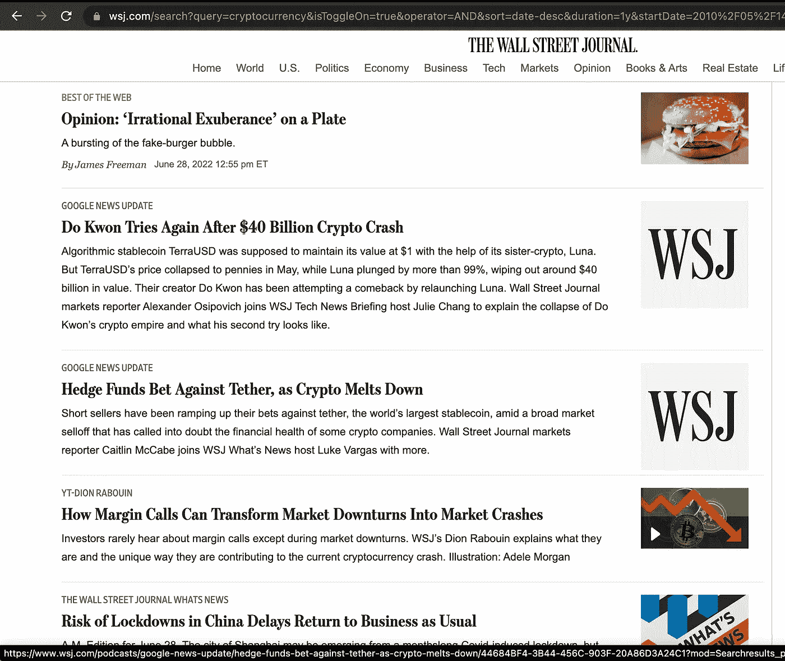
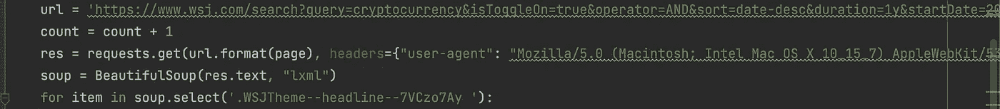
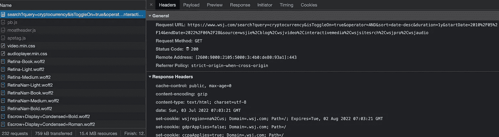

# 所有机器学习的先驱:网络搜集:技术、工具和实现(教程 2)

> 原文：<https://medium.com/mlearning-ai/the-precursor-to-all-machine-learning-web-scraping-technique-tools-and-implementation-tutorial-ffcdfd02fa64?source=collection_archive---------4----------------------->



查看我的第一篇使用 JSON response 进行 web 抓取的文章:

[](/@afsarequebal/the-precursor-to-all-machine-learning-web-scraping-technique-tools-and-implementation-tutorial-49e54c06caa3) [## 所有机器学习的先驱:网络搜集:技术、工具和实现(教程…

### 这是两个网页抓取教程的第一部分。

medium.com](/@afsarequebal/the-precursor-to-all-machine-learning-web-scraping-technique-tools-and-implementation-tutorial-49e54c06caa3) 

**问题陈述:从华尔街日报上使用关键词“加密货币”的最后 25 篇文章中抓取文字。**



**解决方案:这里需要从屏幕上获取链接，并使用链接来检索文章文本。我们按照以下步骤来完成手头的任务。**

**第一步:确定要使用的网站:**

[https://www.wsj.com/search?query=cryptocurrency&isToggleOn = true&operator = AND&sort = date-desc&duration = 1y&start date = 2010% 2f 05% 2f 14&end date = 2022% 2f 06% 2f 28&source = ws Jie % 2c blog % 2c wsj video % 2c interactive media % 2c wsjsitesrch % 2c wsjpro % 2c wsjaudio&page = 270](https://nam12.safelinks.protection.outlook.com/?url=https%3A%2F%2Fwww.wsj.com%2Fsearch%3Fquery%3Dcryptocurrency%26isToggleOn%3Dtrue%26operator%3DAND%26sort%3Ddate-desc%26duration%3D1y%26startDate%3D2010%252F05%252F14%26endDate%3D2022%252F06%252F28%26source%3Dwsjie%252Cblog%252Cwsjvideo%252Cinteractivemedia%252Cwsjsitesrch%252Cwsjpro%252Cwsjaudio%26page%3D270&data=05%7C01%7Cequebal.a%40northeastern.edu%7Cda0bb5447e084d3481b108da5b722515%7Ca8eec281aaa34daeac9b9a398b9215e7%7C0%7C0%7C637922843046192443%7CUnknown%7CTWFpbGZsb3d8eyJWIjoiMC4wLjAwMDAiLCJQIjoiV2luMzIiLCJBTiI6Ik1haWwiLCJXVCI6Mn0%3D%7C3000%7C%7C%7C&sdata=zthfujaK4s%2FvQeH0CCCt92nQ1G18WyMPiwqoKz%2BHBsE%3D&reserved=0)

**第二步:查看页面的源代码，它显示了页面上的链接。**识别包含链接的 HTML 元素。在我们的情况下，它在下面。

```
.WSJTheme--headline--7VCzo7Ay
```



**第三步:使用 BeautifulSoup python 库渲染 HTML 响应。**这个库提供了很多从 HTML 中获取元素的方法。参考:[https://pypi.org/project/beautifulsoup4/](https://pypi.org/project/beautifulsoup4/)

**第四步:在 URL 中，我们需要发送头和 cookies。**当我们需要向 API 发送附加信息时，这是必需的。《华尔街日报》需要订阅才能阅读新闻。只需右键单击 URL 调用，然后单击复制为 CURL 链接，如下所示:它将包含标题和 cookies。



**第五步:一旦我们得到了链接，重复这些步骤得到文章。**

[**Github 代码链接:**](https://github.com/afsarequebal/wsjwebscrape)

[](https://github.com/afsarequebal/wsjwebscrape) [## GitHub-afsarequebal/wsjweb scrape

### 此时您不能执行该操作。您已使用另一个标签页或窗口登录。您已在另一个选项卡中注销，或者…

github.com](https://github.com/afsarequebal/wsjwebscrape) 

感谢您的阅读！！！

[](/mlearning-ai/mlearning-ai-submission-suggestions-b51e2b130bfb) [## Mlearning.ai 提交建议

### 如何成为 Mlearning.ai 上的作家

medium.com](/mlearning-ai/mlearning-ai-submission-suggestions-b51e2b130bfb)