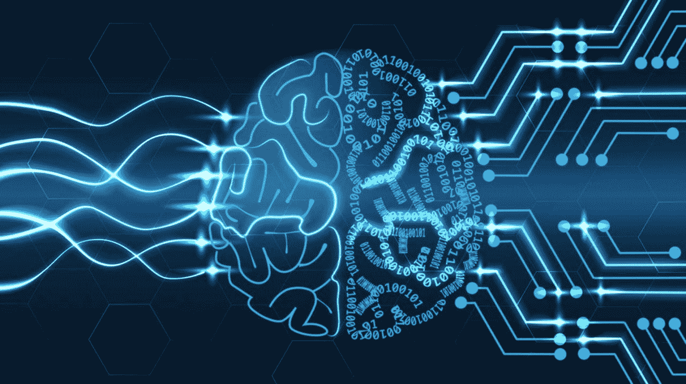

# 人工智能(AI)在教育中的前景

> 原文：<https://medium.com/mlearning-ai/the-promise-of-artificial-intelligence-ai-in-education-8238a0a491f8?source=collection_archive---------6----------------------->

最初发布于 2020 年 11 月 3 日 LinkedIn

教育领域正在经历一场重大变革，并受到资源不断数字化的巨大影响，新冠肺炎疫情进一步推动了这一变革。随着学校、大学和教育中心的突然关闭，所有的学习都被迫转向远程模式，这对于大多数学生、教师和家长来说是一种固有的新事物。

在世界某些地区，通过户外活动恢复生命似乎是一种缓刑，但很快就变成了假阳性，因为随着病例数量再次上升，我们现在看到全球多个国家实施了第二次封锁。这让教育界处于悬崖边缘，在应该如何实施教学方法方面需要做出一些艰难的选择——那些准备在春天返校的学校是继续远程学习，还是像许多学校已经做的那样，冒险继续进行面对面的教学？

重要的是要强调这样一个事实，即在疫情之前，学习技术的数字化正以加速的步伐前进，而新冠肺炎作为催化剂加速了这一运动，并将其送入平流层，特别是在高等教育领域。在过去的 8 个月中，我们已经见证了在线学习技术的进步，这给公司和机构带来了更大的压力，他们需要为我们的学生引入不同类型的学习环境，重点关注灵活性、个性化、适应性和可访问性。

在后新冠肺炎时代，教育的未来仍有待确定，但该领域的众多专家似乎正在构建和展示一个可能的心智模型。在过去几年中，推动教育数字化的关键力量是人工智能和机器学习的改进，我们将深入探讨这些技术的具体进步如何帮助学生和教师。

解构眼前的问题——一个教育者的目标是什么？在我看来，这是为了帮助学生理解概念和实施这样的学习，同时努力提高学习效率，并弥合某些学习差距。然而，今天的教育工作者无法花费适当的时间来最大限度地发挥孩子的潜力，因为他们的时间被应该自动化的世俗任务所消耗。下面讨论的是一些关于人工智能将如何在改善我们学生的生活以及解决教师倦怠问题方面发挥关键作用的见解。

**帮助学生**

*   人与人工智能的接口:人工智能能够监控和学习学生及其倾向，以了解他们精通什么以及他们的学习差距在哪里。人工智能现在能够确定学生需要学习什么材料，并通过提供专注于个人优势和劣势的差异化和定制化学习体验来帮助推动个性化和高效的学习，而无需向学生提供冗余信息(避免产生无用的反馈循环至关重要)。这样既节省了时间，又提高了学习的速度。
*   社会情绪学习(SEL):有了额外的空闲时间，教师现在可以支持社会情绪学习，并与学生建立一对一的关系，这将允许更好的合作，并鼓励学生的自我调节和毅力。学生的情绪状态会影响他们如何专注、参与和保持学习动力。最近，一家教育科技公司推出了一款产品，试图通过个人的键盘敲击和鼠标动作等技术来识别学生的情绪状态。它运行一种算法，该算法能够以个性化支持的形式提供适当的干预，或者将该信息提供给教师，以便加强这些干预。
*   有了人工智能及其能力，我们现在可以连接到世界各地的不同教室，诱导伟大的合作和沟通技能，特别是在这样一个互动如此之低的时期，提高学生的 SEL 组件。

**帮助教师避免职业倦怠**

在我们的全球教育社会中，一个令人生厌的讨论话题和一个仍然令人悲伤的事实是，教师职业是薪酬最低和最不受重视的职业之一。下面列出的一些人工智能技术的使用案例，我们已经看到并将在不久的将来看到，将旨在帮助教师减少某些工作量，从而腾出更多的自由时间，这反过来将有望降低压力水平和倦怠——所有这些都使该职业更具吸引力。

*   给论文和家庭作业评分的能力，其中一些已经在今天实现了。对开放式回答进行评分的机器是一个有很大改进空间的领域，我相信随着我们继续将数据输入这些网络，我们会在适当的时候看到这一点。
*   分析仪表板已经成为教育领域的一个热门话题，因为它自动化了过去人工参与的收集和筛选数据以得出某些结论的工作，这非常耗时。教师现在可以查看现成的仪表板，了解学生的学习差距在哪里。
*   对于老师来说，创建测验和家庭作业是一项单调乏味的任务，这不会产生最佳效果，因为不同的学生会纠结于不同的问题。这是在人工智能的帮助下可以个性化到每个个体的东西。
*   像考勤这样的管理任务是老师不应该浪费时间的。
*   人工智能还可以帮助向教师提供信息，他们可以用这些信息来教育自己，以改善学生的学习。人工智能可以识别教师材料中的差距，并提供建议。例如，如果多个学生提交了一个不正确的答案，人工智能警报就能够提醒教师这一情况。教师现在可以向学生提供提示，或者集中精力缩小给定主题的概念差距。

我还认为，教师的角色将慢慢转变为某种程度上的教练或导师，专注于开发学习内容。人工智能的整个要点(我们已经看到一些小规模的实施)是解放教师的时间，让他们专注于更紧迫、更有价值的任务，如发现学生的学习差距，并直接与他们合作，弥补这些差距，纠正他们可能犯的任何错误。

在这篇文章中，我谈到了人工智能给教育领域的教师和学生带来的潜在好处。在我的下一篇文章中，我将深入探讨人工智能在教育领域的未来的广阔潜力，事物的前景可能会是什么样子，以及实施这些技术所涉及的风险。

*最初发表于*[*【https://www.linkedin.com】*](https://www.linkedin.com/pulse/promise-artificial-intelligence-ai-education-aarchit-malhotra/)*。*

 [## Mlearning.ai 提交建议

### 如何成为 Mlearning.ai 上的作家

medium.com](/mlearning-ai/mlearning-ai-submission-suggestions-b51e2b130bfb)