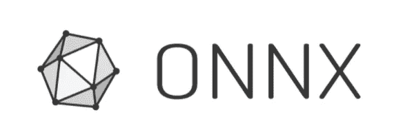
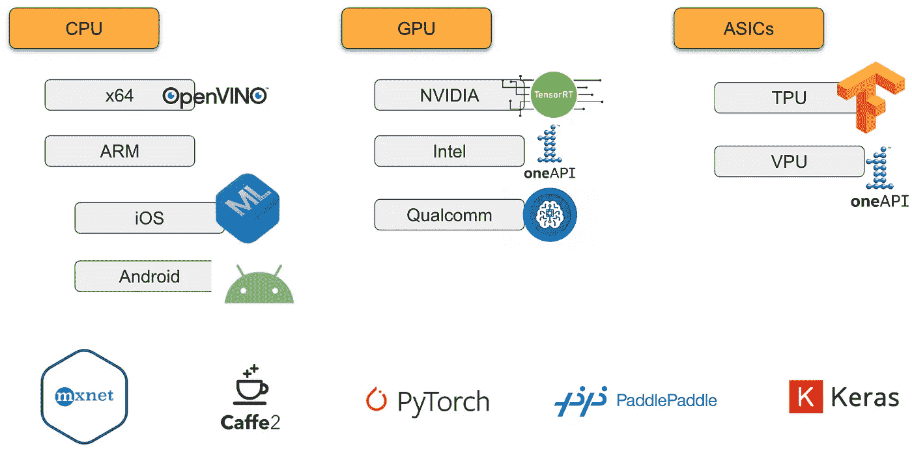
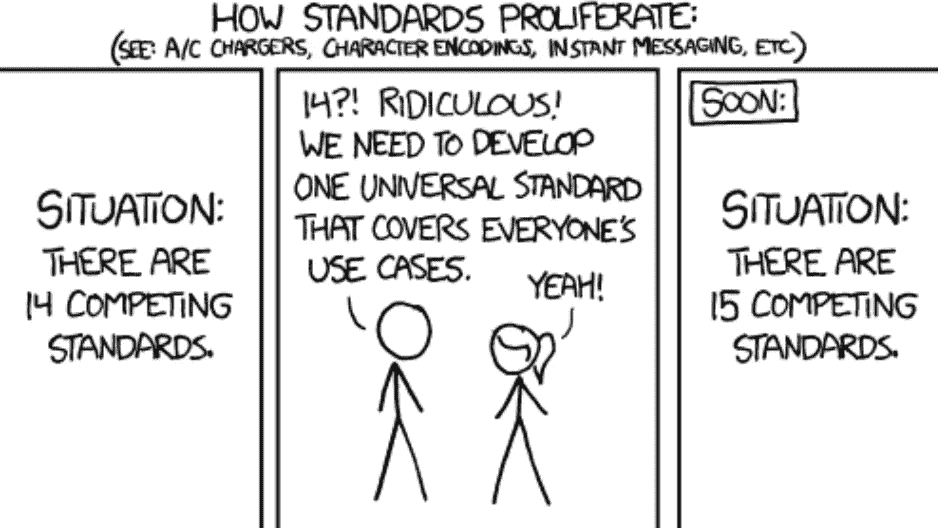
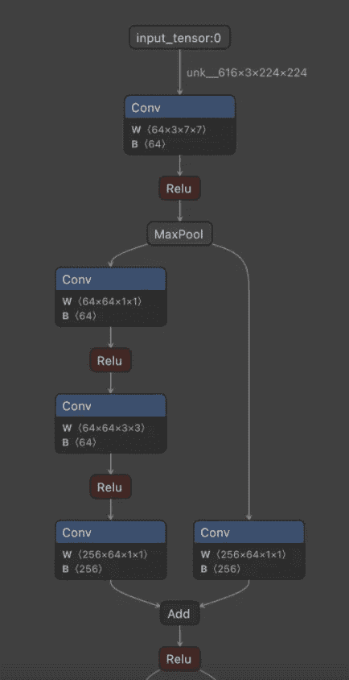
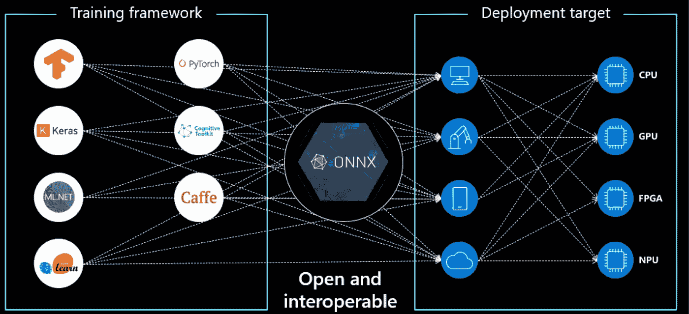
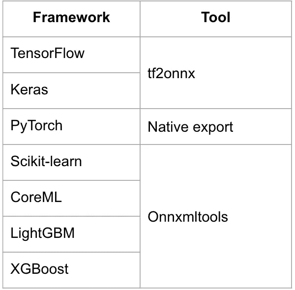
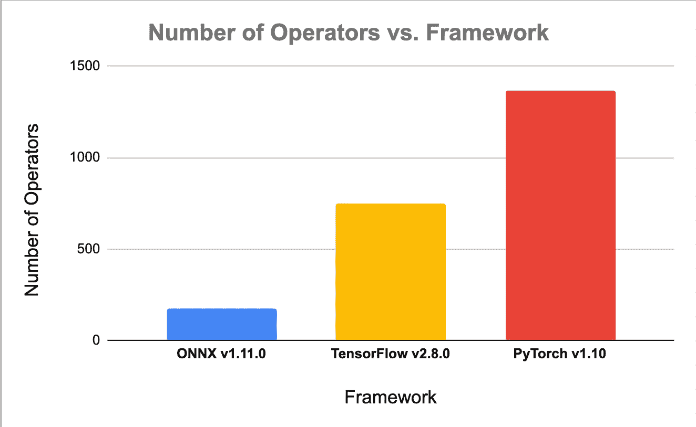

# ONNX 的承诺

> 原文：<https://medium.com/mlearning-ai/the-promise-of-onnx-d43c371f913d?source=collection_archive---------0----------------------->

机器学习框架是一种工具，它使开发人员能够创建模型来完成给定的任务，例如图像分类或自然语言处理。ML 框架中一些最熟悉的例子是 PyTorch 和 TensorFlow。

**ONNX(Open Neural Network EXchange)**是一个开源标准，它定义了一组通用的运算符和一种文件格式，使人工智能开发人员能够使用各种框架、工具、运行时和编译器的模型。

> **在这篇文章中，我将谈论:**
> 
> 为什么要创建 ONNX？
> 
> 什么是 ONNX？
> 
> ONNX 的承诺
> 
> 承诺的实现

# 【ONNX 为什么会被创造出来？

机器学习/深度学习的出现导致为处理深度学习/机器学习模型的执行而引入的框架/库的数量呈指数级增长。

这一增长的主要驱动力是，

(a)硬件供应商，他们开发了自己的框架，以实现纵向集成，并使其硬件模型的开发更加容易

和

(b)软件供应商，他们开发自己的框架以实现特定用例的最佳性能

用于开发深度学习模型的可用框架数量的激增导致了生态系统的碎片化，并使得跨框架或硬件生态系统工作变得困难。必须选择在何处开发和培训模型，并且在数据科学管道的后期转移到不同的框架或不同的硬件生态系统几乎是不可能的。这是由于框架与不同硬件的编译器的兼容性，但我们将把编译器的故事留待以后再说。

ONNX 的诞生是为了消除框架之间以及不同硬件生态系统之间的互操作性惯性。

在本文的其余部分，我们将探索解决框架过多的问题的方法是否是在组合中引入另一个框架？

# 什么是 ONNX？

ONNX 是一个开放规范，由以下定义组成:

## **计算图形模型的文件格式**

**模型:**是一个包含版本信息和元数据的非循环计算数据流图。

**图形:**包含模型中数据流图形的名称、构成图形的计算节点列表、图形的输入和输出。

**计算节点:**图中每个计算节点接受[定义类型](https://github.com/onnx/onnx/blob/main/docs/IR.md#standard-data-types)的零个或多个输入，一个或多个定义类型的输出，以及特定节点对其输入执行的操作类型。

Figure 2: An example ONNX graph

## 标准数据类型

ONNX 作为一个标准支持以下数据类型列表:
**张量类型:**

*   Int8、Int16、Int32、Int64
*   量化整数
*   Uint8、uint16、uint32、uint64
*   浮点 16，浮点，双精度
*   弯曲件
*   线
*   复杂 64，复杂 128

**非张量类型:**

*   顺序
*   地图
*   运算符(内置/自定义)

## 经营者

ONNX 图中的每个计算节点执行特定的操作，并产生一个或多个输出。ONNX 标准定义了 ONNX 图形支持的[操作符](https://github.com/onnx/onnx/blob/main/docs/Operators.md)的正式列表。该运算符列表不断发展，并通过 ONNX Opsets 保持更新。

每个增量 ONNX Opset 都增加了对新运算符的支持，并改进了现有的运算符列表。

这个规范是一个开放的标准，每个人都可以同意，因此可以从任何框架转换到 ONNX。

# ONNX 的承诺

ONNX 的核心设计理念是:

*   互用性
*   轻便

Figure 3: The Promise of ONNX

ONNX 旨在通过提供一个有效的接口将模型从一个框架转换到另一个框架，成为不同框架之间的中介。*下面的图 4* 列出了将模型从一些最常见的框架转换成 ONNX 格式的工具。

Figure 4: Onnx Conversion support

# 诺言的实现

实际上，从任何框架到 ONNX 的模型转换都是一个挑战。主要障碍之一是这些框架的表面积不同。

转换库面临的挑战是跟上 ONNX 及其每个版本的源代码库的变化趋势(每年大约 4-6 次)

从一个框架到另一个框架的模型转换归结为能够表示原始模型的底层数学运算。图 5 显示了每个框架中定义的唯一操作符的数量。ONNX 支持 PyTorch 支持的大约 13%的操作符。这极大地限制了可以实际转换为 ONNX 的模型数量。

Figure 5: Number of operators per framework

值得注意的是，PyTorch 等框架上的 1000 多个操作符在特定操作的功能上也有一定程度的重复，这也回避了一个问题，即 ONNX 等框架是否应该支持所有操作的全局超集？

为了解决运营商覆盖的问题，ONNX 采取了不同的策略，而不是在所有这些框架上追逐永无止境的运营商列表。

**ONNX 函数**使用 ONNX 中的原始/现有操作符帮助表达复杂操作。每一个即将到来的 ONNX 版本都将增加新的功能，并且比以往任何时候都更容易[根据需要添加自己的功能](https://github.com/onnx/onnx/blob/main/docs/AddNewOp.md#step1_new_operator_or_function)。这有助于限制需要维护的操作符的数量，也有利于编译器开发人员，因为它减少了为硬件优化少量操作符的范围和工作量。

> 运算符是用于定义 ONNX 模型的基本构件。凭借丰富的操作符，ONNX 可以描述来自各种框架的大多数 DNN 和 ML 模型。**函数可以用更原始的运算符来表达复杂的运算符**。ONNX 规范包括一组支持许多模型的核心运算符。添加所有可能的操作符并不是我们的目标，但是我们会根据需要添加更多的操作符来满足不断发展的需求。

我不能夸大上述与前一个时代的 **CISC Vs RISC** 战争的相似性。我们不仅可以坐在前排看这是如何发生的，而且还有机会真正影响这个有影响力的行业的方向，这个行业已经通过促进开源项目和推动人工智能软件的边界塑造了技术的未来。

活着是多么美好的时光啊！！！

## [T5【成为作家】m learning . ai](https://mlearning.substack.com/about)

 [## Mlearning.ai 提交建议

### 如何成为 Mlearning.ai 上的作家

medium.com](/mlearning-ai/mlearning-ai-submission-suggestions-b51e2b130bfb)